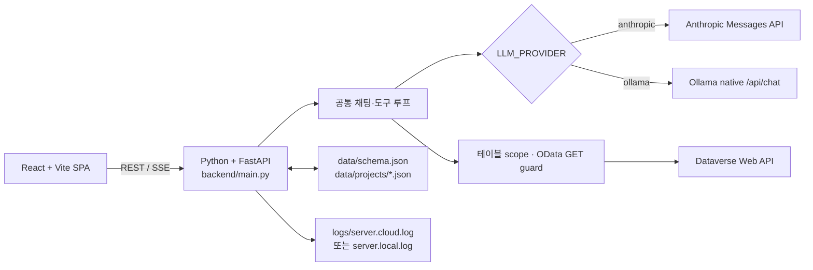

# Quali CRM AI Notebook

> 2026-08-13 기준 기능 개발을 종료하고 인수인계 상태로 전환했습니다. 최종 기준은 [개발 종료 인수인계서](FINAL_HANDOVER.md)와 [9개 상세 명세](#개발-종료--인수인계)입니다.

Dataverse(Dynamics 365 CRM)를 자연어로 조회하는 읽기 전용 노트북형 챗봇입니다. 이 저장소의 기준 런타임은 **React + Vite 프론트엔드와 Python/FastAPI 백엔드**입니다. `LLM_PROVIDER`로 Anthropic 또는 Ollama만 선택하며 화면, API, Dataverse 도구, 프롬프트 정책, 프로젝트 저장 형식과 오류 계약은 같습니다.

`crm-ai-chat` 단일 프로젝트로 운영합니다. `.env`의 `LLM_PROVIDER`만 `anthropic`/`ollama`로 바꾸면 같은 백엔드가 클라우드·로컬 LLM을 모두 처리합니다.
(2026-08-13부터: 과거 별도로 동기화하던 `crm-ai-chat-local-llm` mirror 저장소는 폐기했고, 더 이상 두 저장소를 유지하지 않습니다.)

## 아키텍처



활성 코드는 다음처럼 나뉩니다.

| 경로 | 역할 |
|---|---|
| `src/` | 프로젝트·노트북·테이블 범위·지침·로그 UI |
| `backend/main.py` | FastAPI 앱, 공통 REST API, 미들웨어, SPA 정적 파일 서빙 |
| `backend/chat_api.py` | 공급자 중립 히스토리, 최대 6회의 도구 루프, SSE 응답 |
| `backend/llm_provider.py` | 공급자 중립 메시지·도구·이벤트·상태 계약 |
| `backend/anthropic_provider.py`, `backend/ollama_provider.py` | Anthropic/Ollama 프로토콜 차이를 감추는 어댑터 |
| `backend/provider_factory.py` | `LLM_PROVIDER`에 따라 단일 어댑터 선택 |
| `backend/dataverse.py` | OAuth client credentials, Dataverse GET, 메타데이터→스키마 변환 |
| `backend/projects.py`, `backend/history.py` | 프로젝트·셀·범위·지침·공급자 중립 대화 기록 영속화 |
| `backend/logger.py` | 프로필별 JSON Lines 로그와 회전 관리 |
| `src/types/index.ts`, `backend/llm_provider.py` | 프론트엔드 타입과 Python 공급자 중립 계약 |
| `tests_py/`, `tests_python/` | 공급자, 프로젝트·history 비노출, OData 보안, FastAPI API 계약 테스트 |

## 실행 프로필

| 프로필 | 설정 | LLM 연결 | 모델 선택 순서 | 필수 조건 | 활성 앱 로그 |
|---|---|---|---|---|---|
| Cloud | `LLM_PROVIDER=anthropic` | Anthropic Messages API(`/v1/messages`) | `LLM_MODEL` → `ANTHROPIC_MODEL` → `claude-haiku-4-5` | `ANTHROPIC_API_KEY` | `logs/server.cloud.log` |
| Local | `LLM_PROVIDER=ollama` | Ollama native(`/api/chat`) | `LLM_MODEL` → `LOCAL_LLM_MODEL` → `qwen3:30b-a3b` | 선택 모델이 설치된 Ollama | `logs/server.local.log` |

`LLM_BASE_URL`은 공통 endpoint override입니다. 없으면 각각 `ANTHROPIC_BASE_URL` 또는 `LOCAL_LLM_BASE_URL`을 사용합니다. 공급자를 바꿔도 프로젝트 파일과 공급자 중립 대화 히스토리 형식은 유지되며, 과거 Anthropic/OpenAI 형식의 히스토리는 읽을 때 정규화됩니다.

Anthropic 프로필에서는 질문, 선택된 스키마 카탈로그, 프로젝트 지침, 대화 기록과 도구 결과가 Anthropic으로 전송됩니다. Ollama 프로필에서는 같은 내용이 설정된 Ollama endpoint로 전송됩니다. 두 프로필 모두 실제 CRM 조회는 서버가 Dataverse Web API에 직접 요청합니다.

## Dataverse 도구와 실제 사용 근거

앱이 LLM에 노출하는 도구는 아래 두 개뿐입니다.

| 도구 | 동작 |
|---|---|
| `dataverse_describe_table` | `data/schema.json` 캐시에서 테이블 컬럼·타입·엔티티집합명을 읽음 |
| `dataverse_query` | 허용된 엔티티집합에 Dataverse OData `GET` 요청 |

CRM 생성·수정·삭제 도구는 없습니다. `dataverse_query`는 프로젝트의 테이블 범위를 서버에서 다시 읽어 엔티티집합 allowlist를 적용하고, 일반 collection 조회에 `$top`이 없으면 `$top=100`을 추가하며 100을 넘는 명시값도 100으로 낮춥니다. 프로젝트 테이블 배열이 비어 있으면 `schema.json`에 등록된 전체 테이블이 범위입니다.

개발 종료 전 보존된 로그와 프로젝트 히스토리를 확인한 결과, 두 도구는 정의만 된 것이 아니라 실제로 호출되었습니다.

| 확인 위치 | Cloud 프로필 | Local 프로필 |
|---|---:|---:|
| 서버 로그 | describe 시도 9회, query 시도 21회 | 완료된 describe 7회, query 1회 |
| 저장된 프로젝트 히스토리 | query 성공 3회, 오류 1회 | query 성공 1회 |

로그와 저장 히스토리에는 같은 실행이 중복 기록될 수 있으므로 위 숫자를 서로 더하면 안 됩니다. 이는 전체 수명 누계나 고유 호출 수가 아니라, 남아 있던 자료에서 확인 가능한 최소 증거입니다.

### MCP와 웹앱 REST 경로의 관계

웹앱(React + FastAPI)이 채팅에서 CRM을 조회할 때는 MCP를 거치지 않습니다. `backend/chat_api.py`가 Anthropic/Ollama의 네이티브 tool-use로 `dataverse_describe_table`/`dataverse_query`를 직접 실행하고, `backend/dataverse.py`로 Dataverse REST/OData GET을 호출합니다. 프로세스 하나, 왕복 하나로 끝나는 이 경로가 지금도 실제로 쓰이는 경로입니다.

**MCP는 이 웹앱 밖에서 같은 CRM 도구를 쓰고 싶은 외부 클라이언트(Claude Desktop, Claude Code 등)를 위한 별도 진입점**으로 `backend/mcp_server.py`에 있습니다(2026-08-13부터 별도 저장소가 아니라 이 프로젝트 안에 Python으로 통합 — 과거 Node/TS `crm-ai-chat-dataverse-mcp` 저장소는 더 이상 쓰지 않습니다). 새 가드 로직을 따로 짜지 않고 `chat_api.py`가 쓰는 것과 **같은** 화이트리스트·`$top` 상한·8 KiB 응답 상한 함수를 그대로 불러와 쓰므로, 웹앱과 MCP 경로의 안전장치가 서로 갈라질 수 없습니다. 웹앱 FastAPI 프로세스는 이 MCP 서버를 실행하거나 호출하지 않습니다 — MCP client(Claude Desktop 등)가 필요할 때 별도 프로세스로 직접 띄웁니다.

```powershell
# Claude Desktop/Code 같은 stdio MCP client에 등록해 쓸 때
npm run mcp
# 또는
python -m backend.mcp_server

# 원격 HTTP MCP client(streamable-http)에서 쓸 때
npm run mcp:http
```

Claude Desktop에 등록하려면 `claude_desktop_config.json`(Store 버전은 `%LOCALAPPDATA%\Packages\Claude_pzs8sxrjxfjjc\LocalCache\Roaming\Claude\claude_desktop_config.json`)에 다음을 추가합니다(Claude Desktop을 완전히 종료한 뒤 편집):

```json
{
  "mcpServers": {
    "dataverse": {
      "command": "C:\\Users\\hansu\\projects\\crm-ai-chat\\.venv\\Scripts\\python.exe",
      "args": ["-m", "backend.mcp_server"],
      "cwd": "C:\\Users\\hansu\\projects\\crm-ai-chat"
    }
  }
}
```

MCP client는 프로젝트 스코프 없이 `schema.json`에 등록된 전체 카탈로그를 볼 수 있습니다(읽기 전용, 화이트리스트 밖 엔티티는 여전히 거부).

과거(2026-08-13 이전) 개발 종료 검증에서는 그때 별도 저장소였던 Node/TS MCP도 실제 MCP SDK 클라이언트로 확인했습니다. `initialize → catalog resource → tools/list → describe → query` 왕복과 allowlist 거부가 통과했으며, live query는 1행 반환을 확인하되 CRM 원문은 기록하지 않았습니다. 세 저장소의 `schema.json`은 36개 테이블 기준으로 갱신시각을 제외한 의미 내용이 같았고, 표본 테이블의 저장 컬럼 110개가 실제 Dataverse 메타데이터 110개와 일치했습니다. 지금의 Python `backend/mcp_server.py`는 같은 계약(`initialize → catalog → describe → query`, allowlist 거부)을 `tests_python/test_mcp_server.py`와 stdio 클라이언트 smoke test로 다시 확인했습니다.

이 앱이 하는 일은 SQL 생성·실행이 아니라 **자연어 → 도구 선택 → OData 상대경로 → Dataverse GET**입니다. 사용자 관점에서 Text-to-SQL 계열로 부를 수는 있지만 기술 문서에서는 `Text-to-OData`로 표기합니다.

## 공통 기능과 API

- 프로젝트 생성·이름 변경·삭제, 테이블 조회 범위 지정
- 노트북 셀 추가·실행·자동 저장, Markdown 표 렌더링, 실행 쿼리 표시
- 프로젝트별 조인·업무 용어·질문 예시 지침과 로그 기반 초안 생성
- 공급자와 무관한 동일 SSE 이벤트: `tool`, `query`, `text`, `error`, `done`
- 스키마 캐시, 대화 히스토리 trim/describe 결과 compact, 요청 실패 시 현재 턴 rollback
- 공통 rate limit, 동시 실행 제한, provider 연결 상태와 Dataverse 환경변수 누락 여부가 포함된 health check

| Method | Path | 설명 |
|---|---|---|
| `POST` | `/api/chat` | `{ message, sessionId }`를 받아 SSE로 응답 |
| `GET`, `POST` | `/api/projects` | 프로젝트 목록·생성 |
| `GET`, `PATCH`, `DELETE` | `/api/projects/{project_id}` | 상세·부분 저장·삭제; LLM history는 응답에서 제외 |
| `GET` | `/api/tables` | 등록된 테이블 카탈로그 |
| `POST` | `/api/schemas/refresh` | `schema.json`에 이미 등록된 테이블들의 메타데이터 갱신 |
| `GET` | `/api/describe?table=...` | 테이블 스키마 조회·캐시 |
| `GET` | `/api/instructions/draft` | 활성 프로필 로그에서 지침 후보 생성; 자동 저장하지 않음 |
| `GET` | `/api/logs?n=100` | 활성 프로필 구조화 로그 조회(최대 200건) |
| `GET` | `/api/health` | uptime, 스키마 수, provider 연결, 동시 실행 상태 |

지침은 전역 API가 아니라 `PATCH /api/projects/{project_id}`의 `instructions` 필드로 프로젝트마다 저장됩니다. 채팅 요청의 테이블 범위와 지침도 클라이언트 입력을 신뢰하지 않고 서버의 프로젝트 파일에서 읽습니다.

## 설치와 실행

Python 3.11 이상, Node.js 20 이상과 npm을 권장합니다. Local 프로필은 Ollama와 사용할 모델도 먼저 설치합니다.

```powershell
Copy-Item .env.example .env
python -m venv .venv
.venv\Scripts\python -m pip install -r requirements.txt
npm install
npm run type-check
npm test
npm run dev
```

Local 프로필 모델 준비 예시:

```powershell
ollama pull qwen3:30b-a3b
```

프로덕션 실행:

```powershell
npm run build
npm start

# 또는 Windows 운영 스크립트
powershell -ExecutionPolicy Bypass -File scripts\server.ps1 start
powershell -ExecutionPolicy Bypass -File scripts\server.ps1 status
powershell -ExecutionPolicy Bypass -File scripts\server.ps1 logs
powershell -ExecutionPolicy Bypass -File scripts\server.ps1 stop
```

`npm run dev`는 Uvicorn/FastAPI와 Vite를 함께 실행합니다. Vite의 `/api` proxy는 `VITE_API_PROXY_TARGET`이 없으면 `.env`의 `PORT`를 따릅니다. `npm run build`는 React SPA의 `dist/`만 만들며 Python 백엔드는 별도 빌드 산출물이 없습니다. `npm start`는 `python -m backend.main`을 실행하고 FastAPI가 `dist/`도 함께 제공합니다.

Local Ollama와 Dataverse 설정이 준비된 환경에서는 `npm run test:e2e:safe`로 CRM 행을 LLM에 보내지 않는 `$top=0` FastAPI 종단간 검증을 다시 실행할 수 있습니다. 이 검증은 임시 프로젝트·서버를 정리하며 질문·응답·테이블명·비밀값을 출력하지 않습니다.

## 환경변수

실제 비밀값은 `.env`에만 두고 커밋하지 마세요. 전체 예시와 우선순위는 [`.env.example`](.env.example)이 기준입니다.

| 변수 | 용도 |
|---|---|
| `LLM_PROVIDER` | `anthropic` 또는 `ollama`; 명시 설정 권장 |
| `LLM_MODEL`, `LLM_BASE_URL` | 공급자 공통 모델/endpoint override |
| `ANTHROPIC_API_KEY`, `ANTHROPIC_MODEL`, `ANTHROPIC_BASE_URL`, `ANTHROPIC_MAX_TOKENS` | Cloud 프로필 |
| `LOCAL_LLM_MODEL`, `LOCAL_LLM_BASE_URL`, `LOCAL_LLM_MAX_TOKENS`, `LOCAL_LLM_KEEP_ALIVE` | Local 프로필 |
| `DATAVERSE_TENANT_ID`, `DATAVERSE_CLIENT_ID`, `DATAVERSE_CLIENT_SECRET`, `DATAVERSE_URL` | 두 프로필의 공통 Dataverse 서비스 주체 |
| `PORT` | FastAPI/Uvicorn 포트, 기본 `3000` |
| `CHAT_TIMEOUT_MS`, `DESCRIBE_TIMEOUT_MS`, `SHUTDOWN_TIMEOUT_MS` | 요청·종료 제한 시간 |
| `MAX_REQUEST_BODY_BYTES`, `DATAVERSE_MAX_RESPONSE_BYTES`, `DATAVERSE_METADATA_MAX_RESPONSE_BYTES` | 요청·Dataverse 응답 크기 상한 |
| `DATAVERSE_MAX_RETRIES`, `DATAVERSE_PICKLIST_CONCURRENCY` | Dataverse 재시도·메타데이터 병렬 상한 |
| `MAX_CONCURRENT_API`, `MAX_SESSIONS` | 동시 LLM 작업 및 메모리 히스토리 상한 |
| `RATE_LIMIT_WINDOW_MS`, `RATE_LIMIT_MAX`, `RATE_LIMIT_MAX_BUCKETS` | `/api/chat`, `/api/describe` IP rate limit |
| `FORWARDED_ALLOW_IPS`, `ENABLE_API_DOCS` | 신뢰 proxy 범위와 API 문서 노출(기본 꺼짐) |
| `API_KEY` | 설정 시 모든 `/api/*`에 `X-API-Key` 필요 |
| `LOG_MAX_FILES`, `LOG_MAX_BYTES` | 일별/용량 회전 로그 보관 개수·크기 |
| `VITE_APP_NAME`, `VITE_CONN_NAME`, `VITE_API_PROXY_TARGET` | 화면 표시와 개발 proxy |

`API_KEY`를 켜면 현재 SPA가 헤더를 직접 넣지 않으므로, 운영 reverse proxy에서 키를 주입하거나 별도 인증 연동이 필요합니다.

## 로그

한 프로세스는 선택된 프로필의 구조화 앱 로그 하나만 사용합니다.

- `LLM_PROVIDER=anthropic` → `logs/server.cloud.log`
- `LLM_PROVIDER=ollama` → `logs/server.local.log`

`/api/logs`와 운영 스크립트도 같은 활성 파일을 읽습니다. 로그는 일별 또는 50MB에서 회전하고 gzip으로 보관됩니다. 과거 `logs/app.log`가 남아 있어도 현재 서버는 읽거나 쓰지 않습니다. `logs/` 전체는 gitignore 대상이며, 로그에는 질문·쿼리·일부 답변이 포함될 수 있으므로 운영 데이터로 보호하세요.

## 데이터 백업과 복원

DB는 없으며 `data/`가 상태의 원본입니다.

| 파일 | 내용 |
|---|---|
| `data/projects/*.json` | 프로젝트명, 테이블 범위, 지침, 셀, 공급자 중립 LLM history |
| `data/schema.json` | 등록 테이블과 엔티티집합명·스키마 캐시 |
| `data/instructions.json` | 이전 전역 지침의 1회성 마이그레이션 원본; 이후 프로젝트별 지침 사용 |

백업은 서버를 멈춘 뒤 `data/` 전체를 날짜가 붙은 별도 보안 위치에 복사하세요. `.env`는 소스나 일반 백업에 넣지 말고 비밀 저장소에 별도 보관합니다. 복원할 때는 서버를 중지하고 현재 `data/`를 먼저 다른 이름으로 보존한 다음 백업본을 배치하고 재시작하여 `/api/health`, 프로젝트 목록과 샘플 조회를 확인하세요.

새 checkout의 빈 `data/`만으로는 조회할 엔티티집합 allowlist가 없습니다. 반드시 운영 백업의 `schema.json`을 복원하거나 승인된 테이블 목록으로 먼저 seed해야 합니다. 현재 `/api/schemas/refresh`는 이미 등록된 테이블을 갱신할 뿐 전체 Dataverse 테이블을 자동 발견하지 않습니다.

## 보안과 알려진 한계

- **P0 종료 조치:** 작업 과정에서 출력에 노출됐던 기존 Anthropic API 키는 다음 Anthropic 실행 전에 반드시 폐기하고 새 키로 교체해야 합니다. 실제 키 값은 소스·문서·노션에 기록하지 않습니다.
- 앱 도구는 Dataverse GET 두 개뿐이지만, Azure 서비스 주체 자체에도 최소 읽기 권한만 부여해야 합니다.
- 프로젝트별 테이블 범위가 비어 있으면 거부가 아니라 `schema.json`의 전체 등록 테이블 허용입니다. 민감 테이블은 카탈로그와 서비스 주체 권한에서 제외하세요.
- 프로젝트별 사용자 인증·권한 분리는 없습니다. `API_KEY`도 하나의 공유 키이므로 실제 운영에서는 reverse proxy/SSO, TLS와 네트워크 접근 제어가 필요합니다.
- 파일 기반 단일 인스턴스 설계입니다. 여러 프로세스나 두 checkout은 프로젝트 상태를 실시간 공유하지 않으며, 트랜잭션 DB·분산 lock을 제공하지 않습니다.
- `data/`, `logs/`, 백업에는 CRM 데이터가 들어갈 수 있습니다. 디스크 권한, 암호화, 보존 기간과 폐기 정책을 적용하세요.
- Ollama의 속도와 tool-calling 정확도는 모델·하드웨어에 따라 달라집니다. 모델 변경 후 describe → query → 최종 답변 회귀 테스트가 필요합니다.
- Anthropic 장애/과금/외부 전송과 Ollama 서버 장애/자원 사용은 provider 고유 운영 위험이며 `/api/health`로 구분해 확인합니다.
- `defineview/`, `data/`, `logs/`, `.env`는 gitignore 대상입니다. `defineview/`는 문서 작성 참고 자료일 뿐 배포 산출물이 아닙니다.

## 활성 런타임 기준

개발·운영 진입점은 `backend/main.py`입니다. `package.json`의 `dev:server`는 Uvicorn으로 `backend.main:app`을 실행하고, `start`는 `python -m backend.main`을 실행합니다. (폐기된 `crm-ai-chat-local-llm`에 보존돼 있던 `server/*.ts`, `shared/`, `tests/`, `dist-server/`, `claudeapi/`는 레거시 Node/TS 백엔드였으며 그 저장소와 함께 더 이상 사용하지 않습니다.) 유일한 활성 백엔드는 `backend/` Python/FastAPI입니다. 사용자 데이터가 새 형식으로 성공 저장되기 전에는 기존 `data/`를 삭제하지 마세요.

2026-08-13 종료 검증에서 `npm run type-check`, `npm test`(43/43), `npm run build`, Python 컴파일 검사를 통과했습니다. 자동 검증에는 실제 FastAPI SSE 도구 루프, 지침·서버 범위, 동시 요청 직렬화, 오류 rollback, Dataverse 응답·재시도, 원자 저장과 로그 회전도 포함됩니다. 또한 Local Ollama(`qwen3:8b`) + FastAPI + Dataverse REST의 안전한 `$top=0` 라이브 E2E를 canonical checkout과 Local mirror checkout에서 각각 실행해 describe 1회, query 2회, 지침 marker, SSE done 1/error 0, 테스트 프로젝트 정리를 모두 확인했습니다. CRM 행은 두 실행 모두 LLM에 보내지 않았습니다. Anthropic live는 스키마의 외부 전송 위험 때문에 실행하지 않았고 adapter 계약 테스트로만 검증했습니다. 세부 증거와 범위는 [09 종단간 검증 시나리오](specifications/09_종단간검증시나리오.md)에 기록했습니다.

## 개발 종료 · 인수인계

- [배포·운영 안내](DEPLOYMENT.md)
- [최종 개발 종료 인수인계서](FINAL_HANDOVER.md)
- [01 화면정의서](specifications/01_화면정의서.md)
- [02 화면설계서](specifications/02_화면설계서.md)
- [03 메뉴정의서](specifications/03_메뉴정의서.md)
- [04 플로우차트](specifications/04_플로우차트.md)
- [05 정책정의서](specifications/05_정책정의서.md)
- [06 권한정의서](specifications/06_권한정의서.md)
- [07 인프라 아키텍처 정의서](specifications/07_인프라아키텍처정의서.md)
- [08 API 정의서](specifications/08_API정의서.md)
- [09 종단간 검증 시나리오](specifications/09_종단간검증시나리오.md)
- [Notion 통합 인수인계 문서](https://app.notion.com/p/3babcaaf1f5281eca0c6c6dc049945de?pvs=204)

운영 중 수정이 꼭 필요하면 canonical 저장소의 `backend/`와 공통 프론트엔드를 수정하고 Cloud/Local 프로필을 함께 회귀 검증한 뒤 Local mirror에 동일 revision을 반영하세요. 환경별 `.env`와 데이터·로그는 Git 밖에서 분리 관리합니다.
