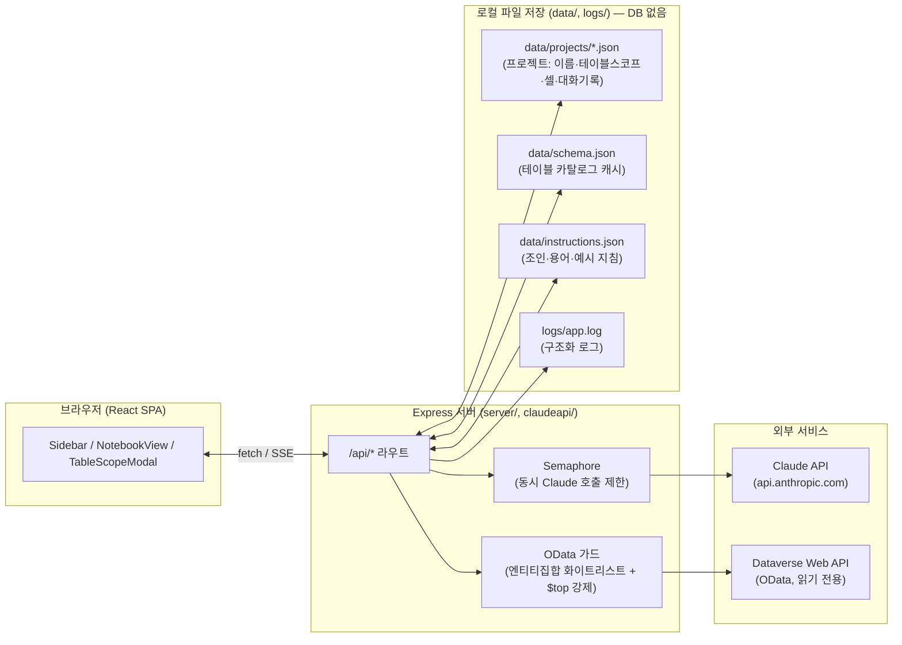
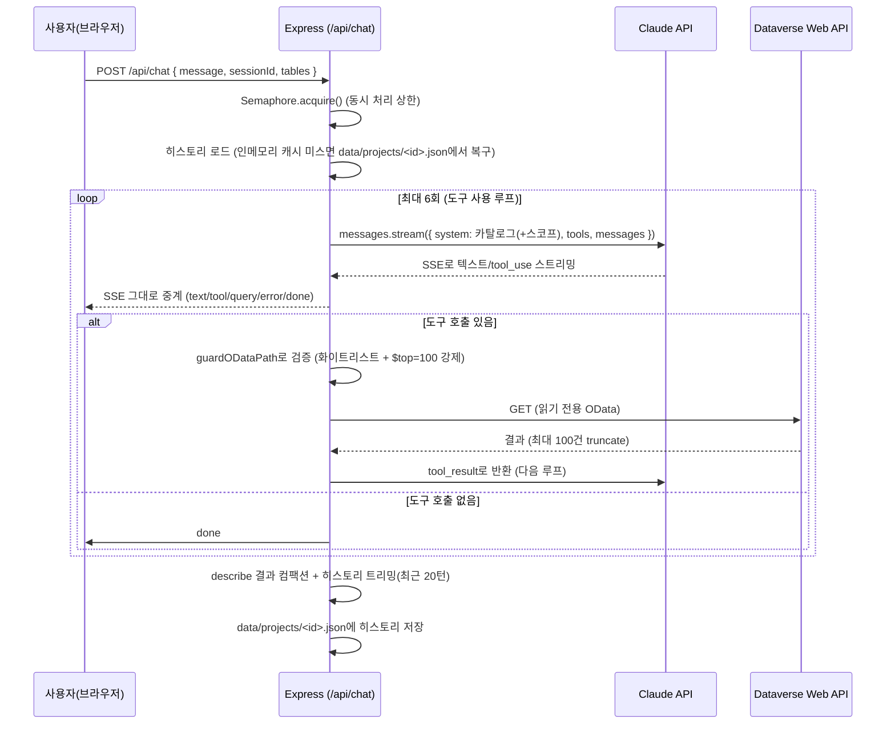

# Quali CRM AI Notebook

Dataverse(Dynamics 365 CRM)에 있는 데이터를 자연어로 물어보면 Claude가 OData 쿼리를
직접 만들어 조회하고 답해주는 사내 조회 전용(read-only) 노트북형 챗봇.

이 문서는 **인수인계용**입니다 — 코드를 처음 보는 사람이 아키텍처·데이터 흐름·운영
방법을 이 문서 하나로 파악할 수 있게 정리했습니다.

---

## 1. 한눈에 보는 아키텍처



**핵심 설계 결정**: DB가 없습니다. 모든 상태(프로젝트, 스키마 캐시, 지침, 로그)는
서버 로컬 디스크의 JSON/텍스트 파일입니다. 사내 소규모(수십 명 이하) 단일 인스턴스
운영을 전제로 한 의도적 단순화입니다 (§8 참고).

---

## 2. 핵심 개념 3가지

### 2.1 프로젝트 (구 "세션")
과거엔 "새 세션" 버튼으로 매번 휘발성 대화만 시작했지만, 지금은 **프로젝트**가 그
자리를 완전히 대체합니다. 프로젝트 하나 = `data/projects/<uuid>.json` 파일 하나:

| 필드 | 내용 |
|---|---|
| `name` | 사용자가 붙인 이름 |
| `tables` | 이 프로젝트가 조회할 수 있는 테이블 목록. **빈 배열 = 전체 테이블(스코프 제한 없음)** |
| `cells` | 노트북에 보이는 질문/답변 셀 원문 (프론트 전용 구조, 서버는 내용 해석 안 함) |
| `history` | Claude와 주고받은 원문 메시지 히스토리 — **API 응답에 절대 노출 안 됨**, 다음 질문의 문맥으로만 씀 |
| `createdAt` / `updatedAt` | 타임스탬프 |

사용자가 사이드바에서 🗑 눌러 명시적으로 지우기 전까지 서버 재시작·브라우저 새로고침에도
사라지지 않습니다. 자세한 코드는 [server/projects.ts](server/projects.ts).

### 2.2 테이블 스코프 → TextToSQL 범위 제한
프로젝트의 `tables`가 비어있지 않으면, 그 프로젝트로 보내는 모든 채팅 요청에서:
1. **시스템 프롬프트**의 [테이블 카탈로그] 목록이 그 테이블들로만 필터링되고
2. **OData 가드**(`guardODataPath`)가 그 목록 밖의 엔티티집합명 조회를 아예 차단합니다.

즉 모델이 스코프 밖 테이블을 "환각"으로 조회 시도해도 서버가 물리적으로 막고,
`tool_result` 오류로 돌려보내 모델이 스스로 "그 테이블은 범위 밖"이라고 답하게 만듭니다.
[claudeapi/chat-api.ts](claudeapi/chat-api.ts)의 `allowedEntitySets`/`guardODataPath`/`buildSystemPrompt` 참고.

### 2.3 스키마 카탈로그 (LLM 미사용, 순수 REST)
`data/schema.json`은 Dataverse의 `EntityDefinitions` 메타데이터 API를 직접 호출해
만듭니다 (LLM 호출 전혀 없음, [server/dataverse.ts](server/dataverse.ts)의 `fetchEntitySchema`).
사이드바의 "↻ 스키마 갱신" 버튼 = `POST /api/schemas/refresh`가 이 파일을 다시 채웁니다.

컨텍스트(=비용) 절약을 위해 매 요청 전체 컬럼을 다 보내지 않고, **테이블명·라벨·
엔티티집합명 한 줄짜리 "카탈로그"만** 시스템 프롬프트에 넣습니다. 실제 컬럼이 필요한
테이블은 모델이 `dataverse_describe_table` 도구로 그때그때 캐시 조회합니다(네트워크
호출 없음, 즉시 응답).

---

## 3. 질문 하나가 처리되는 순서



**오류 내성**: 요청이 중간에 실패하면 그 요청이 추가한 히스토리(반쪽짜리
tool_use/tool_result)를 통째로 롤백합니다 — 안 그러면 다음 요청부터 그 세션이
영구적으로 API 400을 반환합니다 (`rollbackLen` 처리, [claudeapi/chat-api.ts](claudeapi/chat-api.ts)).

---

## 4. 디렉토리 구조

```
├── src/                     프론트엔드 (React + Vite)
│   ├── App.tsx              최상위 상태(프로젝트 목록/활성 프로젝트) + 라우팅 없음(SPA 1페이지)
│   ├── api.ts               fetch 래퍼: streamChat(SSE), 프로젝트 CRUD, renderMd
│   ├── components/
│   │   ├── Header.tsx           로고 + 현재 프로젝트명 + Run All/셀추가
│   │   ├── Sidebar.tsx          연결상태 + 스키마갱신 + 프로젝트 목록
│   │   ├── TableScopeModal.tsx  테이블 선택 팝업 (검색 + 도메인별 체크리스트)
│   │   ├── NotebookView.tsx     셀 배열 상태 관리 + 자동저장(디바운스)
│   │   ├── NotebookCell.tsx     셀 하나(질문 입력 + 답변 출력 + 삭제확인)
│   │   ├── QueryPanel.tsx       답변 아래 접이식 "실행된 쿼리 보기"
│   │   └── LogModal.tsx         우측 상단에서 여는 서버 로그 뷰어(/api/logs 폴링)
│   └── types/index.ts       프론트 전용 타입 + shared 재수출
│
├── server/                  백엔드 공통 인프라
│   ├── index.ts             Express 앱 조립: 정적 서빙, 레이트리밋, 모든 /api/* 라우트
│   ├── dataverse.ts         Dataverse 인증(client_credentials) + OData GET + 메타데이터→마크다운
│   ├── projects.ts          프로젝트 영속화 (data/projects/*.json 읽기/쓰기)
│   ├── logger.ts            JSON 라인 로그(logs/app.log) + 콘솔 컬러 출력
│   ├── semaphore.ts         동시 실행 제어(대기열 + 포화 판단)
│   └── sse.ts                Server-Sent-Events 헬퍼 + HttpStatus 상수
│
├── claudeapi/chat-api.ts    채팅 엔드포인트 본체: 시스템 프롬프트 빌드, 도구 루프,
│                             OData 가드, 히스토리 관리(트리밍/컴팩션/롤백)
│
├── shared/types.ts          프론트·백엔드 공용 타입(SseEvent, Instructions, ProjectSummary 등)
│
├── data/                    🚫 git 추적 안 함 — 실행 중 생성되는 상태 파일
│   ├── schema.json              테이블 스키마 캐시
│   ├── instructions.json        조인/용어/예시 지침
│   └── projects/<uuid>.json     프로젝트별 상태(위 §2.1)
│
├── logs/                    🚫 git 추적 안 함
│   ├── app.log                   구조화 로그(JSON lines), 일별 로테이션 + 50MB 캡 + gzip 보관 30개
│   └── console.log               (Windows) 원시 stdout/stderr — 시작 실패 진단용, 재시작마다 초기화
│
└── scripts/
    ├── server.ps1            Windows 운영 스크립트 (start/stop/restart/status/logs)
    ├── server.sh             Linux 운영 스크립트 (+ cron-setup/cron-remove)
    ├── ecosystem.config.js   PM2로 돌릴 때 쓰는 대안 배포 설정
    ├── warmup_schema.sh      배포 직후 스키마 캐시 워밍업(= "스키마 갱신" 버튼의 CLI판)
    └── nginx.conf.example    리버스 프록시 예시
```

---

## 5. API 레퍼런스

| Method | Path | 설명 |
|---|---|---|
| `POST` | `/api/chat` | 채팅(SSE 스트림). Body: `{ message, sessionId, tables? }`. 이벤트: `text`/`tool`/`query`/`error`/`done` |
| `GET` | `/api/projects` | 프로젝트 목록(요약: id/name/tables/생성·수정시각) |
| `POST` | `/api/projects` | 프로젝트 생성. Body: `{ name, tables? }` |
| `GET` | `/api/projects/:id` | 프로젝트 상세(name/tables/cells) — `history`는 절대 포함 안 됨 |
| `PATCH` | `/api/projects/:id` | 부분 수정 `{ name?, tables?, cells? }` (이름변경·스코프변경·셀 자동저장 모두 이걸 씀) |
| `DELETE` | `/api/projects/:id` | 완전 삭제 (파일 자체를 지움, 복구 불가) |
| `GET` | `/api/tables` | 전체 테이블 카탈로그(도메인별 그룹) — Sidebar/TableScopeModal이 씀 |
| `POST` | `/api/schemas/refresh` | Dataverse에서 전체 테이블 스키마 재조회(배치 6개 병렬) → schema.json 갱신 |
| `GET` | `/api/describe?table=` | 테이블 하나의 스키마 조회 (캐시 있으면 즉시, 없으면 조회 후 캐시) |
| `GET` | `/api/instructions` / `POST` | 조인/용어/예시 지침 읽기/쓰기 (data/instructions.json) |
| `GET` | `/api/logs?n=` | 최근 로그 N건 (LogModal이 10초 간격 폴링) |
| `GET` | `/api/health` | 헬스체크: uptime, 스키마 테이블 수, 채팅 가능 여부, 동시처리 현황 |

`/api/chat`·`/api/describe`는 `RATE_LIMIT_*` 레이트리밋 적용. `API_KEY` 환경변수를
설정하면 모든 `/api/*`에 `X-API-Key` 헤더 필수(사내망이라도 켜는 걸 권장).

---

## 6. 환경변수

`.env.example`을 복사해 `.env`로 쓰세요(`.env`는 git에 절대 안 올라감). 코드가 실제로
읽는 전체 목록:

| 변수 | 필수 | 기본값 | 설명 |
|---|---|---|---|
| `ANTHROPIC_API_KEY` | ✅ | — | 없으면 `/api/chat` 자체가 등록 안 됨 |
| `DATAVERSE_TENANT_ID` / `_CLIENT_ID` / `_CLIENT_SECRET` / `DATAVERSE_URL` | ✅ | — | Azure 서비스 주체(client_credentials) |
| `PORT` | — | `3000` | |
| `ANTHROPIC_MODEL` | — | `claude-haiku-4-5` | 속도 우선 모델 |
| `ANTHROPIC_MAX_TOKENS` | — | `4096` | |
| `MAX_CONCURRENT_API` | — | `10` | 동시 Claude 스트림 수 (Semaphore) |
| `CHAT_TIMEOUT_MS` | — | `120000` | |
| `MAX_SESSIONS` | — | `200` | 인메모리 히스토리 캐시 상한(초과 시 오래된 것부터 정리 — **디스크 파일은 안 지워짐**) |
| `DESCRIBE_TIMEOUT_MS` | — | `60000` | |
| `RATE_LIMIT_WINDOW_MS` / `RATE_LIMIT_MAX` | — | `60000` / `20` | |
| `API_KEY` | — | (없음=인증 비활성) | |
| `LOG_MAX_FILES` | — | `30` | app.log 로테이션 보관 개수 |
| `SHUTDOWN_TIMEOUT_MS` | — | `30000` | graceful shutdown 강제 종료 대기 |
| `VITE_APP_NAME` / `VITE_CONN_NAME` | — | `Quali CRM` / `Quali Cloud` | UI 타이틀/사이드바 연결명 |

---

## 7. 실행 / 운영

```bash
npm install
npm run dev            # 서버(tsx watch)+프론트(vite) 동시 실행, 개발용
npm run build           # 프론트+서버 프로덕션 빌드
npm run type-check      # tsc --noEmit (client) + tsc -p tsconfig.server.json (server)
```

**Windows 운영** (`scripts/server.ps1`):
```powershell
powershell -ExecutionPolicy Bypass -File scripts\server.ps1 start|stop|restart|status|logs
```
`start`/`restart`는 프론트 빌드 → cmd.exe로 tsx 백그라운드 실행 → `logs/console.log`로
stdout/stderr 리다이렉트까지 자동으로 합니다. `status`는 PID와 최근 app.log 5줄을,
`logs`는 실시간 tail을 UTF-8로 정확히 보여줍니다.

> PowerShell 실행 정책이 `Restricted`면 프로필/스크립트 로드가 막힙니다.
> `Set-ExecutionPolicy -Scope CurrentUser RemoteSigned` 한 번 해두세요(관리자 권한 불필요).

**Linux 운영** (`scripts/server.sh`): `start|stop|restart|status|logs|cron-setup|cron-remove`.
**PM2로 돌리는 대안**: `scripts/ecosystem.config.js` (`pm2 start ecosystem.config.js --env production`).

---

## 8. 알려진 제약 (설계상 트레이드오프 — 버그 아님)

- **DB 없음, 단일 인스턴스 전제**: 모든 상태가 로컬 파일이라 여러 서버 인스턴스로
  수평 확장하면 상태가 안 맞습니다. 수십 명 이하 사내 도구 목적엔 충분.
- **동시 쓰기 보호는 "동기 fs 호출"에만 의존**: `server/projects.ts`의 읽기-수정-쓰기가
  전부 동기 함수라 Node 이벤트 루프 특성상 안전하지만, 파일 잠금 같은 진짜 트랜잭션은
  없습니다.
- **인증은 선택사항**: `API_KEY` 설정 안 하면 사내망에 접근 가능한 누구나 사용 가능.
- **`MAX_SESSIONS` 정리는 인메모리 캐시만 비움**: `data/projects/*.json` 파일 자체는
  사용자가 사이드바에서 지워야만 삭제됩니다.
- **읽기 전용**: 커스텀 도구가 `dataverse_query`(GET)와 `dataverse_describe_table` 딱
  둘 — 쓰기 도구 자체가 존재하지 않아 모델이 데이터를 바꿀 방법이 없습니다.

## 9. 트러블슈팅

- **로그/터미널에 한글이 깨져 보임**: Windows PowerShell이 `-Encoding` 없이 파일을
  읽으면 시스템 기본 코드페이지(한국어 Windows는 CP949)로 잘못 해석합니다. 파일
  자체는 정상 UTF-8입니다. `Get-Content ... -Encoding UTF8`을 쓰거나, 이 PC의
  PowerShell 프로필에 `$PSDefaultParameterValues['Get-Content:Encoding']='UTF8'`이
  이미 등록돼 있어 새 터미널 창에서는 자동 해결됩니다.
- **서버 시작 실패**: `logs/console.log` 확인(빌드 에러·모듈 로드 실패 등 app.log보다
  먼저 발생하는 문제까지 잡힘). `scripts/server.ps1 start`가 실패 시 자동으로 마지막
  20줄을 보여줍니다.
- **`ANTHROPIC_API_KEY 미설정` 에러**: `.env` 확인. 채팅 라우트 자체가 등록 안 된 상태.
