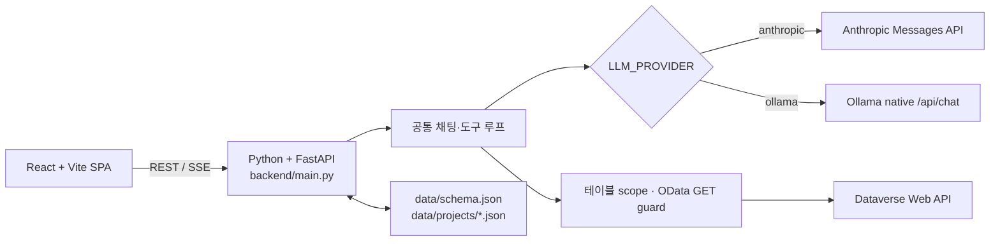

# Quali CRM AI Notebook

> 2026-08-13 기준 기능 개발을 종료하고 인수인계 상태로 전환했습니다. 전체 문서는 [📚 docs/](docs/README.md)에서 시작하세요.

Dataverse(Dynamics 365 CRM)를 자연어로 조회하는 읽기 전용 노트북형 챗봇입니다. React + Vite 프론트엔드와 Python/FastAPI 백엔드로 이루어진 **단일 프로젝트**이며, `.env`의 `LLM_PROVIDER`만 `anthropic`(Cloud)/`ollama`(Local)로 바꾸면 같은 코드가 클라우드·로컬 LLM을 모두 처리합니다.

## 아키텍처



앱이 LLM에 노출하는 도구는 `dataverse_describe_table`, `dataverse_query` 두 개뿐이고(생성·수정·삭제 없음) MCP 프로토콜은 쓰지 않는 **직접 tool-loop(Text-to-OData)** 방식입니다. 같은 종류의 조회를 MCP로 감싼 독립 제품은 별도 저장소 [crm-ai-chat-mcp](../crm-ai-chat-mcp)입니다 — 이 웹앱은 그 저장소를 호출하지 않습니다.

## 빠른 시작

```powershell
Copy-Item .env.example .env
python -m venv .venv
.venv\Scripts\python -m pip install -r requirements.txt
npm install
npm run dev
```

`npm run dev`는 Uvicorn/FastAPI와 Vite를 함께 실행합니다(브라우저 `http://localhost:3000`). 운영 실행 스크립트, 환경변수 전체, API, 배포 시나리오, 백업·복원은 문서를 보세요.

## 더 읽기

| | |
|---|---|
| 📚 [문서 인덱스](docs/README.md) | 통합 인수인계서, 배포 결정표·설치 가이드, Notion 검증 결과로 연결 |
| 🗒️ [통합 인수인계서](docs/HANDOVER.md) | 아키텍처·API·정책·권한·인프라·검증 상세 |
| 📦 [배포 결정표](docs/DEPLOYMENT_OPTIONS.md) | 어떤 환경에 무엇을 어떻게 설치할지, git/tar 인도 방법 |
| 🔗 [Notion 인수인계 허브](https://app.notion.com/p/CRM-AI-Chat-3b5bcaaf1f52814f8843e4bcab4e1791) | 프로젝트 비교·인프라·제품화 로드맵 (검증 결과는 [docs/NOTION.md](docs/NOTION.md)) |
