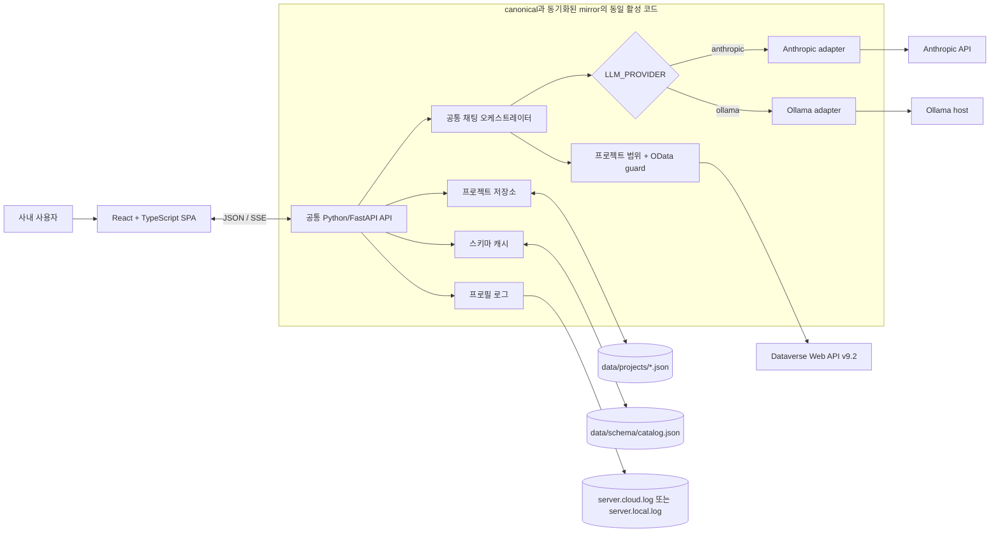
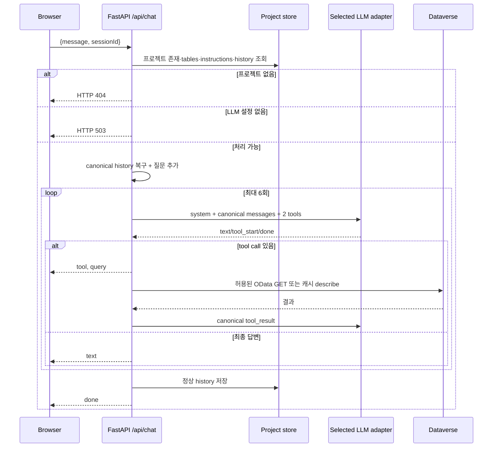

# CRM AI Notebook 통합 인수인계서

> 2026-08-13 기준, 신규 기능 개발 종료·유지보수 전환. 2026-08-21에 "지침" UI(조인·용어·예시)를
> 모달에서 상시 우측 패널 + 클릭 기반 관계 다이어그램으로 재작업했다(§3, §5, §12 참고) —
> 프로덕트 스코프(§1.2, §9의 인증·쓰기 금지 등 보안 경계)는 그대로이고, "지침을 어떻게
> 채우는가"라는 UX만 바뀐 유지보수성 개선이라 위 종료 선언과 배치되지 않는다. 기준 런타임:
> React + TypeScript 프론트엔드 + Python/FastAPI 백엔드.

**제품 코드의 기준은 `crm-ai-chat` 하나뿐이다.** Cloud/Local은 별도 저장소가 아니라 같은 코드에서 `LLM_PROVIDER` 값만 다른 두 배포 프로필이며, 동일한 Python/FastAPI와 프론트엔드를 사용하고 배포 환경의 LLM 제공자·모델·접속 정보와 활성 로그 파일만 다르다. (별도 저장소인 `crm-ai-chat-mcp`는 이 제품과 무관한 독립 MCP 서버다.)

---

## 0. 먼저 읽을 결론

### 0.1 종료 상태

- 자연어 질문을 LLM이 해석해 Microsoft Dataverse Web API의 OData GET으로 바꾸는 노트북형 사내 도구다. SQL을 생성·실행하는 Text-to-SQL이 아니라 **Text-to-OData**다.
- 브라우저, FastAPI, 프로젝트 저장소, 프롬프트, Dataverse 도구, SSE, 오류 계약은 두 프로필이 같다.
- 차이는 `LLM_PROVIDER`와 해당 제공자의 모델·base URL·자격증명뿐이다.
- Cloud는 `anthropic`, Local은 `ollama` 프로필을 사용한다.
- 활성 로그는 프로필별로 정확히 하나다. Cloud는 `logs/server.cloud.log`, Local은 `logs/server.local.log`다.
- 앱이 LLM에 제공하는 CRM 도구는 `dataverse_describe_table`, `dataverse_query` 두 개뿐이며 생성·수정·삭제 도구는 없다.
- 신규 기능 개발은 종료한다. 장애·보안·규정·업무 변경이 확인될 때만 유지보수한다.
- 현재 사용자 인증·RBAC·프로젝트 소유권이 없으므로 인터넷 공개 또는 불특정 다중 사용자 운영에 적합하지 않다.

### 0.2 두 프로필 비교

| 항목 | Cloud 프로필 | Local 프로필 | 공통 여부 |
|---|---|---|:---:|
| 저장소 역할 | `crm-ai-chat` 단일 저장소, `.env`의 `LLM_PROVIDER=anthropic` | 같은 저장소, `LLM_PROVIDER=ollama` | O(같은 저장소) |
| 프론트엔드 | React 18 + TypeScript + Vite | 동일 | O |
| 백엔드 | Python + FastAPI/Uvicorn | 동일 | O |
| 채팅 오케스트레이터 | `backend/chat_api.py` | 동일 | O |
| LLM 어댑터 | Anthropic Messages REST/SSE | Ollama native `/api/chat` NDJSON | 프로필 차이 |
| 기본 모델 | `claude-haiku-4-5` | `qwen3:30b-a3b` | 환경에서 변경 가능 |
| LLM 상태 확인 | Anthropic `/v1/models` | Ollama `/api/tags` | 어댑터 내부 차이 |
| Dataverse/API/UI/저장 | 동일 | 동일 | O |
| 활성 로그 | `logs/server.cloud.log` | `logs/server.local.log` | 파일명만 다름 |
| 질문 데이터 위치 | Anthropic 외부 서비스로 전달 가능 | Ollama 실행 호스트에서 처리 | 데이터 경계 차이 |

이 저장소에서 현행 백엔드 기능 판단의 기준은 `backend/`, `requirements.txt`, `package.json`이다. `npm run dev:server`는 `backend.main:app`을 Uvicorn으로 실행하고 `npm start`는 `python -m backend.main`을 실행한다. 과거 `server/*.ts`, `dist-server/`, `claudeapi/` 소스가 checkout에 남아 있어도 활성 런타임 근거로 사용하지 않는다.

### 0.3 유지보수 원칙

1. 공통 기능을 수정한 뒤 Cloud/Local 두 프로필을 함께 회귀 검증한다(단일 저장소이므로 별도 mirror 동기화 단계는 없다).
2. 제공자별 코드는 `backend/anthropic_provider.py`, `backend/ollama_provider.py` 경계 안에 둔다.
3. `backend/chat_api.py`와 프론트엔드에 제공자별 분기를 추가하지 않는다.
4. 배포 차이는 `.env`로만 표현한다.
5. `data/`, `logs/`, `.env`는 Git에 없으므로 별도 백업 없이 저장소만 복제하면 복구되지 않는다.

---

## 1. 제품 범위

### 1.1 제공 기능

- 프로젝트 생성·조회·이름 변경·삭제
- 프로젝트별 Dataverse 테이블 범위 설정
- 프로젝트별 테이블 관계·업무 용어·질문 예시 지침 저장(상시 우측 패널, 탭마다 자체 후보 —
  조인은 관계 다이어그램에서 컬럼 클릭으로 생성, 용어는 Dataverse에 설명 없는 컬럼만 자동
  후보로, 예시는 실제로 실행해 확인한 노트북 셀에서 가져옴 — 전역 로그 기반 "초안 생성"
  버튼은 2026-08-21에 제거)
- 질문 셀 추가·실행·전체 실행·삭제·자동 저장
- LLM 도구 호출과 실제 OData 상대 경로 표시
- Markdown 답변, 표 CSV 및 일반 답변 TXT 내보내기
- Dataverse 스키마 조회·캐시·전체 갱신
- 서버 상태 및 활성 프로필 로그 조회 API
- 성공한 대화 이력의 프로젝트별 영속화와 이전 형식 자동 정규화

### 1.2 범위 밖

- Dataverse 레코드 생성·수정·삭제
- 사용자 로그인, 사용자별 권한, RBAC, 프로젝트 소유권
- 공유 데이터베이스, 다중 인스턴스 동기화, 트랜잭션
- 자동 백업·휴지통·삭제 복구
- 신규 Dataverse 테이블의 자동 발견과 초기 카탈로그 생성
- 인터넷 공개를 위한 TLS/WAF/SSO/감사 체계
- Ollama native API와 Anthropic Messages API 이외의 LLM 프로토콜 보장

### 1.3 핵심 용어

| 용어 | 정의 |
|---|---|
| 프로필 | 같은 앱에서 LLM 제공자와 로그 파일을 선택하는 실행 설정. `anthropic`은 Cloud, `ollama`는 Local이다. |
| 프로젝트 | 이름, 테이블 범위, 지침, 셀, LLM history를 한 JSON 파일로 저장하는 작업 단위 |
| 테이블 범위 | 프로젝트가 LLM에 제공하고 서버가 OData 시작 엔티티 집합에 적용하는 범위. Dataverse 보안 역할을 대체하지 않는다. |
| canonical history | `text`, `tool_call`, `tool_result` 블록으로 통일한 공급자 중립 대화 형식 |
| 스키마 캐시 | `data/schema/catalog.json`의 테이블·컬럼·라벨·엔티티 집합명 메타데이터 |
| SSE | 서버가 `text`, `tool`, `query`, `error`, `done` 이벤트를 브라우저에 전달하는 스트림 |

---

## 2. 통합 아키텍처



### 2.1 계층별 책임

| 계층 | 주요 파일 | 책임 |
|---|---|---|
| UI | `src/` | 프로젝트·셀·지침 UI, REST/SSE 소비, 자동 저장, 내보내기 |
| API | `backend/main.py` | FastAPI 12개 API, 정적 파일, 선택 API 키, 레이트리밋, health |
| 채팅 | `backend/chat_api.py` | 서버 권위 컨텍스트, 프롬프트, 최대 6회 도구 루프, 롤백·저장 |
| 공급자 계약 | `backend/llm_provider.py` | 공급자 중립 message/tool/usage/health 타입 |
| 공급자 어댑터 | `backend/anthropic_provider.py`, `backend/ollama_provider.py` | 외부 프로토콜 ↔ canonical 계약 변환 |
| 공급자 선택 | `backend/provider_factory.py` | `LLM_PROVIDER` 검증과 어댑터 수명주기 |
| history | `backend/history.py` | 기존 형식 정규화, describe 결과 압축, 질문 경계 trim |
| Dataverse | `backend/dataverse.py` | Entra client credentials, GET, 메타데이터 조회, 토큰 캐시 |
| 프로젝트 | `backend/projects.py` | 프로젝트 JSON CRUD, ID 검증, history 비노출·저장 |
| 로깅 | `backend/logger.py` | 프로필 로그 선택, JSON Lines 기록, 회전·gzip |

### 2.2 공급자 중립 계약

- 채팅 코어는 `LlmProvider.stream()`과 `LlmProvider.health()`만 사용한다.
- Anthropic의 `tool_use`와 Ollama의 `tool_calls`는 모두 `tool_call`로 변환한다.
- 도구 결과는 공급자에 관계없이 `tool_result`로 저장한다.
- 이전 Anthropic/OpenAI 계열 history는 읽을 때 메모리에서 canonical 형식으로 변환하고 다음 성공 저장 때 교체한다.
- 공급자를 바꿔도 프로젝트와 history 형식은 유지된다.

### 2.3 활성·레거시 경계

| 경로 | 현재 상태 | 처리 원칙 |
|---|---|---|
| `backend/` | 유일한 활성 Python/FastAPI 백엔드 | 현행 기능·장애 수정의 기준 |
| `server/*.ts`, `dist-server/` | 이전 TypeScript 서버 흔적 | 실행·빌드·문서 근거로 사용하지 않음 |
| `claudeapi/` | 이전 분리 채팅 오케스트레이터 흔적 | 현행 실행 대상 아님 |
| `data/instructions.json` | 이전 전역 지침 | 프로젝트에 `instructions`가 없을 때 한 번 복사하는 마이그레이션 원본 |

---

## 3. 사용자 화면과 메뉴

브라우저 라우트는 `/` 하나다. 별도 로그인·관리자 화면은 없다.

| Screen ID | 화면 | 진입 | 핵심 기능 |
|---|---|---|---|
| `UI-01` | 메인 노트북 | `/` | 셀 실행·전체 실행·추가, 프로젝트 전환 |
| `UI-02` | 프로젝트 사이드바 | 좌측 패널 | 프로젝트 CRUD, 테이블 범위, 스키마 갱신 |
| `UI-03` | 테이블 선택 | 프로젝트의 테이블 수/추가 버튼 | 검색·도메인 필터·전체/개별 선택 |
| `UI-04` | 프로젝트별 지침 | 헤더 `지침` 토글(왼쪽 카탈로그 사이드바와 대칭되는 오른쪽 상시 패널) | 조인은 스키마 FK 기반 자동 후보(클릭 한 번으로 추가) + "🗺 다이어그램으로 연결하기"(컬럼 클릭 → 대상 테이블 클릭, 시스템 감사·소유권 컬럼은 표시에서 제외), 용어는 설명 없는 컬럼만 후보로 보여주는 목록, 예시는 노트북에서 실제로 실행해 확인한 셀을 가져오거나 질문·답변을 직접 입력 |
| `UI-05` | 질문 셀 | 노트북 반복 항목 | 입력·실행·상태·답변·쿼리·내보내기 |

(과거 `UI-06` 서버 로그 화면은 메뉴에 연결된 적 없는 미완성 컴포넌트였다. 2026-08-18 정리에서 `src/components/LogModal.tsx`를 삭제했다 — `/api/logs`는 API로는 남아 있고 화면만 없다.)

UI는 Cloud/Local에서 같으며 제공자 이름은 연결 환경 표시와 응답 특성에만 영향을 준다.

---

## 4. 질문 처리 계약



### 4.1 서버 권위 규칙

- 브라우저는 `message`, `sessionId`만 전송한다.
- 서버가 저장 프로젝트의 `tables`, `instructions`, `history`를 다시 읽는다.
- 요청 body로 테이블 범위나 지침을 바꿀 수 없다.
- 존재하지 않거나 형식이 잘못된 `sessionId`는 404이며 새 프로젝트 파일을 만들지 않는다.
- 프로젝트 생성·수정에서 `name`, `tables`, `instructions`, `cells`의 외형을 검사하고 `tables`의 모든 논리명이 현재 카탈로그에 등록됐는지 확인한다.
- 허용할 `entitySetName`이 하나도 없으면 조회를 거부하는 fail-closed 방식이다.
- OData 입력은 엔티티 집합명으로 시작하는 상대경로만 허용하며 절대 URL, CR/LF, 역슬래시, fragment, `$batch`, `$ref`, `$value`를 Dataverse 호출 전에 거절한다.
- 일반 컬렉션 쿼리에 `$top`이 없으면 `$top=100`을 추가하고, 명시된 `$top`이 100을 넘으면 100으로 낮춘다. `$count=true`도 행 조회이므로 같은 상한을 적용한다.
- 도구 결과 전체는 직렬화 기준 최대 8 KiB이며, JSON `value` 배열은 그 안에서 최대 100행만 모델에 제공한다.
- 오류·취소 때 현재 요청에서 추가한 history를 롤백한다.

### 4.2 LLM 도구

| 도구 | 입력 | 실행 주체 | 효과 |
|---|---|---|---|
| `dataverse_describe_table` | `{ table }` | 앱 서버 | `data/schema/catalog.json`에서 컬럼·타입·엔티티 집합명을 읽음 |
| `dataverse_query` | `{ path }` | 앱 서버 | Dataverse Web API에 인증된 GET 수행 |

도구가 정의돼 있다는 사실과 실제 사용 기록은 다르다. 종료 전 레거시 로그·저장 history 감사에서는 두 도구 모두 실제 호출 흔적이 확인됐다. 로그와 history는 같은 호출을 중복 기록할 수 있으므로 단순 합산하지 않는다.

### 4.3 별도 Dataverse MCP와의 관계

`C:\Users\hansu\projects\crm-ai-chat-dataverse-mcp`는 표준 MCP(JSON-RPC over stdio) 서버로 `dataverse://catalog` resource와 같은 이름의 두 도구를 제공한다. 그러나 이 웹앱은 그 MCP 프로세스를 자식 프로세스나 네트워크 서비스로 호출하지 않는다.

| 경로 | 실행 방식 | 용도 |
|---|---|---|
| 통합 웹앱 | FastAPI 내부 provider-neutral tool calling → `backend/dataverse.py` → REST/OData GET | 브라우저 제품의 실제 질문 처리 |
| 별도 MCP 저장소 | MCP client가 stdio child process로 실행 → resource/tool call | 연결·탐색·스키마/도구 검증, MCP client 사용 |

도구 이름과 안전장치 개념을 공유한다고 해서 웹앱이 MCP runtime을 사용했다는 뜻은 아니다. 운영·장애 조사에서는 두 실행 경로의 로그와 프로세스를 구분한다.

---

## 5. HTTP API

두 프로필 모두 아래 13개를 같은 URI와 계약으로 제공한다.

| No. | Method | URI | 목적 |
|---:|:---:|---|---|
| 1 | POST | `/api/chat` | LLM·Dataverse 도구 루프, SSE 응답 |
| 2 | GET | `/api/projects` | 프로젝트 요약 목록 |
| 3 | POST | `/api/projects` | 프로젝트 생성 |
| 4 | PUT | `/api/projects/reorder` | 사이드바에서 옮긴 프로젝트 순서 저장 |
| 5 | GET | `/api/projects/{project_id}` | 프로젝트 상세(history 제외) |
| 6 | PATCH | `/api/projects/{project_id}` | 이름·테이블·지침·셀 수정 |
| 7 | DELETE | `/api/projects/{project_id}` | 프로젝트 즉시 삭제 |
| 8 | GET | `/api/projects/{project_id}/join-candidates` | 스키마 FK 기반 조인 후보 계산(저장 안 함) |
| 9 | GET | `/api/tables` | 등록 테이블 카탈로그 |
| 10 | POST | `/api/schemas/refresh` | 기존 카탈로그의 메타데이터 갱신 |
| 11 | GET | `/api/describe?table=...` | 스키마 조회·캐시 |
| 12 | GET | `/api/logs?n=...` | 활성 프로필 최신 로그 |
| 13 | GET | `/api/health` | 앱·LLM·Dataverse 설정·동시성 상태 |

(2026-08-21에 `GET /api/instructions/draft`를 제거했다 — 로그 전체를 훑어 조인·용어·예시를
한 번에 채우던 전역 기능이 프로젝트 스코프 밖이라는 문제가 있었고, 각 지침 탭이 이제
자기 프로젝트 범위의 후보를 직접 보여줘서 중복이었다: 조인은 관계 다이어그램, 용어는
"정의 필요" 컬럼 목록, 예시는 노트북 셀 가져오기. `backend/instructions_draft.py`도 같이 삭제.)

### 5.1 채팅 SSE 이벤트

| 이벤트 | 필드 | 의미 |
|---|---|---|
| `text` | `text` | 최종 사용자 답변 텍스트 |
| `tool` | `name` | 모델이 도구 호출을 시작함 |
| `query` | `tool`, `input` | 앱 서버가 실행하려는 도구와 입력 |
| `error` | `message` | 스트림 시작 후 실패 |
| `done` | 없음 | 정상 완료 |

### 5.2 주요 HTTP 상태

| 상태 | 조건 |
|---:|---|
| 400 | 채팅의 `message` 또는 `sessionId` 누락, describe의 `table` 누락 |
| 401 | `API_KEY`를 켠 상태에서 키 누락·불일치 |
| 404 | 프로젝트가 없거나 ID가 유효하지 않음, 미등록 `/api/*` 경로 |
| 413 | mutation JSON body가 기본 1 MiB 상한을 초과함 |
| 415 | mutation 요청의 Content-Type이 JSON 계열이 아님 |
| 422 | FastAPI typed query/path validation 실패 |
| 429 | IP 레이트리밋 또는 채팅 동시성 과부하 |
| 500 | 파일·Dataverse·내부 처리 오류 |
| 503 | 선택한 LLM 설정 미완료, 프론트 빌드 없음 |

---

## 6. 데이터와 백업

### 6.1 프로젝트 파일

`data/projects/<id>.json`은 다음을 함께 가진다.

```json
{
  "id": "uuid",
  "name": "영업 분석",
  "tables": ["account", "opportunity"],
  "instructions": { "joins": [], "terms": [], "examples": [] },
  "cells": [],
  "history": [],
  "createdAt": "ISO-8601",
  "updatedAt": "ISO-8601"
}
```

프로젝트 API는 `history`를 응답에서 제거하지만 파일에는 CRM 조회 결과가 포함된 tool result가 저장될 수 있다. 셀 답변에도 CRM 값이 남을 수 있다.

### 6.2 스키마 파일

`data/schema/catalog.json`은 앱이 알고 있는 테이블 카탈로그다. 전체 갱신은 이미 등록된 키만 새로 조회하며 새 clone에서 전체 테이블을 자동 발견하지 않는다.

### 6.3 로그

| 프로필 | 활성 파일 | 내용 |
|---|---|---|
| Cloud | `logs/server.cloud.log` | JSON Lines 구조화 로그 |
| Local | `logs/server.local.log` | 같은 형식의 JSON Lines 구조화 로그 |

회전 조건은 1일 또는 50MB이며 `LOG_MAX_FILES` 기본 30개, 회전본 gzip 압축이다. 질문·답변 일부, 도구 입력, 오류가 포함될 수 있으므로 민감 데이터로 취급한다. 과거 `logs/app.log` 등은 마이그레이션 전 이력이며 현행 `/api/logs`가 읽는 활성 파일이 아니다.

### 6.4 반드시 백업할 항목

| 우선순위 | 항목 | 이유 |
|:---:|---|---|
| P0 | `.env` 또는 비밀 저장소의 값 | LLM·Dataverse 연결 복구. 평문 백업 접근 제한 필요 |
| P0 | `data/schema/catalog.json` | 카탈로그와 엔티티 집합명. Git에 없음 |
| P0 | `data/projects/` | 지침·셀·canonical history. Git에 없음 |
| P1 | `logs/server.*.log` 및 회전본 | 감사·장애 분석. 업무/CRM 데이터 포함 가능 |
| P1 | 정확한 소스 revision과 lockfile | 앱 코드·의존성 재현 |

백업 전 앱 쓰기를 중지하거나 일관된 스냅샷을 사용한다. 복구 후 `npm run build`, `/api/health`, 프로젝트 조회, 대표 읽기 질문을 확인한다.

---

## 7. 환경변수

### 7.1 프로필 선택

| 변수 | Cloud | Local | 설명 |
|---|---|---|---|
| `LLM_PROVIDER` | `anthropic` | `ollama` | 허용값은 두 개뿐. 미설정 기본은 `anthropic`; 운영에서는 명시 |
| `LLM_MODEL` | Claude 모델 | Ollama 모델 | 공통 모델 override |
| `LLM_BASE_URL` | Anthropic endpoint | Ollama endpoint | 공통 base URL override |
| 제공자 키 | `ANTHROPIC_API_KEY` 필수 | 없음 | Ollama native adapter는 `LOCAL_LLM_API_KEY`를 사용하지 않음 |
| 로그 | 자동 Cloud 파일 | 자동 Local 파일 | `LLM_PROVIDER`에서 파생 |

공통 override가 없으면 Anthropic은 `ANTHROPIC_MODEL`, `ANTHROPIC_BASE_URL`, Ollama는 `LOCAL_LLM_MODEL`, `LOCAL_LLM_BASE_URL`을 사용한다.

### 7.2 공통 주요 변수

| 변수 | 기본값 | 의미 |
|---|---:|---|
| `PORT` | `3000` | FastAPI/Uvicorn 앱 포트 |
| `VITE_API_PROXY_TARGET` | `http://localhost:${PORT}` | Vite 개발 프록시 override |
| `CHAT_TIMEOUT_MS` | `120000` | LLM 요청 제한 시간 |
| `DESCRIBE_TIMEOUT_MS` | `60000` | Dataverse 요청 제한 시간 |
| `MAX_CONCURRENT_API` | `10` | 동시 채팅 처리 상한 |
| `MAX_SESSIONS` | `200` | 메모리 history 세션 상한 |
| `RATE_LIMIT_WINDOW_MS` | `60000` | 채팅·describe IP 제한 창 |
| `RATE_LIMIT_MAX` | `20` | 창당 요청 수 |
| `LOG_MAX_FILES` | `30` | 회전 로그 보존 개수 |
| `API_KEY` | 빈 값 | 모든 `/api/*`에 적용하는 선택 공유 키 |

Dataverse 필수값은 `DATAVERSE_TENANT_ID`, `DATAVERSE_CLIENT_ID`, `DATAVERSE_CLIENT_SECRET`, `DATAVERSE_URL`이다.

> `API_KEY` 주의: 서버는 `X-API-Key` 또는 `api_key`를 검사하지만 현재 SPA는 키를 보내지 않는다. 별도 인증 프록시가 안전하게 헤더를 주입하지 않는 상태에서 활성화하면 브라우저 API가 401로 중단된다. Query string 키는 로그·브라우저 기록 유출 위험 때문에 권장하지 않는다.

---

## 8. 설치·실행·검증

두 프로필의 실행 명령은 같고 `.env`만 다르다.

```powershell
python -m venv .venv
.venv\Scripts\python -m pip install -r requirements.txt
npm install
npm run type-check
npm test
npm run build
npm start
```

개발 모드는 다음과 같다.

```powershell
npm run dev
```

Vite는 기본 5173, FastAPI/Uvicorn은 `PORT`를 사용하며 프록시는 `VITE_API_PROXY_TARGET` 또는 같은 `PORT`로 계산된다. `npm run build`는 SPA `dist/`만 만들고 Python 백엔드는 별도 빌드 산출물이 없다.

2026-08-13 자동 검증은 `npm run type-check`, `npm test` 43/43, `npm run build`, Python 컴파일을 통과했다. 현행 FastAPI의 Local Ollama(`qwen3:8b`) 프로필도 canonical checkout과 Local mirror checkout 각각에서 Dataverse REST 읽기 전용 `$top=0` 라이브 E2E를 통과했다. 두 실행 모두 health/schema, 프로젝트 지침, describe 1회, query 2회, SSE done 1/error 0, marker와 cleanup을 확인했으며 CRM 행은 LLM에 보내지 않았다. Anthropic live는 내부 스키마 외부 전송 위험 때문에 안전 심사에서 차단해 실행하지 않았으며 adapter mock 계약 테스트만 통과했다.

### 8.1 프로필별 사전조건

| 프로필 | 필수 확인 |
|---|---|
| Cloud | `LLM_PROVIDER=anthropic`, 유효한 Anthropic 키·모델, 외부 전송 승인, outbound HTTPS |
| Local | `LLM_PROVIDER=ollama`, Ollama 실행, 모델 설치, `/api/tags` 접근, CPU/RAM/VRAM 용량 |
| 공통 | Dataverse 서비스 주체·URL, `data/schema/catalog.json`, `data/projects/` 복구, 앱 포트 접근 통제 |

### 8.2 시작 후 확인

1. `GET /api/health`에서 `chat.provider`, `chat.model`, `chat.health.status`, `chat.enabled`를 확인한다.
2. `GET /api/tables`에서 카탈로그가 비어 있지 않은지 확인한다.
3. 프로젝트 목록과 기존 셀이 복원되는지 확인한다.
4. `dataverse_describe_table`이 필요한 질문과 실제 행 조회 질문을 각각 실행한다.
5. Cloud는 `server.cloud.log`, Local은 `server.local.log`에 기록되는지 확인한다.
6. 지침 패널에서 "정의 필요"/미완성 예시가 있는 채로 저장을 눌러도 그 항목은 저장되지 않고
   화면에 남는지 확인한다(완전한 항목만 저장 — `InstructionsPanel.tsx`의 `handleSave` 참고).

### 8.3 운영 스크립트와 배포 검증 명령

`npm start`(`python -m backend.main`)를 직접 실행하는 대신 다음 운영 스크립트를 쓸 수 있다.

| 환경 | 스크립트 | 비고 |
|---|---|---|
| Windows | `scripts\server.ps1 start\|status\|logs\|stop` | 소유한 FastAPI PID만 종료, 별도 콘솔 로그 파일 없음 |
| Linux | `scripts/server.sh` | 같은 start/status/logs/stop 인터페이스 |
| PM2 | `scripts/ecosystem.config.js` | Linux에서 PM2로 상시 구동할 때 사용 |
| Reverse proxy | `scripts/nginx.conf.example` | nginx 뒤에 둘 때 참고용 설정 예시 |

배포 전/후 검증은 다음 명령으로 재현한다(2026-08-13 종료 검증에 사용한 것과 동일):

```powershell
npm run type-check
npm test
npm run build
.venv\Scripts\python -m compileall -q backend scripts\e2e_fastapi_safe.py
.venv\Scripts\python -m pip check
```

Local Ollama와 Dataverse가 준비된 환경에서는 `npm run test:e2e:safe`(`$top=0`만 사용, CRM 행을 LLM에 보내지 않음)를 추가로 실행할 수 있다.

앱 포트는 사내망 또는 reverse proxy 뒤에서만 노출하고 인터넷에 직접 공개하지 않는다. 전달 헤더는 기본적으로 loopback proxy만 신뢰하며, 다른 proxy가 필요할 때만 `FORWARDED_ALLOW_IPS`를 구체적으로 설정한다. `/docs`, `/redoc`, `/openapi.json`은 기본 비활성이며 진단 환경에서만 `ENABLE_API_DOCS=true`로 켠다.

---

## 9. 보안·권한

> 작업 과정에서 출력에 노출됐던 기존 Anthropic API 키는 폐기·재발급 완료(2026-08-14). git 이력(`crm-ai-chat`, `crm-ai-chat-mcp` 전체 커밋·전체 브랜치) 검색으로 실제 값이 커밋된 적 없음도 확인했다.

### 9.1 현재 모델

| 주체 | 현재 권한 |
|---|---|
| 앱 포트에 도달한 접속자 (`API_KEY` 없음) | 모든 프로젝트·스키마·로그·채팅 API 사용 가능 |
| 공유 키 보유자 (`API_KEY` 있음) | 모든 API 사용 가능. 기능·프로젝트별 차등 없음 |
| 앱 서버 | 로컬 파일 읽기/쓰기, Dataverse 서비스 주체로 GET |
| LLM | 질문·카탈로그·도구 결과를 받고 도구 호출을 제안. 자격증명과 직접 Dataverse 접속권은 없음 |
| Dataverse 서비스 주체 | 실제 권한은 Dataverse 보안 역할에 따름. 앱 코드는 GET만 호출 |

테이블 범위, 프로젝트 API의 history 비노출, “CRM 쓰기 도구 없음”은 유용한 방어지만 사용자 인증·인가를 대신하지 않는다. 서비스 주체 자체에는 최소 읽기 권한만 부여해야 한다.

### 9.2 외부 공개 전 P0

- SSO 또는 사용자 인증과 RBAC·프로젝트 소유권 구현
- 로그·프로젝트 API의 역할 분리와 감사 이벤트 정의
- SPA와 인증 토큰의 안전한 연동
- TLS·reverse proxy·허용 네트워크·요청 크기·CORS 정책 확정
- 프로젝트·로그의 보존 기간, 삭제, 암호화, 백업 접근 정책 확정
- Dataverse 서비스 주체의 최소 권한 검증
- Cloud 프로필의 데이터 분류와 Anthropic 전송 승인

---

## 10. 알려진 제약

### P0 — 운영 범위 제한

1. 사용자 계정·RBAC·프로젝트 소유권이 없다.
2. `API_KEY`는 하나의 공유 비밀일 뿐이며 현 SPA가 직접 보내지 않는다.
3. 셀·history·로그에 CRM 값과 질문이 평문으로 남을 수 있다.
4. Cloud 프롬프트·스키마·도구 결과는 외부 Anthropic 서비스로 전달될 수 있다.

### P1 — 안정성

1. 프로젝트·스키마 JSON은 임시 파일을 `fsync`한 뒤 원자적으로 교체하지만, 프로세스 간 공유 락·DB 트랜잭션·자동 백업은 없다.
2. 다중 앱 인스턴스는 파일과 메모리 세션을 안전하게 공유하지 못한다.
3. 프로젝트 삭제는 즉시 파일 삭제이며 휴지통·버전 이력이 없다.
4. 전체 스키마 갱신은 기존 카탈로그 키만 처리하고 새 테이블을 발견하지 않는다.
5. 명시된 최상위 `$top`은 100으로 제한하지만 `$expand` 내부 관계 깊이·행수는 완전한 OData parser 수준으로 통제하지 않는다. 대신 Dataverse 응답과 LLM 도구 결과에 별도 바이트 상한을 적용한다.
6. 지침의 조인/용어/예시 후보는 스키마·노트북 실행 결과 등 검증 가능한 근거에서만 만들어지지만(§0.1 참고), 실제로 채우는 내용(용어 정의, 예시 답변)은 여전히 사람이 입력하므로 잘못 채워질 수 있다 — 저장 전 검토가 필요하다.

### P2 — 유지보수

1. 레거시 디렉터리가 남으면 현행 구현으로 오해할 수 있다.
2. Local mirror는 자동 동기화되지 않으므로 revision 확인 없이 운영하면 코드가 드리프트할 수 있다.
3. 자동 테스트(2026-08-21 기준 46개, `npm test`)는 provider, 실제 FastAPI SSE 도구 루프, 동시성·rollback, 프로젝트·history 비노출, OData/Dataverse 경계, 파일·로그 내구성과 API 계약을 다루지만 UI·Anthropic 실환경 회귀를 모두 보장하지 않는다.
4. Cloud/Local 두 프로필이 같은 코드를 공유하므로, 한쪽 프로필만 검증하고 배포하면 다른 프로필의 회귀를 놓칠 수 있다.
5. 앱 LICENSE·운영 책임자·SLA는 저장소에서 확정되지 않았다.

---

## 11. 장애 대응

| 증상 | 우선 확인 |
|---|---|
| `/api/chat` 503 | `LLM_PROVIDER`, Anthropic 키, provider `configured` |
| health는 200이나 chat 비활성 | `chat.health.status`, `missingEnv`, 모델/endpoint |
| Cloud LLM 실패 | outbound HTTPS, 키·모델 접근권, `/v1/models`, 제한·할당량 |
| Local LLM 실패 | Ollama 프로세스, `/api/tags`, 모델 설치, RAM/VRAM, timeout |
| 테이블 0개 | `data/schema/catalog.json` 존재·JSON 유효성·복구 여부 |
| 허용 엔티티 집합 없음 | 프로젝트 tables와 schema의 `entitySetName` 확인 |
| Dataverse 401 | tenant/client/secret/URL, 앱 등록·보안 역할, 토큰 재발급 |
| API 전체 401 | `API_KEY` 설정과 SPA 헤더 미지원 여부 |
| 프로젝트/셀 유실 | `data/projects/` 경로·권한·백업 확인 |
| 로그가 안 보임 | 프로필에 맞는 `server.cloud.log`/`server.local.log`와 파일 권한 확인 |

---

## 12. 상세 정의서 이력

과거 화면정의서·화면설계서·메뉴정의서·플로우차트·정책정의서·권한정의서·인프라아키텍처정의서·API정의서·종단간검증시나리오 9종(`specifications/`, 3,111줄)은 이 문서(HANDOVER.md)와 내용이 크게 중복되어 2026-08-14 삭제했다. 필요하면 git 이력(`git log --diff-filter=D -- specifications/`)에서 복원할 수 있다. 위 1~11절이 그 문서들이 다루던 화면·API·정책·권한·인프라·검증 내용의 현재 유효한 요약이다.

### 변경 이력

- 2026-08-14: `specifications/` 9종 삭제, 이 문서(당시 `FINAL_HANDOVER.md`)로 통합.
- 2026-08-18: 문서를 `docs/HANDOVER.md`로 이동하고 `DEPLOYMENT.md`를 흡수 삭제(§8.3에 운영 스크립트·배포 검증 명령 병합). `tests_py/`를 `tests_python/`으로 통합. 미연결 상태였던 `UI-06`(`LogModal.tsx`) 삭제. `crm-ai-chat-local-llm` mirror가 이미 폐기된 사실을 반영해 §0.3·§10의 잔여 mirror 언급을 정정. 상세 배포 시나리오는 [DEPLOYMENT_OPTIONS.md](DEPLOYMENT_OPTIONS.md), Notion 대조 결과는 [NOTION.md](NOTION.md) 참고.
- 2026-08-21: "지침" UI를 모달(`InstructionsModal.tsx`)에서 왼쪽 카탈로그 사이드바와 대칭되는
  상시 우측 패널(`InstructionsPanel.tsx`)로 전환. 조인 탭에 클릭 기반 관계 다이어그램
  (`RelationshipDiagram.tsx` — 컬럼 클릭 → 대상 테이블 클릭으로 조인 생성, 4단계 드롭다운
  위저드 삭제)을 추가. 용어 탭은 Dataverse에 설명이 없는 컬럼만 후보로 보여주는 방식으로
  교체(타입이 코드값을 가질 수 있는 Boolean만 대상 — Picklist/State/Status는 이미 옵션으로
  자체 설명됨). 예시는 실제로 노트북에서 실행해 확인한 셀(질문·답변·조회 쿼리)을 가져오거나
  직접 입력하는 방식으로 교체하고 로그 답변 텍스트를 그대로 신뢰하던 기존 방식은 제거.
  이에 따라 전역 로그 기반 `GET /api/instructions/draft`(`backend/instructions_draft.py`)를
  삭제 — 각 탭이 이미 자기 프로젝트 범위의 후보를 보여줘서 중복이었음. 프로젝트 전환 시
  `App.tsx`의 `NotebookView`/`InstructionsPanel`가 동일한 `key` 문자열(`activeProject.id`)을
  공유해 이전 노트북이 정리(unmount)되지 않고 계속 쌓이던 버그를 발견해 각각
  `nb-${id}`/`ip-${id}`로 분리해 수정(Playwright로 재현·검증). 자동 테스트 50→45개
  (draft 관련 테스트 5개 삭제).

  같은 날 이어서: 조인 탭에 스키마 FK 기반 자동 후보(`GET /api/projects/{id}/join-candidates`
  — `schema.json`의 `lookups`를 메모리 캐시(`schema_lookups`, `reload_from_schema_file()`/
  `describe_table()`에서 갱신)로 훑어 프로젝트 테이블 스코프 "안에서만" 연결되는 FK를
  계산, 저장은 안 하고 매번 새로 계산만 함)를 추가해 다이어그램을 열지 않아도 대부분의
  실제 관계가 카드로 바로 뜨게 함. `RelationshipDiagram.tsx`가 보여주는 Lookup 컬럼에서
  `createdby`/`ownerid`/`transactioncurrencyid` 같은 시스템 감사·소유권 컬럼을
  제외(`src/lib/schemaColumns.ts`의 `NOISE_COLUMN_RE` — 용어 탭과 공유)해 테이블 상자당
  실제 업무 관계(`new_l_*`)보다 시스템 컬럼이 더 많아 보이던 문제를 줄임. 예시 탭에서
  "실제 조회 쿼리" 입력칸을 제거하고 질문·답변 두 가지만 받도록 단순화(백엔드
  `_instruction_prompt()`의 "조회 쿼리:" 줄도 같이 제거). 상시 패널이라 "닫기=취소"가
  아니라는 원 설계 의도와 달리 실사용에 필요 없다고 판단된 "되돌리기"(마지막 저장 상태로
  전체 되돌리기) 버튼 제거 — 개별 항목 삭제(×)로 충분. 자동 테스트 45→46개
  (`test_join_candidates_only_offers_fks_inside_project_table_scope` 추가).

- 2026-08-26: 조인 탭의 다이어그램(`RelationshipDiagram.tsx`, 드래그앤드롭 캔버스·최대
  2테이블 제한)을 세 번째 개편에도 "쓰기 어렵다"는 피드백으로 완전히 삭제. 다시 보니
  자동 후보(`관계를 찾았습니다`) 대비 실제로 더 해주는 일이 없었음(둘 다 결국
  `schema_lookups`의 같은 FK 데이터를 다룸) — 유일한 차이는 임의의 Lookup 컬럼을 캔버스에
  놓인 아무 테이블에나 드래그해 실제 FK 여부와 무관하게 관계를 우길 수 있던 자유도인데,
  기능이라기보다 잘못된 관계를 등록하기 쉬운 허점으로 판단해 포기. 대신 같은 자동 후보
  데이터(`joinCandidates`)를 `fromTable` 기준으로 묶어 펼쳐보는 목록("➕ 테이블에서 찾아
  추가하기")으로 대체 — 용어 탭의 `instr-term-group` 패턴 재사용. 설명(label) 입력은
  다이어그램의 "관계 상세" 패널이 없어지면서 `JoinRow`에 인라인 ✎ 편집으로 이동.
  `src/lib/schemaColumns.ts`의 `LOOKUP_TYPES`(다이어그램 전용)도 같이 정리.

  같은 날 실제 사용 중 발견한 버그 2건도 수정: ①테이블 스코프를 바꾼 직후
  `InstructionsPanel`의 조인 후보 재조회가 PATCH 저장보다 먼저 도착하면 옛 스코프 기준
  후보가 남는 경합 — `projectUpdatedAt`(저장 성공 후 갱신되는 값)을 재조회 useEffect의
  의존성에 추가해 저장 완료 후 한 번 더 재조회되게 함. ②로컬 Ollama(llama3.1:8b) 실측에서
  `dataverse_query`가 테이블 논리명(`new_project`)을 그대로 path에 써서 실제 스코프 안
  테이블도 조회 실패하는 현상 발견 — `build_compact_catalog()`가 엔티티집합명을 줄 끝이
  아니라 맨 앞으로 당기고, 시스템 프롬프트에 테이블명/엔티티집합명이 다르다는 구체적 예시를
  추가(`backend/dataverse.py`, `backend/chat_api.py`). 프롬프트 보강이라 약한 모델에서
  100% 해결을 보장하진 않음.
