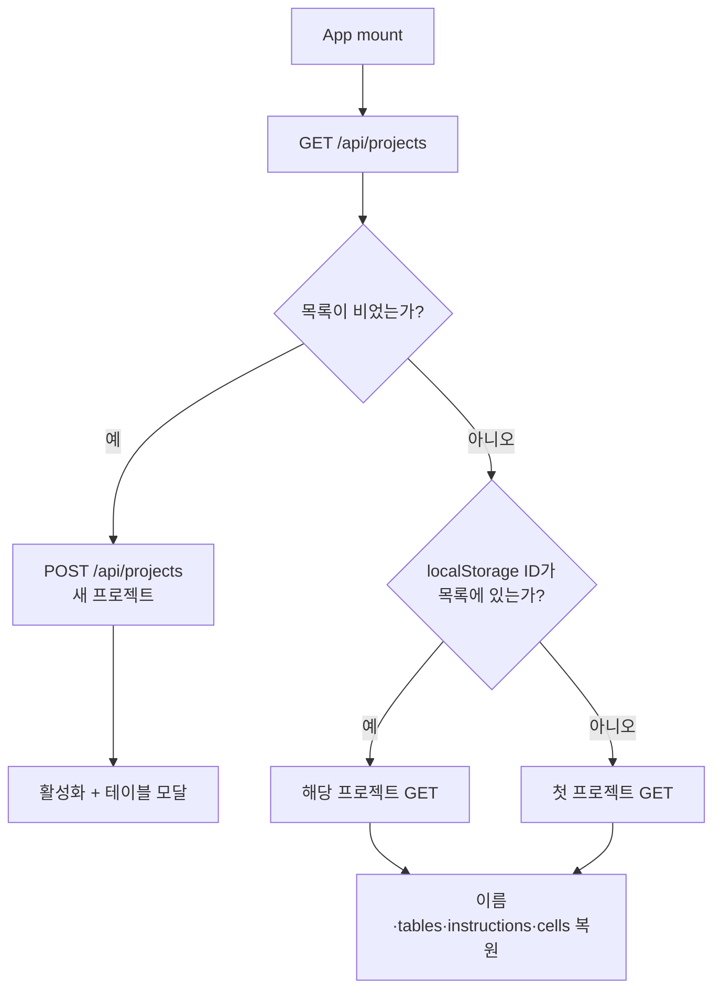
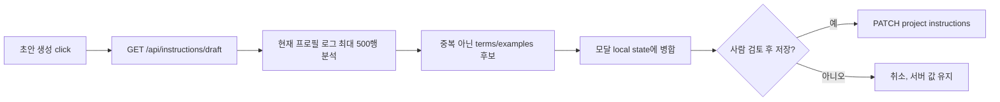
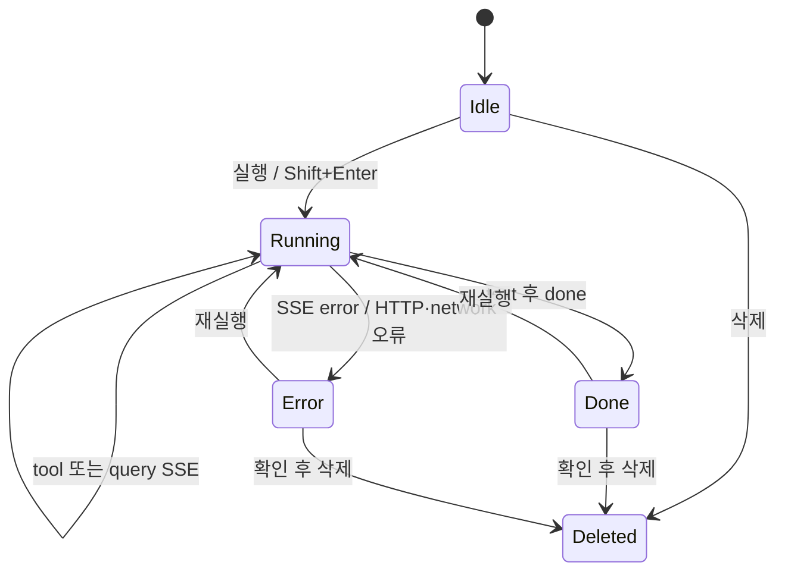

# CRM AI Notebook — 02 화면설계서

> 문서 ID: `CRM-AI-SPEC-02`<br>
> 버전: `3.0`<br>
> 상태: `Final`<br>
> 기준일: `2026-08-13`<br>
> 적용 대상: Cloud / Local 공통 React UI<br>
> 상위 문서: [`../FINAL_HANDOVER.md`](../FINAL_HANDOVER.md)<br>
> 참조: [`01_화면정의서.md`](01_화면정의서.md)

> **프로필 원칙:** 화면 컴포넌트·상태·REST/SSE 계약은 canonical과 동기화된 Local mirror에서 동일하다. 제공자별 데이터 형식은 서버 adapter 밖으로 노출하지 않는다.

---

## 1. 목적·범위

이 문서는 화면정의서의 Screen ID를 실제 React 컴포넌트, 상태, 이벤트, 저장 규칙으로 구체화한다. `defineview` 화면설계서 예시처럼 메뉴 위치·컨테이너·요소·상호작용·검수 기준을 한 흐름으로 정리한다.

## 2. 공통 설계 기준

### 2.1 컴포넌트 매핑

| Screen ID | 컴포넌트 | 책임 | 주요 상태 |
|---|---|---|---|
| `UI-01` | `App.tsx`, `Header.tsx`, `NotebookView.tsx` | 앱 초기화, 활성 프로젝트, 노트북 행동 | active project, toast, sidebar |
| `UI-02` | `Sidebar.tsx` | 프로젝트 CRUD, 테이블 범위 진입, 스키마 갱신 | 목록, 생성명, refresh 상태, width |
| `UI-03` | `TableScopeModal.tsx` | 테이블 검색·필터·선택 | query, domain, selected |
| `UI-04` | `InstructionsModal.tsx` | 지침 편집·초안·저장 | tab, draft loading/message, local form |
| `UI-05` | `NotebookCell.tsx`, `QueryPanel.tsx` | 질문 입력, 실행 상태, 답변·쿼리·내보내기 | cell text/output |
| `UI-06` | `LogModal.tsx` | 로그 조회·필터 | 미연결 |

### 2.2 레이아웃

```text
┌──────────────────────────── GNB 48px ────────────────────────────────┐
│ Logo │ Active project │ Run All │ Add cell │ Instructions │ Toggle │
├────── LNB 140~480px ───────┬──────────── Content ───────────────────┤
│ connection / schema        │ max-width 1100px notebook              │
│ project create / list      │ cell → cell → add bar                 │
│ internal vertical scroll   │ content vertical scroll               │
├────────────────────────────┴────────────────────────────────────────┤
│ Toast                                                           │
└─────────────────────────────────────────────────────────────────────┘
                    ┌──────── Portal modal ────────┐
                    │ header / tabs / list / footer│
                    └──────────────────────────────┘
```

| 영역 | 설계 |
|---|---|
| App shell | 100vh 다크 테마, GNB 고정, 본문 내부 스크롤 |
| Sidebar | 기본 260px, 접기 가능, drag resize 140~480px |
| Notebook | 본문 중앙, 최대 1100px |
| Modal | `document.body` Portal, 배경 overlay, 내부 스크롤 |
| Feedback | 실행 스피너·버튼 disabled·토스트·오류 색상 |
| Rich output | `marked`로 Markdown 변환 후 DOMPurify 정화 |

### 2.3 공통 데이터 원칙

- 브라우저 `localStorage`에는 마지막 활성 프로젝트 ID만 저장한다.
- 프로젝트명·tables·instructions·cells는 서버 프로젝트 JSON이 기준이다.
- 셀 변경은 900ms debounce 후 프로젝트 PATCH로 저장한다.
- 질문 요청은 `{ message, sessionId }`만 전송한다.
- 서버가 프로젝트의 tables·instructions·history를 읽어 프롬프트와 가드에 적용한다.
- LLM 제공자 또는 모델을 바꿔도 프론트 타입과 SSE 이벤트를 바꾸지 않는다.

## 3. UI-01 메인 노트북 설계

### 3.1 초기화 상태



| 상태 | UI | 실패 처리 |
|---|---|---|
| 목록 로딩 | 프로젝트 로딩 문구 | 목록 실패 시 콘솔/화면 오류 경로 확인 |
| 기존 활성 복원 | 프로젝트 상세와 셀 표시 | ID가 없으면 최근 목록 첫 항목으로 대체 |
| 목록 없음 | `새 프로젝트` 생성 | 생성 응답 검증 후 테이블 모달 진입 |
| 활성 프로젝트 없음 | 노트북 행동 제한 | 프로젝트 생성·선택 유도 |

### 3.2 Header 행동

| Design ID | 요소 | 이벤트 | 결과 |
|---|---|---|---|
| `HD-01` | Logo | 없음 | 제품 식별 |
| `HD-02` | 프로젝트명 | click | sidebar 펼침 |
| `HD-03` | Run All | click | 현재 셀 배열 순서로 `runCell` await 반복 |
| `HD-04` | 셀 추가 | click | 빈 셀 추가 및 textarea focus |
| `HD-05` | 지침 | click | 현재 프로젝트 instructions로 모달 open |
| `HD-06` | Sidebar toggle | click | collapsed 전환 |

Run All은 빈 질문 셀에서는 실제 API 호출을 하지 않으며 각 `runCell` Promise가 끝난 뒤 다음 셀로 이동한다.

## 4. UI-02 프로젝트 사이드바 설계

### 4.1 구성 요소

| Design ID | 요소 | 입력/상태 | 이벤트 | 서버 결과 |
|---|---|---|---|---|
| `SB-01` | 연결명 | `VITE_CONN_NAME` | 없음 | 정적 표시 |
| `SB-02` | 스키마 갱신 | refresh loading/message | click | `POST /api/schemas/refresh` |
| `SB-03` | 새 프로젝트명 | local string | change/Enter/click | `POST /api/projects` |
| `SB-04` | 프로젝트 행 | summary + active ID | click | 상세 GET 후 활성 전환 |
| `SB-05` | 범위 버튼 | `tables.length` | click | `UI-03` open |
| `SB-06` | 이름 수정 | inline input | confirm | PATCH `{name}` |
| `SB-07` | 삭제 | confirm dialog | confirm | DELETE, 다음 프로젝트 선택/생성 |
| `SB-08` | resizer | pointer 위치 | mouse drag | 140~480px 범위 width 변경 |

### 4.2 생명주기 규칙

1. 생성 성공 후 새 프로젝트를 활성화하고 테이블 모달을 연다.
2. 전환 때 `NotebookView`를 project ID key로 재마운트해 해당 셀로 교체한다.
3. 이름·tables·instructions·cells PATCH는 프로젝트 전체 파일의 관련 필드와 `updatedAt`을 갱신한다.
4. 삭제는 확인 후 즉시 파일을 제거한다. 휴지통은 없다.
5. 마지막 프로젝트가 삭제되면 새 기본 프로젝트를 생성하는 앱 흐름을 유지한다.

## 5. UI-03 테이블 선택 설계

### 5.1 상태 모델

| 상태 | 출처 | 초기화 | 저장 여부 |
|---|---|---|---|
| `tables` | `/api/tables` | 모달 open 시/상위 제공 | 읽기 전용 카탈로그 |
| `selected` | active project `tables` | open 시 복사 | 저장 클릭 때 PATCH |
| `query` | 사용자 검색 | open 시 빈 값 | 저장 안 함 |
| `domain` | 사용자 탭 선택 | 전체 | 저장 안 함 |

### 5.2 상호작용

| 동작 | 조건 | 결과 |
|---|---|---|
| 검색 | query 입력 | 논리명·표시명 일치 행만 표시 |
| 도메인 필터 | 탭 click | 선택 도메인 행 표시, selected 유지 |
| 행 토글 | checkbox/row click | selected set 추가·삭제 |
| 전체 선택/해제 | 일괄 버튼 | 설계 범위의 행을 selected에 반영 |
| 취소/닫기 | 언제나 | 임시 selected 폐기 |
| 저장 | 프로젝트 존재 | PATCH `{tables:[...]}`, 모달 닫기 |

빈 배열은 “전체 테이블”로 해석한다. 사용자가 아무것도 선택하지 않은 상태와 전체 허용이 같은 표현임을 UI 문구로 혼동하지 않게 한다.
서버는 `tables`가 문자열 배열이고 각 값이 현재 schema catalog에 등록됐는지 재검사한다.

## 6. UI-04 프로젝트별 지침 설계

### 6.1 데이터 구조

```ts
interface Instructions {
  joins: Array<{ fromTable: string; fromCol: string; toTable: string; toCol: string; label?: string }>
  terms: Array<{ table: string; column: string; term: string; def: string }>
  examples: Array<{ question: string; answer: string }>
}
```

### 6.2 탭 설계

| 탭 | 필드 | 목적 | 입력 검토 |
|---|---|---|---|
| 관계 | from table/column, to table/column, label | join 해석 보조 | 실제 논리명·관계 확인 |
| 업무 용어 | table, column, term, definition | 조직 용어를 CRM 컬럼에 매핑 | 초안 빈 필드 보완 |
| 질문 예시 | question, answer | few-shot 답변 형식·업무 해석 보조 | 실제 조회 결과와 일치 확인 |

### 6.3 초안 생성



- Cloud/Local 모두 같은 버튼과 API를 제공한다.
- 초안 `joins`는 항상 빈 배열이다.
- 질문 다음에 쿼리가 1회 이상 기록된 답변만 예시 후보로 삼는다.
- 용어 후보의 table·column·definition은 비어 있을 수 있다.
- 자동 저장하지 않는다.

### 6.4 프롬프트 반영 경계

프론트는 지침을 질문 문자열에 붙이지 않는다. 저장된 프로젝트 지침을 서버가 요청마다 읽어 공통 system prompt에 추가한다. 따라서 개발자가 UI에서 provider별 지침 조합을 구현하면 안 된다.

## 7. UI-05 질문 셀 설계

### 7.1 셀 모델

```ts
interface Cell {
  id: number
  type: 'ai'
  text: string
  output: {
    loading: boolean
    content: string
    toolName: string | null
    error: boolean
    rawContent: string
    execN: number
    queries?: Array<{ tool: string; input: Record<string, unknown> }>
    elapsedMs?: number
  } | null
}
```

### 7.2 실행 상태 전이



| 이벤트 | 셀 갱신 |
|---|---|
| 실행 시작 | `loading=true`, 기존 output 초기화, 실행 번호 증가 |
| `text` | `content` 누적 |
| `tool` | `toolName` 표시 |
| `query` | `queries` 배열에 도구·입력 추가 |
| `done` | `loading=false`, `rawContent`, `elapsedMs`, `toolName=null` |
| `error` | 오류 content, `error=true`, `loading=false` |

현재 Anthropic adapter는 text delta를 전달할 수 있고 Ollama adapter는 완성된 visible text를 한 번에 전달할 수 있다. 이벤트 종류와 최종 셀 상태는 같지만 글자가 나타나는 시간감은 다를 수 있다.

### 7.3 입력·삭제·저장

- Shift+Enter는 실행하고 일반 Enter는 줄바꿈이다.
- textarea는 내용 높이에 맞춰 늘어나며 최대 높이 이후 내부 스크롤한다.
- 빈 셀 삭제는 즉시 처리하고 질문 또는 output이 있으면 브라우저 확인창을 띄운다.
- 셀 배열 변경은 스트리밍 토큰마다 서버에 보내지 않고 900ms debounce한다.
- 프로젝트 전환 직후 복원된 `initialCells`는 불필요한 첫 저장을 건너뛴다.

### 7.4 출력·내보내기

- 답변 Markdown은 `marked` 변환 뒤 DOMPurify로 정화한다.
- 렌더링 결과에 `<table>`이 있으면 표시 텍스트 기준 UTF-8 BOM CSV로 내보낸다.
- 표가 없으면 모델 원문 `rawContent`를 TXT로 내보낸다.
- 다운로드 파일은 `crm_result_<cellId>.csv|txt`다.

## 8. API·오류 표시 설계

| 계층 | 성공 | 오류 |
|---|---|---|
| 프로젝트 REST | JSON 반영 | 현재 일부 helper가 오류 본문을 세밀히 표시하지 않으므로 network panel과 서버 로그 병행 |
| chat 시작 전 | HTTP 200 SSE | 400/401/404/413/415/422/429/503은 `HTTP <status>`로 catch될 수 있음 |
| chat 스트림 중 | 공통 이벤트 소비 | `error.message`를 셀 오류로 표시 |
| 자동 저장 | PATCH 완료 | 현재 사용자에게 세부 저장 실패 UI가 제한적 |
| 초안 | 후보 병합·메시지 | 실패 메시지, 기존 지침 유지 |

## 9. 반응형·접근성

| 항목 | 현재 설계 | 검수 |
|---|---|---|
| Sidebar resize | mouse drag 140~480px | pointer 종료 시 상태 해제 |
| 작은 화면 | CSS 기반 축소 | 모달 overflow, header 버튼 겹침 확인 |
| 키보드 실행 | Shift+Enter | IME 조합·줄바꿈 확인 |
| 포커스 | 새 셀 textarea 자동 focus | modal close 후 복귀는 별도 검증 |
| 위험 행동 | 프로젝트/내용 있는 셀 확인창 | 취소 시 데이터 유지 |
| 접근성 | 기본 HTML 중심 | 전문 WCAG·screen reader 검증 미완료 |

## 10. 설계 검수 체크포인트

| ID | 시나리오 | 기대 결과 |
|---|---|---|
| `DSN-CHK-01` | Cloud/Local `src/` 비교 | 기능 코드 동일 |
| `DSN-CHK-02` | 프로젝트 전환 직후 | 다른 프로젝트 셀·지침이 순간적으로 섞이지 않음 |
| `DSN-CHK-03` | 셀 빠른 연속 편집 | 마지막 상태가 900ms 후 저장 |
| `DSN-CHK-04` | Run All | 순차 실행, 빈 셀 API 호출 없음 |
| `DSN-CHK-05` | 지침 초안 취소 | 프로젝트 JSON 변경 없음 |
| `DSN-CHK-06` | body에 임의 tables 추가 | HTTP 400; 정상 body에서는 저장 프로젝트 범위 사용 |
| `DSN-CHK-07` | 두 provider 답변 | 같은 UI 상태·SSE 종류로 종료 |
| `DSN-CHK-08` | Markdown script 입력 | DOMPurify로 위험 markup 제거 |
| `DSN-CHK-09` | 표/일반 답변 내보내기 | 각각 CSV/TXT |
| `DSN-CHK-10` | `API_KEY` 활성화 | 현 SPA가 401임을 운영자가 인지 |

## 11. 알려진 제약

- 인증·RBAC·소유권 UI가 없다.
- REST helper 일부는 비정상 응답을 사용자 친화적으로 통일하지 않는다.
- 자동 저장과 chat history 저장은 같은 프로젝트 파일을 다루며 단일 프로세스 동기 파일 접근을 전제로 한다.
- LogModal은 접근 통제·마스킹 설계 전까지 메뉴에 연결하지 않는다.
- 공급자별 첫 text 이벤트 타이밍은 같지 않을 수 있다.
- 모바일·키보드·screen reader 수용 기준은 정식 확정되지 않았다.

## 12. 변경 이력

| 버전 | 날짜 | 상태 | 변경 내용 |
|---|---|---|---|
| `1.0` | 2026-08-12 | Superseded | Cloud/Local 분리 동작 기준 |
| `2.0` | 2026-08-12 | Superseded | 공통 UI/API와 이전 서버 구현 기준 |
| `3.0` | 2026-08-13 | Final | 공통 React UI, Python/FastAPI API, 서버 지침 주입, 공통 초안, provider adapter 계약 기준으로 확정 |
