# CRM AI Notebook — 04 플로우차트

> 문서 ID: `CRM-AI-SPEC-04` 
> 버전: `3.0` 
> 상태: `Final` 
> 기준일: `2026-08-13` 
> 적용 대상: Cloud / Local 공통 React + Python/FastAPI 흐름 
> 상위 문서: [`../FINAL_HANDOVER.md`](../FINAL_HANDOVER.md)

> **프로필 원칙:** 질문 처리·프로젝트·스키마·오류 흐름은 같다. `LLM_PROVIDER`가 선택한 adapter 내부의 외부 프로토콜만 다르다.

---

## 1. 목적·범위

이 문서는 `defineview` 플로우차트 예시의 시작/판단/처리/종료 노드를 사용해 질문 한 건, 도구 루프, history 마이그레이션, 프로젝트 생명주기, 스키마 갱신, 지침 초안, 오류·취소 흐름을 정의한다.

### 1.1 구현 근거

| 흐름 | 공통 활성 코드 |
|---|---|
| API·인증·프로젝트·스키마·health | `backend/main.py` |
| 질문·도구 루프 | `backend/chat_api.py` |
| provider 선택 | `backend/provider_factory.py` |
| provider 공통 계약 | `backend/llm_provider.py` |
| provider 변환 | `backend/anthropic_provider.py`, `backend/ollama_provider.py` |
| history 변환·정리 | `backend/history.py` |
| 프로젝트 저장 | `backend/projects.py` |
| Dataverse GET | `backend/dataverse.py` |
| 지침 초안 | `backend/instructions_draft.py` |

과거 `server/*.ts`, `dist-server/`, `claudeapi/`는 이 흐름의 활성 구성요소가 아니다. 현행 백엔드 기준은 `backend/`다.

## 2. 서버 기동 플로우

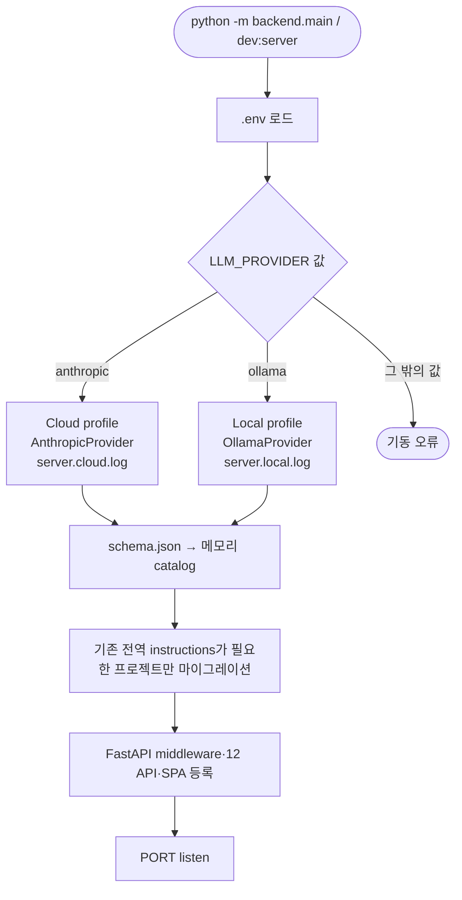

| 판단 | 결과 |
|---|---|
| `LLM_PROVIDER=anthropic` | Anthropic adapter, Cloud 로그 선택 |
| `LLM_PROVIDER=ollama` | Ollama adapter, Local 로그 선택 |
| 미설정 | 기본 Anthropic 사용. 운영에서는 명시 권장 |
| 지원하지 않는 값 | 초기 module load에서 오류 |
| Anthropic key 미설정 | 서버와 chat route는 기동, 요청은 503, health는 misconfigured |
| Ollama 중지 | route는 기동, health unreachable, 요청은 provider 오류 |

## 3. 질문 처리 플로우

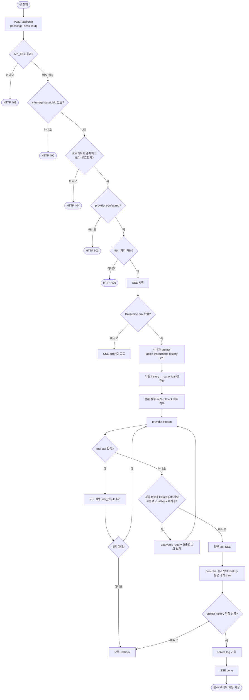

### 3.1 질문 입력의 권위

| 값 | 전송/출처 | 서버 사용 규칙 |
|---|---|---|
| `message` | 브라우저 body | trim 후 user text로 추가 |
| `sessionId` | 브라우저 body | ID regex와 실제 프로젝트 존재 확인 |
| `tables` | 브라우저가 보내지 않음 | 서버가 프로젝트 JSON에서 읽음 |
| `instructions` | 브라우저가 chat에 보내지 않음 | 서버가 프로젝트 JSON에서 읽음 |
| `history` | 브라우저에 노출하지 않음 | 서버 메모리 또는 프로젝트 JSON에서 복구 |

이 경계로 과거의 body tables 신뢰와 비정상 sessionId history 파일 생성 문제를 제거했다.

### 3.2 provider 공통 이벤트 흐름

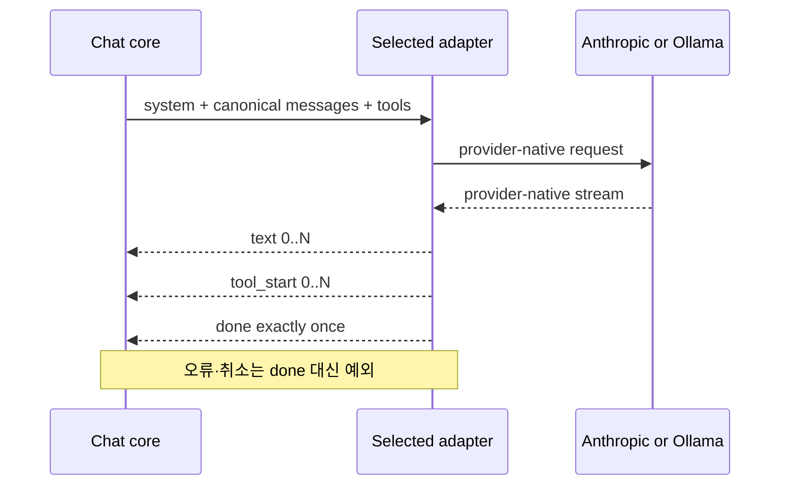

- Anthropic SSE `tool_use`와 Ollama `tool_calls`는 같은 `tool_start`/canonical `tool_call`로 변환한다.
- Anthropic은 text delta를 흘릴 수 있다.
- Ollama는 thinking text를 제거한 visible text를 수집 후 전달할 수 있다.
- 브라우저에 보내는 이벤트는 provider 원문이 아니라 `text/tool/query/error/done`이다.

## 4. Dataverse 도구 플로우

### 4.1 Describe

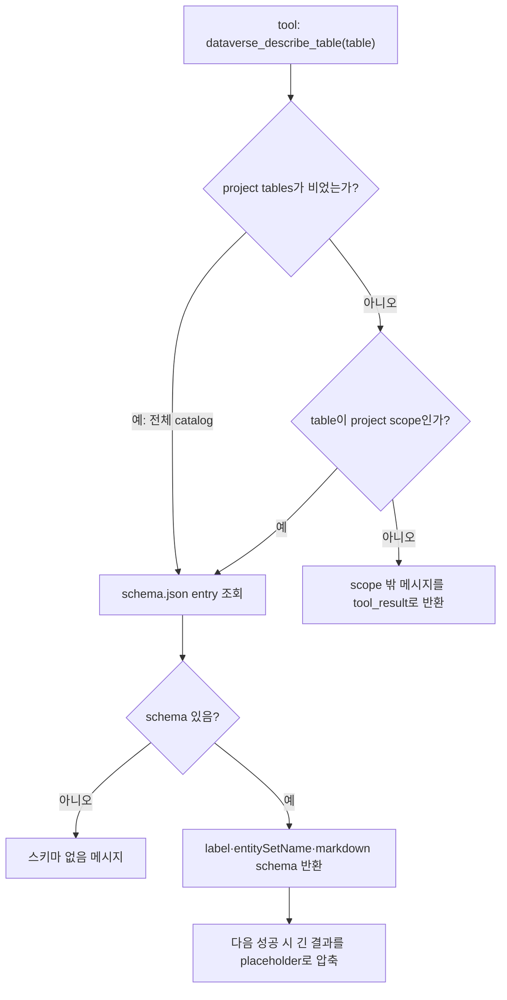

채팅용 describe는 캐시를 읽는다. 사용자가 직접 호출하는 `GET /api/describe`는 캐시 miss일 때 Dataverse metadata를 조회해 `schema.json`을 갱신한다.

### 4.2 Query

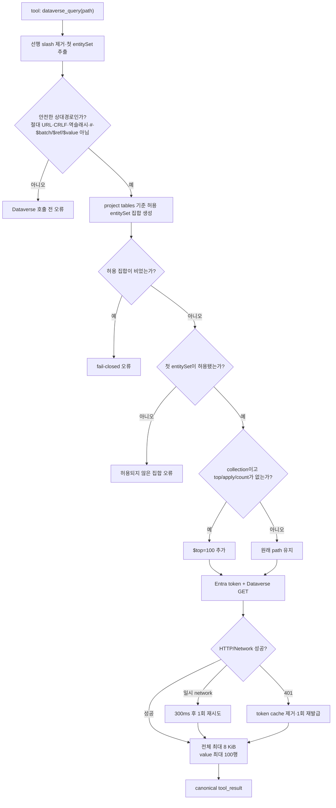

앱은 OData GET만 수행한다. 모델은 path를 제안하지만 Dataverse 자격증명을 받지 않는다.

### 4.3 별도 MCP 경로와 웹앱 경로

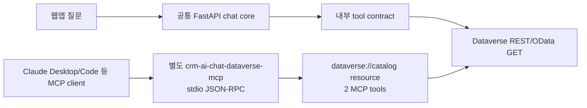

웹앱은 별도 MCP process를 직접 호출하지 않는다. 두 경로는 도구 이름과 조회 안전장치 개념을 공유하지만 runtime·transport·로그가 다르다. 제품의 자연어 변환 대상은 SQL이 아니라 OData 상대경로다.

## 5. canonical history 플로우

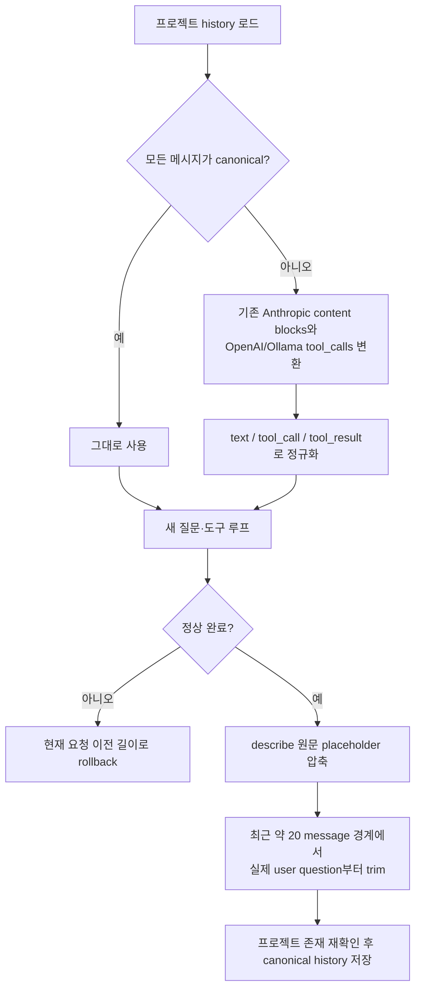

변환은 읽는 순간 메모리에서 수행한다. 실패한 요청은 디스크를 바꾸지 않으며 다음 성공 때 canonical 형식으로 저장된다. tool call/result 짝을 중간에서 자르지 않는다.

## 6. 프로젝트 생명주기

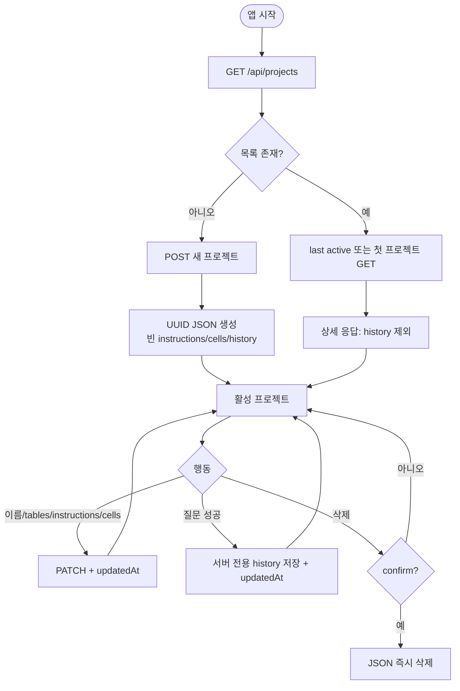

`_read_project`와 `_write_project`는 영문·숫자·하이픈 ID만 허용한다. `save_project_history`는 기존 프로젝트에만 쓰고 새 파일을 만들지 않는다.

## 7. 스키마 갱신 플로우

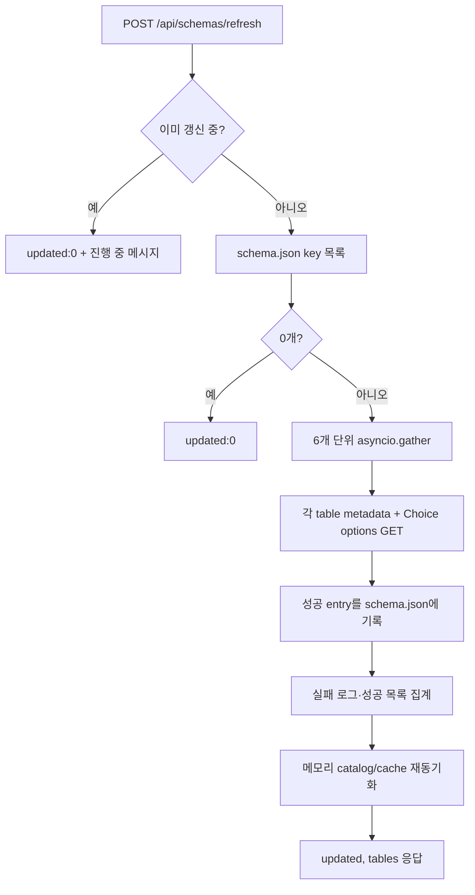

전체 갱신은 기존 JSON key를 대상으로 한다. 새 환경에는 `data/schema.json` 백업 복구가 필요하며 현재 자동 테이블 발견은 없다.

## 8. 지침 초안 플로우

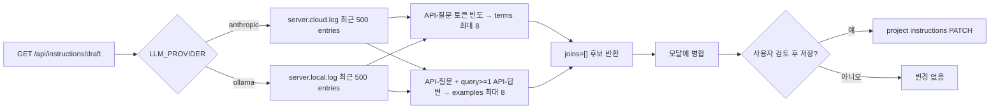

초안 생성은 LLM을 호출하지 않으며 Cloud/Local 모두 같다.

## 9. 오류·취소·과부하 플로우

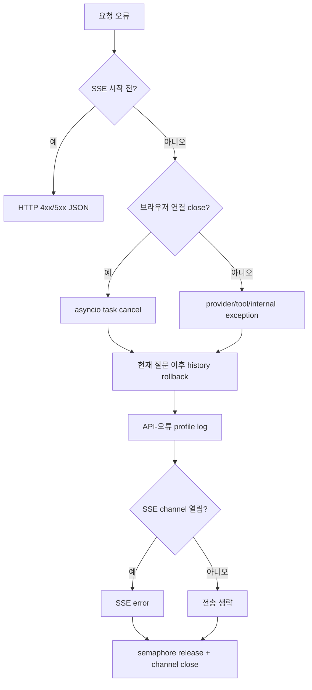

| 오류 위치 | 보존되는 것 | 롤백되는 것 |
|---|---|---|
| body/project/provider 사전 검증 | 기존 프로젝트·history | 새 대화 없음 |
| Dataverse env 오류 | 기존 history | 새 질문 |
| provider timeout/cancel | 기존 history | 새 질문·해당 tool cycle |
| 도구 개별 오류 | 오류를 tool_result로 모델에 전달해 회복 시도 | 최종 요청이 실패하면 전체 새 대화 |
| history 저장 실패 | 기존 디스크 history | 메모리 새 대화는 map에 확정하지 않음 |

## 10. 프로필별 차이

| 경계 | Cloud | Local | 공통 상위 흐름 |
|---|---|---|---|
| adapter 입력 | Anthropic Messages 요청 | Ollama native chat 요청 | canonical request |
| adapter 출력 | Anthropic SSE parse | NDJSON parse, think 제거 | text/tool_start/done |
| health | `/v1/models`, key 필요 | `/api/tags` | `status/provider/model/endpoint` |
| 로그 | `server.cloud.log` | `server.local.log` | 동일 JSON Lines |
| 데이터 전송 | Anthropic 외부 | Ollama host | Dataverse HTTPS는 공통 |

## 11. 검수 체크포인트

| ID | 시나리오 | 기대 결과 |
|---|---|---|
| `FLW-CHK-01` | 존재하지 않는 sessionId | HTTP 404, 프로젝트 파일 생성 없음 |
| `FLW-CHK-02` | chat body에 tables/instructions 임의 추가 | HTTP 400, `{message, sessionId}` 외 필드 거절 |
| `FLW-CHK-03` | schema/entitySet 허용 집합 없음 | Dataverse 호출 전 fail-closed 오류 |
| `FLW-CHK-04` | 두 provider 도구 호출 | 같은 tool/query/text/done 브라우저 이벤트 |
| `FLW-CHK-05` | 기존 provider history로 다른 provider 실행 | 정규화 후 문맥 유지, 성공 시 canonical 저장 |
| `FLW-CHK-06` | provider timeout/브라우저 취소 | 새 질문 history rollback, permit 반환 |
| `FLW-CHK-07` | 도구 6회 초과 | 오류, 반쪽 history 미저장 |
| `FLW-CHK-08` | collection path에 제한 없음 | `$top=100` 추가 |
| `FLW-CHK-09` | 스키마 파일 0개 | 갱신 updated 0, 자동 발견하지 않음 |
| `FLW-CHK-10` | 초안 생성 | 활성 프로필 로그만 읽고 자동 저장 안 함 |
| `FLW-CHK-11` | Cloud/Local 로그 | 각각 지정 파일 하나에 현재 실행 기록 |

## 12. 알려진 제약

- 프로젝트와 스키마 파일은 임시 파일을 `fsync`한 뒤 원자적으로 교체하지만, 프로세스 간 공유 락이나 DB 트랜잭션은 없다.
- 다중 FastAPI/Uvicorn worker는 메모리 semaphore/history와 로컬 파일을 조정하지 못한다.
- OData guard는 첫 entity set과 최상위 `$top<=100`을 통제하지만 `$expand` 내부 관계 깊이는 완전하게 parse·상한 처리하지 않는다.
- Ollama의 visible text는 수집 후 전달될 수 있어 Anthropic과 토큰별 화면 갱신 시점이 같지 않다.
- 초안 로그 파서는 신규 로그의 `requestId`/`sessionId`로 질문·답변을 연결하고 성공한 `dataverse_query`가 있는 대화만 예시 후보로 사용한다. 구 로그는 질문과 답변 사이의 성공 query 기록을 보수적으로 판정하며, 용어 후보는 질문 토큰 빈도를 사용한다.
- `API_KEY`를 켜면 현 SPA가 헤더를 보내지 않아 플로우 첫 단계에서 401이 된다.

## 13. 변경 이력

| 버전 | 날짜 | 상태 | 변경 내용 |
|---|---|---|---|
| `1.0` | 2026-08-12 | Superseded | FastAPI/Express 이원화, body scope 신뢰, Cloud 전용 초안 기준 |
| `2.0` | 2026-08-12 | Superseded | 공통 기능과 이전 서버 구현 기준 |
| `3.0` | 2026-08-13 | Final | 공통 Python/FastAPI, provider adapter, 서버 권위 project context, fail-closed guard, canonical history, 공통 초안·프로필 로그 기준으로 확정 |
