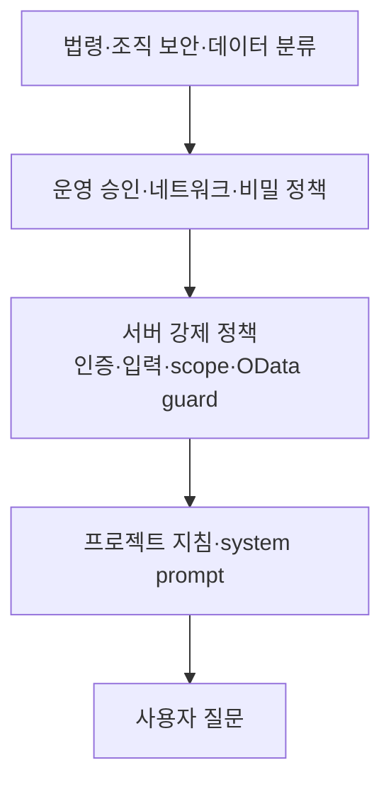

# CRM AI Notebook — 05 정책정의서

> 문서 ID: `CRM-AI-SPEC-05` 
> 버전: `3.0` 
> 상태: `Final` 
> 기준일: `2026-08-13` 
> 적용 대상: Cloud / Local 공통 제품 정책 
> 상위 문서: [`../FINAL_HANDOVER.md`](../FINAL_HANDOVER.md)

> **프로필 원칙:** LLM 데이터 처리 위치와 자격증명만 프로필별로 다르다. API·프로젝트·Dataverse·보존·권한 정책은 같다.

---

## 1. 목적·범위

이 문서는 `defineview` 정책정의서 예시의 정책 ID·분류·규칙·예외·검수 기준 형식을 사용해 현재 코드가 실제로 강제하는 정책, 운영자가 별도로 결정할 정책, 미해결 위험을 구분한다.

### 1.1 상태 정의

| 상태 | 의미 |
|---|---|
| `현행` | 현재 활성 코드가 적용하는 규칙 |
| `운영 결정` | 코드만으로 정해지지 않아 운영자가 문서·설정으로 확정할 규칙 |
| `미해결 위험` | 현재 통제가 부족하며 사용 범위를 제한하는 항목 |
| `범위 밖` | 제품에서 의도적으로 제공하지 않는 기능 |

## 2. 통합 정책표

### 2.1 제품·프로필 정책

| Policy ID | 상태 | 분류 | 정책 | 적용·예외 |
|---|---|---|---|---|
| `POL-CUR-001` | 현행 | 제품 | 활성 런타임은 React + Python/FastAPI이며 두 프로필에서 동일하게 유지한다. | provider adapter와 환경값만 다름 |
| `POL-CUR-002` | 현행 | 프로필 | `LLM_PROVIDER=anthropic`은 Cloud, `ollama`는 Local이다. | 미설정 기본은 Anthropic, 운영에서는 명시 |
| `POL-CUR-003` | 현행 | 프로필 | provider 원문은 canonical message·stream·health 계약으로 변환한다. | 상위 chat/UI에서 provider별 타입 사용 금지 |
| `POL-CUR-004` | 현행 | 로그 | Anthropic은 `server.cloud.log`, Ollama는 `server.local.log` 하나를 활성 파일로 사용한다. | 과거 `app.log`는 현행 로그가 아님 |
| `POL-CUR-005` | 현행 | 기능 | Cloud/Local 모두 공통 12개 API와 지침 초안을 제공한다. | provider dependency 상태만 다름 |

### 2.2 CRM·조회 정책

| Policy ID | 상태 | 분류 | 정책 | 적용·예외 |
|---|---|---|---|---|
| `POL-CUR-006` | 현행 | Dataverse | 앱이 LLM에 제공하는 도구는 `dataverse_describe_table`, `dataverse_query`뿐이다. | CRM C/U/D 도구 없음 |
| `POL-CUR-007` | 현행 | Dataverse | 실제 Dataverse 요청은 앱 서버가 서비스 주체로 GET만 수행한다. | 서비스 주체 자체 권한은 별도 최소화 필요 |
| `POL-CUR-008` | 현행 | 컨텍스트 | chat의 tables·instructions·history는 body가 아니라 저장 프로젝트에서 읽는다. | body는 message/sessionId만 계약 |
| `POL-CUR-009` | 현행 | 프로젝트 | 존재하지 않거나 유효하지 않은 sessionId는 404이며 history 파일을 새로 만들지 않는다. | ID는 영문·숫자·하이픈 |
| `POL-CUR-010` | 현행 | 범위 | tables가 비어 있으면 전체 카탈로그, 값이 있으면 그 논리 테이블만 허용한다. | 사용자 권한이 아닌 프로젝트 범위 |
| `POL-CUR-011` | 현행 | 범위 | 허용 `entitySetName`이 없으면 Dataverse 호출을 거절한다. | fail-closed |
| `POL-CUR-012` | 현행 | OData | path는 엔티티 집합명으로 시작하는 안전한 상대 경로여야 한다. | 절대 URL, CR/LF, backslash, fragment, `$batch/$ref/$value` 거절 |
| `POL-CUR-013` | 현행 | OData | 일반 컬렉션에 `$top`이 없으면 `$top=100`을 붙이고 명시값이 100을 넘으면 100으로 낮춘다. `$count=true`에도 행 상한을 적용한다. | `/$count` scalar와 `$apply`는 별도 처리 |
| `POL-CUR-014` | 현행 | 응답 | 도구 결과 전체는 직렬화 기준 최대 8 KiB이며 JSON `value`는 그 안에서 최대 100행 전달한다. | 브라우저 최종 답변은 모델 결과 |
| `POL-CUR-015` | 현행 | 프롬프트 | 모델은 한국어, 실제 조회 근거, Markdown 표, read-only 거절 규칙을 받는다. | 모델 출력은 확정적 보안 통제가 아님 |
| `POL-CUR-015A` | 현행 | 변환 | 자연어를 SQL이 아니라 Dataverse OData 상대경로로 변환한다. | Text-to-OData이며 SQL engine 없음 |
| `POL-CUR-015B` | 현행 | MCP | 웹앱은 별도 `crm-ai-chat-dataverse-mcp` stdio process를 호출하지 않고 FastAPI 내부 도구로 REST/OData를 실행한다. | 별도 MCP는 MCP client의 탐색·검증 경로 |

### 2.3 입력·프로젝트 정책

| Policy ID | 상태 | 분류 | 정책 | 적용·예외 |
|---|---|---|---|---|
| `POL-CUR-016` | 현행 | 입력 | 프로젝트 생성·수정의 name은 문자열이어야 한다. | 공백 생성명은 기본 이름, 공백 수정명은 기존 이름 유지 |
| `POL-CUR-017` | 현행 | 입력 | tables는 문자열 배열이며 모든 값이 현재 schema catalog에 등록돼야 한다. | 미등록 테이블은 400 |
| `POL-CUR-018` | 현행 | 입력 | instructions는 joins/terms/examples 배열을 가져야 하고 cells는 배열이어야 한다. | 내부 행 필드까지 완전한 runtime schema 검증은 아님 |
| `POL-CUR-019` | 현행 | 프로젝트 | 새 프로젝트는 UUID, 빈 지침·셀·history로 시작한다. | tables 기본 빈 배열=전체 |
| `POL-CUR-020` | 현행 | 프로젝트 | 목록은 `updatedAt` 내림차순이며 API 상세에서 history를 제외한다. | 파일에는 history 존재 |
| `POL-CUR-021` | 현행 | 프로젝트 | 삭제는 확인 후 JSON 파일을 즉시 제거한다. | 휴지통·복구 없음 |
| `POL-CUR-022` | 현행 | 셀 | 셀 변경은 900ms debounce 후 프로젝트 PATCH한다. | 앱 종료 직전 미전송 위험은 검수 필요 |
| `POL-CUR-023` | 현행 | 지침 | 지침은 프로젝트별로 저장하며 chat 서버가 요청마다 읽는다. | 과거 전역 지침은 필요한 파일에 1회 마이그레이션 |
| `POL-CUR-024` | 현행 | 지침 | 초안은 활성 프로필 로그에서 후보만 만들고 자동 저장하지 않는다. | joins는 빈 배열, 사람 검토 필수 |

### 2.4 대화·history 정책

| Policy ID | 상태 | 분류 | 정책 | 적용·예외 |
|---|---|---|---|---|
| `POL-CUR-025` | 현행 | history | 메시지는 공급자 중립 `text/tool_call/tool_result`로 저장한다. | provider를 바꿔도 같은 형식 |
| `POL-CUR-026` | 현행 | history | 과거 Anthropic/OpenAI 계열 형식은 읽을 때 canonical로 정규화한다. | 다음 성공 저장 때 디스크 형식 교체 |
| `POL-CUR-027` | 현행 | history | 오류·timeout·취소 때 현재 요청에서 추가한 대화를 rollback한다. | 이전 정상 history 유지 |
| `POL-CUR-028` | 현행 | history | describe 원문은 성공 후 placeholder로 압축한다. | 필요하면 모델이 다시 describe 호출 |
| `POL-CUR-029` | 현행 | history | 약 20 message 경계에서 실제 사용자 질문부터 유지한다. | tool call/result 짝을 임의로 자르지 않음 |
| `POL-CUR-030` | 현행 | history | 메모리 세션은 24시간 TTL, 기본 200개 상한이다. | 디스크 history는 별도 보존 |
| `POL-CUR-031` | 현행 | 도구 루프 | 최대 6회 provider turn을 허용한다. | 초과하면 오류·rollback |
| `POL-CUR-032` | 현행 | 호환 | OData path를 최종 text로 내보낸 경우 한 번 query tool로 보정할 수 있다. | 요청당 fallback 1회 |

### 2.5 API·운영 정책

| Policy ID | 상태 | 분류 | 정책 | 적용·예외 |
|---|---|---|---|---|
| `POL-CUR-033` | 현행 | 인증 | `API_KEY`가 있으면 모든 `/api/*`에서 header 또는 query 키를 검사한다. | 사용자별 권한이 아님, SPA 미연동 |
| `POL-CUR-034` | 현행 | 레이트리밋 | `/api/chat`, `/api/describe`는 `request.client.host` 기준 기본 20회/60초이며 만료·최대 bucket을 정리한다. | 전달 헤더는 기본 loopback proxy만 신뢰 |
| `POL-CUR-035` | 현행 | 동시성 | chat은 기본 동시 10개 semaphore를 사용한다. | 과부하 시 429 |
| `POL-CUR-036` | 현행 | timeout | LLM 기본 120초, Dataverse 기본 60초다. | 환경변수로 변경 |
| `POL-CUR-037` | 현행 | health | 최상위 `ok`와 별도로 provider health·Dataverse 설정·동시성을 반환한다. | dependency 장애여도 health HTTP 자체는 200 가능 |
| `POL-CUR-038` | 현행 | 로그 | 질문·답변 일부, 도구 입력 preview, 오류, provider/model/usage가 구조화 로그에 남을 수 있다. | 민감 데이터 취급 |
| `POL-CUR-039` | 현행 | 로그 | 로그는 일/50MB 회전, gzip, 기본 30개 보존이다. | 조직 보존 정책은 별도 확정 |

### 2.6 범위 밖 정책

| Policy ID | 상태 | 분류 | 정책 |
|---|---|---|---|
| `POL-OUT-001` | 범위 밖 | CRM 쓰기 | Dataverse 레코드 생성·수정·삭제를 제공하지 않는다. |
| `POL-OUT-002` | 범위 밖 | IAM | 로그인·사용자·RBAC·프로젝트 소유권을 제공하지 않는다. |
| `POL-OUT-003` | 범위 밖 | 분산 | 공유 DB·다중 인스턴스 조정·분산 세션을 제공하지 않는다. |
| `POL-OUT-004` | 범위 밖 | 복구 | 자동 백업·휴지통·버전 복구를 제공하지 않는다. |
| `POL-OUT-005` | 범위 밖 | 모델 | Anthropic Messages와 Ollama native 외 프로토콜 호환을 보장하지 않는다. |

## 3. 정책 우선순위

- Dataverse 보안 역할과 서버 guard가 모델 지시보다 우선한다.
- 프로젝트 지침은 모델 해석을 돕지만 서버 접근 권한을 늘리지 않는다.
- “read-only” 프롬프트만 믿지 않고 앱 코드와 서비스 주체 권한도 읽기 전용이어야 한다.

## 4. 데이터 분류·보존

| 자산 | 위치 | 포함 가능 정보 | 현재 보존 | 운영 결정 |
|---|---|---|---|---|
| 환경 비밀 | `.env`/비밀 저장소 | Anthropic 키, Dataverse client secret | 수동 | vault, rotation, 접근자, 백업 |
| 스키마 | `data/schema.json` | 논리명·컬럼·Choice·entitySetName | 파일 삭제까지 | 백업 주기·변경 이력 |
| 프로젝트 | `data/projects/*.json` | 질문, 답변, 지침, 셀, tool result history | 프로젝트 삭제까지 | 보존 기간·암호화·삭제 승인 |
| Cloud 로그 | `logs/server.cloud.log*` | 질문·답변 preview, query, 오류 | 회전 설정 | 기간·마스킹·감사 접근 |
| Local 로그 | `logs/server.local.log*` | 같은 유형 | 회전 설정 | 기간·마스킹·감사 접근 |
| Cloud 모델 입력 | Anthropic | system prompt, 질문, catalog, tool result | 공급자 계약 | 외부 전송 승인·계약 설정 |
| Local 모델 입력 | Ollama host | 같은 내용 | host 운영 설정 | host ACL·디스크·관리자 권한 |

> 프로젝트 API가 history를 숨기는 것은 노출 축소일 뿐 보존·암호화·사용자 격리가 아니다.

## 5. 운영 결정 정책

| Policy ID | 결정할 항목 | 최소 결정 내용 |
|---|---|---|
| `POL-OPS-001` | 배포 범위 | 내부망/허용 사용자, 공개 금지 범위 |
| `POL-OPS-002` | 비밀 관리 | 저장소 외 보관, rotation, 담당자, 복구 절차 |
| `POL-OPS-003` | 데이터 보존 | 프로젝트·로그 기간, 삭제 승인, 법적 hold |
| `POL-OPS-004` | 백업 | `.env`, schema, projects, logs의 주기·암호화·restore test |
| `POL-OPS-005` | Cloud 외부 전송 | 데이터 분류, Anthropic 계약·지역·승인 |
| `POL-OPS-006` | Local host | Ollama 포트 ACL, 모델 파일·메모리·자동 기동 |
| `POL-OPS-007` | Dataverse | 서비스 주체 최소 읽기 역할과 secret rotation |
| `POL-OPS-008` | 운영 책임 | 코드·데이터·비밀·장애·보안 담당자 |
| `POL-OPS-009` | 변경 관리 | canonical→Local mirror 동기화와 두 provider adapter 회귀 검증 |

## 6. 미해결 위험 정책

| Policy ID | 우선순위 | 위험 | 현재 영향 | 필요한 조치 |
|---|:---:|---|---|---|
| `POL-RISK-001` | P0 | 인증·RBAC 부재 | 접속자가 모든 프로젝트·로그·기능 사용 | SSO, 역할, 소유권, 감사 |
| `POL-RISK-002` | P0 | API key/SPA 불일치 | 키를 켜면 브라우저가 401 | 안전한 토큰/프록시 설계 |
| `POL-RISK-003` | P0 | 민감 정보 평문 | 셀·history·로그 유출 영향 | 암호화·ACL·보존·마스킹 |
| `POL-RISK-004` | P0 | Cloud 외부 전송 | CRM 내용이 외부 LLM로 전달 가능 | 조직 승인·계약·필요시 Local 사용 |
| `POL-RISK-005` | P1 | 로컬 JSON 저장 | 원자 교체는 적용됐지만 다중 프로세스 경합·백업 시점 불일치 가능 | 단일 writer 유지, 앱 중지 snapshot 또는 DB |
| `POL-RISK-006` | P1 | OData 세부 상한 | `$expand` 내부 관계 깊이·행 증가 | parser·expand depth 상한; 응답 byte 상한은 현행 적용 |
| `POL-RISK-007` | P1 | 스키마 bootstrap 없음 | 새 clone에서 조회 불가 | `schema.json` 백업·관리 절차 |
| `POL-RISK-008` | P1 | 자동 복구 없음 | 삭제·손상 시 앱 복구 불가 | 백업·restore test·휴지통 검토 |
| `POL-RISK-009` | P1 | 다중 인스턴스 미지원 | history·file race | 단일 인스턴스 고정 또는 DB/lock |
| `POL-RISK-010` | P2 | 두 repo 수동 동기화 | 코드 drift 재발 | diff 검증·공통 upstream 전략 |
| `POL-RISK-011` | P2 | 자동 테스트 외 범위 | UI·Anthropic 실환경 회귀 누락 | 승인된 golden question·E2E |
| `POL-RISK-012` | P2 | 레거시 코드 혼동 | 잘못된 실행·수정 | inactive 표시 또는 제거 |
| `POL-RISK-013` | P0 | 기존 Anthropic key 노출 | 재사용 시 제3자 오용·과금 위험 | 기존 키 즉시 폐기·재발급 후 Cloud 재검증 |

이미 해결된 과거 결함인 body tables 신뢰, 허용 집합 fail-open, 비정상 sessionId history 쓰기는 이 표의 현행 위험으로 남기지 않는다. 회귀 여부는 검수 항목으로 관리한다.

## 7. 검수 체크포인트

| ID | 정책 검수 | 기대 결과 |
|---|---|---|
| `POL-CHK-01` | provider 선택 | 허용 2값만 기동, 프로필별 로그 자동 선택 |
| `POL-CHK-02` | API parity | 두 환경 모두 같은 12 API |
| `POL-CHK-03` | project payload type | 잘못된 name/tables/instructions/cells는 400 |
| `POL-CHK-04` | unknown table | 생성·수정 요청 400 |
| `POL-CHK-05` | server-authoritative scope | body 조작으로 저장 범위를 우회하지 못함 |
| `POL-CHK-06` | relative OData | 절대 URL·CRLF·backslash·fragment·batch/ref/value 거절 |
| `POL-CHK-07` | fail-closed | 허용 entity set 0개면 Dataverse 미호출 |
| `POL-CHK-08` | provider 전환 history | canonical 정규화·문맥 보존 |
| `POL-CHK-09` | 실패 rollback | 다음 정상 질문에 반쪽 tool history 없음 |
| `POL-CHK-10` | 초안 | 후보 자동 저장 없음 |
| `POL-CHK-11` | 백업 | schema/projects/secret 복원 시험 통과 |
| `POL-CHK-12` | 인증 | API key를 쓸 경우 현 SPA 제약을 해결한 경로에서만 활성화 |

## 8. 변경 이력

| 버전 | 날짜 | 상태 | 변경 내용 |
|---|---|---|---|
| `1.0` | 2026-08-12 | Superseded | 분리 런타임과 과거 scope/session 결함 기준 |
| `2.0` | 2026-08-12 | Superseded | 공통 provider 정책과 이전 서버 구현 기준 |
| `3.0` | 2026-08-13 | Final | 공통 Python/FastAPI/provider 정책, payload validation, 서버 권위 scope, 상대 OData guard, canonical history, 공통 로그·초안 기준으로 확정 |
