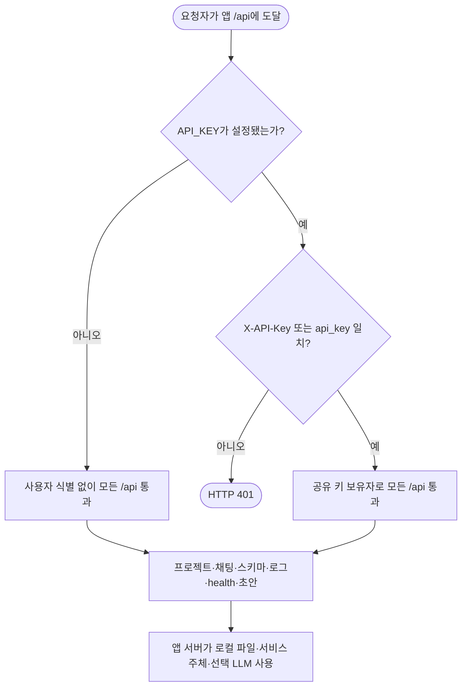
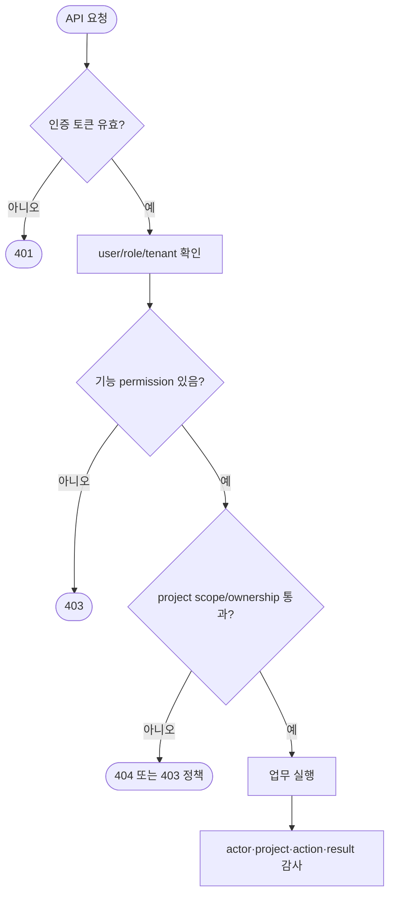

# CRM AI Notebook — 06 권한정의서

> 문서 ID: `CRM-AI-SPEC-06` 
> 버전: `3.0` 
> 상태: `Final` 
> 기준일: `2026-08-13` 
> 적용 대상: Cloud / Local 공통 권한 경계 
> 상위 문서: [`../FINAL_HANDOVER.md`](../FINAL_HANDOVER.md)

> **중요:** 현재 제품에는 사용자 계정, 로그인, 역할, 프로젝트 소유권, RBAC가 없다. 아래의 “접속자”, “공유 키 보유자”, “앱 서버”, “LLM”은 실제 행위 주체를 구분하는 명칭이지 구현된 사용자 역할이 아니다.

> **프로필 원칙:** 앱 권한 모델은 Cloud/Local이 같다. LLM에 전달되는 데이터의 외부/내부 경계만 다르다.

---

## 1. 목적·범위

이 문서는 `defineview` 권한정의서 예시의 주체별 보기·수정·삭제·쓰기 매트릭스를 현재 시스템에 적용하고, 개발을 재개할 경우의 목표 역할을 명확히 “미구현”으로 분리한다.

### 1.1 권한 기호

| 기호 | 의미 |
|:---:|---|
| O | 현재 직접 수행 가능 |
| △ | 앱 서버를 통한 간접 수행, 일부 데이터만 수신, 또는 외부 권한에 따라 달라짐 |
| X | 현재 앱 경로에서 수행 불가 |
| - | 해당 주체에 적용되지 않음 |

### 1.2 행위 정의

| 행위 | 의미 |
|---|---|
| 보기 | 프로젝트·셀·지침·테이블·스키마·로그·health API 읽기 |
| 수정 | 프로젝트 이름·tables·instructions·cells PATCH |
| 삭제 | 프로젝트 JSON과 그 안의 셀·지침·history 즉시 제거 |
| 앱 쓰기 | 프로젝트·history·schema·로그 로컬 파일 변경 |
| 질문 실행 | LLM에 문맥 전달하고 앱 서버가 도구를 실행 |
| Dataverse GET | 업무 데이터 또는 metadata 읽기 |
| Dataverse C/U/D | 레코드 생성·수정·삭제. 앱 기능 범위 밖 |

### 1.3 현행 구현 근거

| 영역 | 공통 코드 |
|---|---|
| 공유 API key gate | `backend/main.py` |
| 프로젝트 ID·파일 접근 | `backend/projects.py` |
| 서버 권위 tables/instructions/history | `backend/chat_api.py` |
| OData 상대경로·scope guard | `backend/chat_api.py` |
| Dataverse 서비스 주체 GET | `backend/dataverse.py` |
| browser 요청 | `src/api.ts` |
| provider 경계 | `backend/llm_provider.py`, provider adapters |
| 프로필 로그 | `backend/logger.py` |

`backend/`가 두 프로필의 활성 권한 판단 근거다. 과거 `server/*.ts`, `dist-server/`, `claudeapi/`는 현행 근거가 아니다.

별도 `crm-ai-chat-dataverse-mcp` stdio 서버의 MCP client 권한 경계도 웹앱 권한과 분리한다. 웹앱은 MCP를 직접 호출하지 않으며 FastAPI 내부 도구와 Dataverse REST를 사용한다. MCP client가 별도 서버를 쓸 때는 그 프로세스의 환경변수·`DATAVERSE_MCP_TABLES`·OS 실행 권한을 독립적으로 관리해야 한다.

## 2. 현재 접근 게이트

| 서버 상태 | 요청자 | 결과 | 한계 |
|---|---|---|---|
| `API_KEY` 비어 있음 | 포트에 도달한 사람 | 모든 `/api/*` 사용 가능 | 기본 사용자 식별·감사 없음 |
| `API_KEY` 있음 | 키 없음/불일치 | 모든 `/api/*` 401 | 정적 SPA가 열려도 API 실패 |
| `API_KEY` 있음 | 공유 키 일치 | 모든 `/api/*` 사용 가능 | 역할·프로젝트별 차등 없음 |
| `API_KEY` 있음 | 현행 SPA | header를 보내지 않아 API 401 | 안전한 인증 프록시/클라이언트 구현 필요 |
| OS 파일 접근 | 서버 계정/관리자 | `.env`, data, logs 직접 접근 가능 | 제품 권한 밖, OS ACL로 통제 |

Query string `api_key`는 기술적으로 지원하지만 브라우저 기록·프록시 로그 등에 남을 수 있어 운영 인증 방식으로 권장하지 않는다.

## 3. 현재 권한

### 3.1 행위 주체별 권한 매트릭스

| 행위 주체 | 보기 | 수정 | 삭제 | 질문 실행 | 스키마 갱신 | 로그 보기 | Dataverse GET | Dataverse C/U/D | 비고 |
|---|:---:|:---:|:---:|:---:|:---:|:---:|:---:|:---:|---|
| 네트워크 접속자 (`API_KEY` 없음) | O | O | O | O | O | O | △ | X | 서버를 통해 모든 앱 기능 사용 |
| 키 없는 접속자 (`API_KEY` 있음) | X | X | X | X | X | X | X | X | 모든 API 401 |
| 공유 API 키 보유자 | O | O | O | O | O | O | △ | X | 공유 키 하나가 전 기능 권한 |
| 앱 서버 프로세스 | O | O | O | O | O | O | O | X | 로컬 파일·service principal 사용 |
| 서버 OS 관리자/백업 계정 | O | O | O | △ | △ | O | △ | △ | 실제 OS·Dataverse 권한에 좌우 |
| Dataverse 서비스 주체 | - | - | - | - | - | - | O | △ | 앱은 GET만 호출하나 주체 자체 역할은 별도 |
| Anthropic LLM | △ | X | X | △ | X | X | △ | X | 문맥·tool result 수신, 직접 자격증명 없음 |
| Ollama LLM | △ | X | X | △ | X | X | △ | X | Ollama host에서 같은 문맥 수신 |

LLM의 Dataverse GET은 △다. LLM은 도구를 제안하고 결과를 받지만 실제 HTTP 요청·토큰·경로 guard는 앱 서버가 담당한다.

### 3.2 기능별 현재 권한

| 기능 | 접속자/공유 키 보유자 | 앱 서버 | LLM | Dataverse 서비스 주체 |
|---|:---:|:---:|:---:|:---:|
| 프로젝트 목록·상세 | O | O | X | - |
| 프로젝트 생성·수정·삭제 | O | O | X | - |
| history 직접 API 조회 | X | O(파일/내부 함수) | △(chat 문맥) | - |
| 프로젝트 tables 결정 | O(PATCH) | O(저장·강제) | X | - |
| 프로젝트 instructions 결정 | O(PATCH) | O(프롬프트 주입) | △(수신) | - |
| 질문 실행 | O | O | △ | △ |
| describe cache 조회 | O/API, △/chat | O | △ | △(cache miss/refresh) |
| query path 제안 | X | △(fallback) | O | X |
| query path 승인·실행 | X | O | X | △(권한 적용) |
| schema 전체 갱신 | O | O | X | O(metadata GET) |
| 지침 초안 | O | O | X | - |
| 활성 로그 조회 | O | O | X | - |

### 3.3 서버가 강제하는 방어

| 통제 | 현재 구현 | 보호 범위 | 대체하지 못하는 것 |
|---|---|---|---|
| project ID regex·존재 확인 | 잘못된 ID/없는 project 404, history 새 파일 생성 금지 | 경로 이탈·ghost project | 사용자 소유권 |
| payload type 검사 | name/tables/instructions/cells 외형 확인 | 일부 잘못된 JSON 저장 방지 | 완전한 JSON Schema·업무 검증 |
| registered table 검사 | tables 값이 catalog에 존재해야 함 | 임의 논리명 저장 방지 | Dataverse 사용자 권한 |
| server-authoritative context | chat body 대신 project tables/instructions/history | 직접 body 조작 우회 방지 | 프로젝트 PATCH 권한 분리 |
| fail-closed entity set | 허용 집합 0개/범위 밖 entity set 거절 | 다른 시작 table 조회 방지 | `$expand` 내부 완전 통제 |
| 상대경로 guard | 절대 URL·제어문자·backslash·fragment·batch/ref/value 거절 | SSRF·비JSON 특수 경로 축소 | 완전한 OData grammar 검사 |
| read-only tools | 두 GET 도구만 제공 | 앱 기능을 CRM 조회로 한정 | 서비스 주체 역할의 최소화 |
| history API 비노출 | 목록/상세에서 history 제거 | 우발적 HTTP 노출 감소 | 파일 접근·공동 프로젝트 격리 |

### 3.4 보안 권한이 아닌 기능

- 프로젝트 테이블 범위는 같은 접속자가 PATCH할 수 있으므로 사용자 인가가 아니다.
- “CRM 쓰기 도구 없음”은 앱 코드 경계이며 서비스 주체 자체가 쓰기 역할을 가지면 최소 권한 상태가 아니다.
- system prompt의 “조회 전용”은 모델 지시이며 서버·Dataverse 권한을 대체하지 않는다.
- `history`를 프로젝트 API에서 숨기는 것은 같은 프로젝트의 셀·질문 접근을 격리하지 않는다.
- 정적 녹색 연결 표시점은 인증·가용성 증거가 아니다.
- 공유 `API_KEY`는 사용자 신원·역할·감사 기록이 아니다.

## 4. LLM 데이터 권한·신뢰 경계

| 데이터 | Anthropic profile | Ollama profile | LLM가 받지 않는 것 |
|---|---|---|---|
| system prompt·catalog | 외부 Anthropic endpoint로 전송 | Ollama host로 전송 | Dataverse client secret |
| 사용자 질문 | 외부 전송 가능 | Ollama host에 전달 | API_KEY |
| 프로젝트 지침 | 외부 전송 가능 | Ollama host에 전달 | 프로젝트 파일 직접 경로 |
| schema describe 결과 | 외부 전송 가능 | Ollama host에 전달 | Entra token |
| query 결과 | 외부 전송 가능 | Ollama host에 전달 | Dataverse Authorization header |
| tool 정의 | 전송 | 전송 | 도구 실행 권한 자체 |

Cloud 사용 전 데이터 분류와 외부 전송 승인이 필요하다. Local도 데이터가 브라우저 장비에만 머무는 것은 아니며 Ollama host 운영자·메모리·로그 경계를 관리해야 한다.

## 5. Dataverse 권한 원칙

1. 앱 등록 서비스 주체에는 필요한 테이블·행·컬럼의 읽기 권한만 부여한다.
2. Create/Write/Delete/Append/Assign/Share 등 불필요한 권한을 제거한다.
3. `DATAVERSE_CLIENT_SECRET`은 저장소·로그·브라우저에 노출하지 않는다.
4. secret rotation 후 `/api/health`만으로 끝내지 말고 실제 metadata와 data GET을 검증한다.
5. row-level/field-level 보안이 필요하면 앱의 tables가 아니라 Dataverse 보안 역할에서 강제한다.

## 6. 목표 권한 모델 — 현재 미구현

### 6.1 목표 역할

| 목표 역할 | 목적 | 기본 범위 |
|---|---|---|
| `Viewer` | 승인된 프로젝트·결과 조회 | 소속/공유 프로젝트 읽기 |
| `Analyst` | 질문·셀·지침 편집 | 승인된 프로젝트 사용 |
| `ProjectOwner` | 프로젝트 구성·공유·삭제 | 소유 프로젝트 |
| `Operator` | health·schema·로그·백업 운영 | 시스템 운영 API |
| `SecurityAdmin` | 사용자·역할·감사·정책 | 보안 관리 |

### 6.2 목표 역할 매트릭스

> 아래 표는 설계 제안이며 현재 모두 미구현이다.

| 목표 역할 | 프로젝트 보기 | 질문 실행 | 셀·지침 수정 | tables 수정 | 프로젝트 삭제 | 스키마 갱신 | 로그 보기 | 사용자·역할 관리 | CRM C/U/D |
|---|:---:|:---:|:---:|:---:|:---:|:---:|:---:|:---:|:---:|
| Viewer | O | X | X | X | X | X | X | X | X |
| Analyst | O | O | O | X | X | X | X | X | X |
| ProjectOwner | O | O | O | O | O | X | X | X | X |
| Operator | △ | △ | X | X | X | O | O | X | X |
| SecurityAdmin | △ | X | X | X | X | △ | O | O | X |

### 6.3 목표 판정 흐름

### 6.4 개발 재개 시 순서

1. 사용자·tenant·프로젝트 소유권 모델과 인증 방식을 결정한다.
2. `/api/*`를 기능 permission과 project scope로 분리한다.
3. SPA가 안전한 토큰을 전달하고 만료·로그아웃을 처리하게 한다.
4. `/api/logs`, schema refresh, 지침 초안을 운영 권한으로 제한한다.
5. 생성·수정·삭제·질문·로그 조회 감사 이벤트를 남긴다.
6. API key query 인증을 제거하거나 제한된 service-to-service 용도로 분리한다.
7. 저장 데이터 ACL·암호화·보존·삭제와 백업 접근자를 연결한다.

## 7. 검수 체크포인트

### 7.1 현재 상태

| ID | 시나리오 | 기대 결과 |
|---|---|---|
| `PERM-CUR-01` | 코드에서 auth/user/role/owner 검색 | 사용자 RBAC가 없음을 확인 |
| `PERM-CUR-02` | API key 없음 | 포트 접근자가 모든 API 사용 가능 |
| `PERM-CUR-03` | API key 잘못됨/맞음 | 각각 401/전 API 허용 |
| `PERM-CUR-04` | API key + 현 SPA | API 401 제약 재현 |
| `PERM-CUR-05` | chat body tables 조작 | HTTP 400; 정상 요청에서는 서버가 프로젝트 범위를 재조회 |
| `PERM-CUR-06` | 비정상 sessionId | 404, 파일 생성 없음 |
| `PERM-CUR-07` | 절대 URL/batch 경로 | Dataverse 호출 전 거절 |
| `PERM-CUR-08` | service principal 역할 확인 | 필요한 read만 부여 |
| `PERM-CUR-09` | Cloud 질문 실행 | 외부 전송 승인 범위 확인 |
| `PERM-CUR-10` | Local 질문 실행 | Ollama host ACL·관리자 범위 확인 |

### 7.2 목표 상태 — 현재 미충족

| ID | 수용 기준 |
|---|---|
| `PERM-TGT-01` | 인증된 actor ID와 역할이 모든 감사 이벤트에 기록됨 |
| `PERM-TGT-02` | 다른 사용자의 비공개 프로젝트 목록·상세·chat이 403/404 |
| `PERM-TGT-03` | 일반 사용자는 logs·schema refresh 접근 불가 |
| `PERM-TGT-04` | 삭제 권한과 복구/승인 정책이 분리됨 |
| `PERM-TGT-05` | SPA token 전달·만료·갱신·로그아웃이 검증됨 |

## 8. 알려진 제약

- 앱 포트에 도달할 수 있는 사람이 기본적으로 모든 프로젝트와 로그를 다룬다.
- 공유 key 하나는 least privilege·개인 감사·프로젝트 격리를 제공하지 않는다.
- SPA 연동 부재 때문에 `API_KEY`를 켜는 것만으로 안전한 브라우저 인증이 완성되지 않는다.
- 프로젝트 파일과 로그가 로컬 평문이며 OS 계정은 API보다 넓은 접근을 가질 수 있다.
- 앱은 GET만 호출하지만 Dataverse 서비스 주체에 쓰기 권한이 남아 있을 수 있다.
- tables scope는 강화됐지만 같은 API 접속자가 프로젝트 자체를 PATCH할 수 있다.
- OData `$expand` 관계 범위는 완전한 field/row authorization이 아니다.

## 9. 변경 이력

| 버전 | 날짜 | 상태 | 변경 내용 |
|---|---|---|---|
| `1.0` | 2026-08-12 | Superseded | 분리 백엔드와 body scope 우회 위험 기준 |
| `2.0` | 2026-08-12 | Superseded | 공통 권한 경계와 이전 서버 구현 기준 |
| `3.0` | 2026-08-13 | Final | 공통 Python/FastAPI 권한 경계, 서버 권위 context, payload·relative OData guard, provider 데이터 경계 기준으로 확정 |
