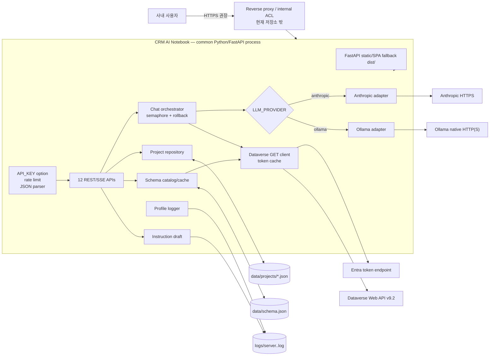
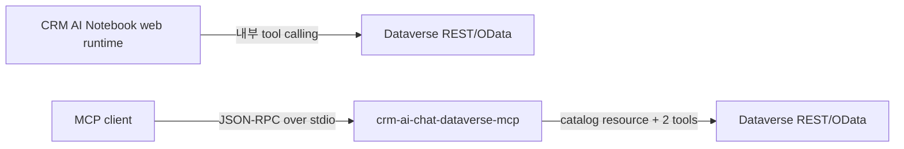
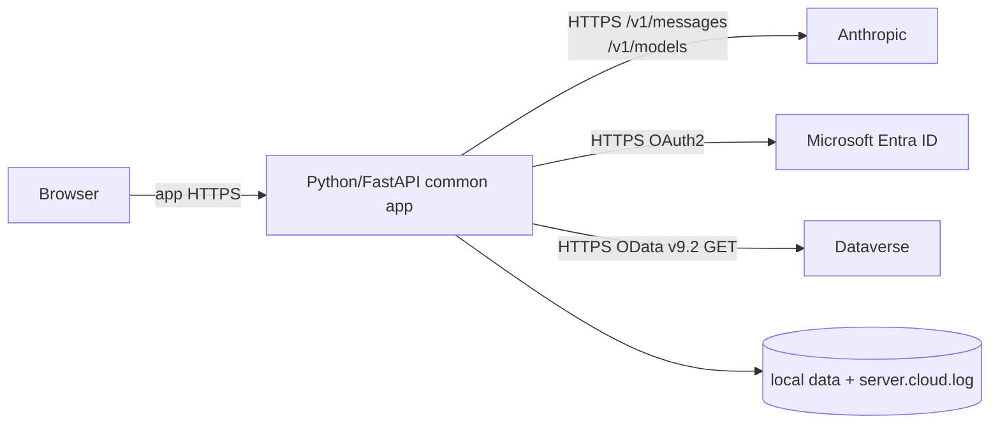
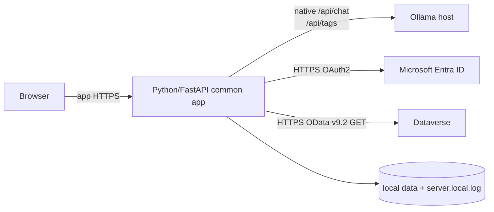
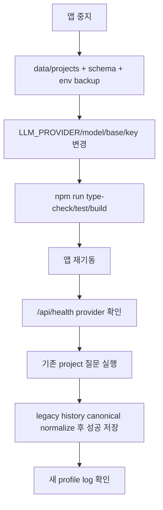
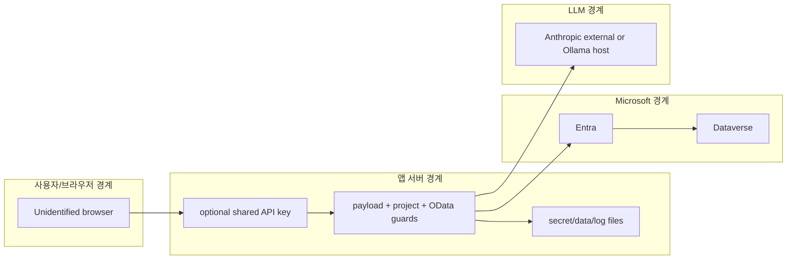
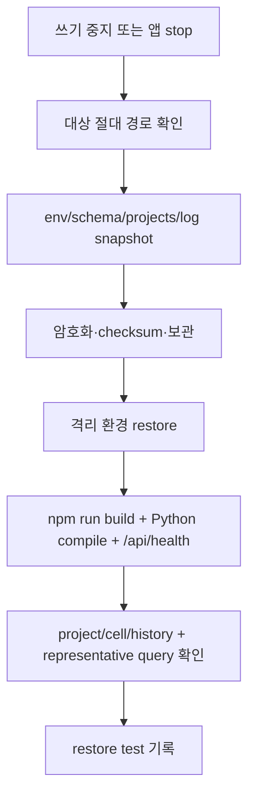

# CRM AI Notebook — 07 인프라 아키텍처 정의서

> 문서 ID: `CRM-AI-SPEC-07`<br>
> 버전: `3.0`<br>
> 상태: `Final`<br>
> 기준일: `2026-08-13`<br>
> 적용 대상: Cloud / Local 공통 React + Python/FastAPI 애플리케이션<br>
> 상위 문서: [`../FINAL_HANDOVER.md`](../FINAL_HANDOVER.md)

> **프로필 원칙:** 애플리케이션 인프라와 코드 계층은 하나다. 배포 시 `LLM_PROVIDER`, 모델, LLM base URL, 필요한 provider 자격증명만 달라진다. Dataverse·API·저장·로그 형식은 공통이며 로그 파일명은 provider에서 파생된다.

---

## 1. 목적·범위

이 문서는 `defineview` 인프라 아키텍처 예시의 논리 구성·물리 배치·연결·신뢰 경계·저장·장애·백업 표를 현재 통합 런타임에 적용한다.

### 1.1 포함 범위

- React 18 + TypeScript + Vite SPA
- Python 3.11+ + FastAPI/Uvicorn 공통 앱 서버
- Anthropic/Ollama provider adapter
- Microsoft Entra ID client credentials와 Dataverse Web API v9.2
- 프로젝트·스키마·로그 로컬 파일
- JSON/SSE, 레이트리밋, semaphore, timeout, health, graceful shutdown
- 단일 노드 배포와 개발 프록시

### 1.2 범위 밖

- 다중 인스턴스·공유 DB·분산 세션
- 사용자 IAM/RBAC·프로젝트 소유권
- Kubernetes·container image·자동 scaling
- 자동 backup scheduler·재해복구 site
- 인터넷 공개용 WAF/TLS/SSO 표준 구성

## 2. 아키텍처 원칙

| 원칙 | 현재 구현 |
|---|---|
| One codebase contract | 활성 `src/`, `backend/`, 실행·검증 script를 동일 계약으로 관리 |
| Provider boundary | LLM 차이는 adapter와 env에서만 처리 |
| Read-only CRM | 두 도구와 Dataverse client가 GET만 수행 |
| Server authority | 프로젝트 tables·instructions·history를 서버가 읽고 검증 |
| Progressive schema | 얇은 catalog 후 필요한 table만 describe |
| Canonical persistence | provider 중립 history로 저장·마이그레이션 |
| Single-node files | data와 logs를 로컬 파일로 보관 |
| Same-origin production | FastAPI가 `/api/*`와 `dist/`를 같은 port에서 제공 |
| Internal-only default | 인증·RBAC 보강 전 외부 공개 금지 |

## 3. 공통 논리 아키텍처



### 3.1 계층별 책임

| 계층 | 구성 요소 | 책임 | 상태 |
|---|---|---|---|
| Browser | React/Vite, marked, DOMPurify | UI·REST/SSE·자동저장·내보내기 | last active ID in localStorage |
| API boundary | FastAPI middleware, rate-limit | static/API, optional key, input outer-shape validation | IP buckets, refresh flag |
| Application | `backend/main.py`, `chat_api.py`, `projects.py`, `instructions_draft.py` | context, tools, CRUD, draft | history map, semaphore |
| Provider | common interface + 2 adapters | native protocol 변환, timeout, health | provider config |
| Data access | `backend/dataverse.py` | Entra token, metadata/data GET, retry | token cache |
| Persistence | data/, logs/ | schema·project·history·structured log | local files |

### 3.2 별도 MCP 서버와의 경계



`crm-ai-chat-dataverse-mcp`는 `dataverse://catalog`, `dataverse_describe_table`, `dataverse_query`를 제공하는 별도 표준 MCP 서버다. 웹앱 FastAPI process는 이 MCP process를 실행하거나 호출하지 않는다. 웹앱은 같은 이름의 provider-neutral 내부 tool contract를 `backend/chat_api.py`에서 실행한다. MCP는 MCP client의 연결·탐색·스키마 검증 경로이며 독립 배포·설정·로그 대상으로 본다.

이 제품은 SQL database나 SQL generator를 사용하지 않는다. 자연어 질문은 Dataverse OData 상대경로로 변환된다.

## 4. 물리 배치 프로필

### 4.1 Cloud profile



| 항목 | 배치 요구 |
|---|---|
| `LLM_PROVIDER` | `anthropic` |
| Provider secret | `ANTHROPIC_API_KEY` |
| Model/base | `LLM_MODEL`, `LLM_BASE_URL` 또는 Anthropic fallback 변수 |
| Outbound | Anthropic, Entra, Dataverse HTTPS |
| Data approval | 질문·지침·catalog·tool result 외부 전송 승인 |
| Active log | `logs/server.cloud.log` |

### 4.2 Local profile



| 항목 | 배치 요구 |
|---|---|
| `LLM_PROVIDER` | `ollama` |
| Provider secret | 없음. native adapter는 `LOCAL_LLM_API_KEY`를 사용하지 않음 |
| Model/base | `LLM_MODEL`, `LLM_BASE_URL` 또는 Local fallback 변수 |
| Model host | 앱과 같은 host의 loopback 또는 제한된 내부 host |
| Outbound | Entra·Dataverse HTTPS. 모델 다운로드 시 별도 경로 |
| Active log | `logs/server.local.log` |

Ollama가 같은 장비면 11434를 loopback으로 유지한다. 별도 장비면 앱 서버에서 필요한 내부망 경로만 허용하고 임의 사용자가 직접 model endpoint에 접근하지 못하게 한다.

### 4.3 프로필 전환



provider를 한 프로세스에서 hot switch하는 기능은 없다. 환경 변경 후 재기동한다.

## 5. 신뢰 경계



| 경계 | 전달 데이터 | 현재 통제 | 미해결 |
|---|---|---|---|
| Browser → App | project mutations, message/sessionId | optional key, type checks, ID validation, rate limit | 사용자 신원·RBAC 없음 |
| App → LLM | system, 질문, catalog, history, tool result | provider endpoint·timeout | Cloud 외부 전송, Local host ACL |
| App → Entra | tenant/client/secret, scope | server-side only, token cache | secret storage/rotation 운영 |
| App → Dataverse | Bearer token, GET path | relative path, entity set scope, special path block, `$top<=100`, response byte limit | `$expand` 내부 깊이는 완전 제어 아님 |
| App → Files | project/schema/log | ID regex, project/schema 원자 교체, local process access | 암호화·프로세스 간 공유 락·RBAC 없음 |
| Operator → Backup | secret/schema/project/log | 저장소 밖 절차 | 담당자·주기·restore test 필요 |

## 6. 네트워크·포트·프로토콜

| Source | Destination | 기본 port/protocol | 목적 | 권장 제한 |
|---|---|---|---|---|
| Browser | App/reverse proxy | `PORT=3000` HTTP 또는 운영 HTTPS | SPA·JSON·SSE | 내부망/SSO/TLS |
| Vite dev | FastAPI/Uvicorn | `PORT`, 기본 3000 HTTP | `/api` proxy | loopback |
| App | Anthropic | 443 HTTPS | Cloud chat/health | provider allowlist |
| App | Ollama | 11434 HTTP 기본 | Local chat/health | loopback/내부 앱 host만 |
| App | Entra | 443 HTTPS | OAuth2 client_credentials | Microsoft endpoint |
| App | Dataverse | 443 HTTPS | metadata/data GET | 지정 tenant URL |

Vite 개발 서버는 기본 5173이다. proxy target은 `VITE_API_PROXY_TARGET` 또는 `http://localhost:${PORT}`로 계산하므로 프로필별 hard-coded port 차이를 만들지 않는다.

SSE를 reverse proxy 뒤에서 사용할 때 buffering과 idle timeout이 chat timeout보다 짧지 않은지 검증한다.

## 7. 저장 구조

```text
<project-root>/
├─ .env                         # Git 제외, secrets/profile
├─ dist/                        # client build, Git 제외
├─ backend/                     # 활성 Python/FastAPI 백엔드
├─ data/                        # 전체 Git 제외
│  ├─ schema.json               # catalog/schema/entitySetName
│  ├─ projects/<id>.json        # instructions/cells/canonical history
│  └─ instructions.json         # legacy migration source only
├─ logs/                        # 전체 Git 제외
│  ├─ server.cloud.log          # Cloud 활성 파일
│  ├─ server.local.log          # Local 활성 파일
│  └─ server.<profile>.log.<date>.gz
└─ defineview/                  # 문서 예시, Git 제외
```

### 7.1 저장 자산

| 자산 | writer | reader | 일관성 특성 |
|---|---|---|---|
| 프로젝트 JSON | projects CRUD, cell PATCH, chat history | API·chat core | 같은 Python process의 로컬 fs, 다중 worker 미지원 |
| schema JSON | describe/refresh | catalog·chat guard | 임시 파일 `fsync` 후 원자 교체, bootstrap 없음 |
| profile log | logger stream | `/api/logs`, draft, operator | JSON Lines, 회전·gzip |
| memory history | chat core | 같은 process chat | TTL 24h, 기본 max 200, disk 복구 |
| token cache | Dataverse client | data/metadata GET | 만료 60초 전 갱신, 401 시 1회 재발급 |

## 8. 백업·복구 아키텍처

### 8.1 백업 단위

| 우선순위 | 단위 | 백업 이유 | 보안 |
|:---:|---|---|---|
| P0 | secrets/env | provider·Dataverse 재연결 | 암호화, 최소 접근, rotation |
| P0 | `data/schema.json` | catalog bootstrap·scope guard | metadata로 분류 |
| P0 | `data/projects/` | 업무 질문·CRM 결과·지침·history | 민감 데이터 암호화 |
| P1 | 활성/회전 로그 | 감사·장애 분석 | 보존·마스킹·접근 제한 |
| P1 | source revision + lockfile | 재현 build | revision 기록 |

### 8.2 일관된 백업 흐름



저장소 clone만으로 `data/`, `logs/`, `.env`는 복구되지 않는다. 특히 `schema.json`이 없으면 테이블 목록이 비고 chat query guard가 fail-closed한다.

## 9. 횡단 관심사

| 관심사 | 현재 구현 | 운영 주의 |
|---|---|---|
| Authentication | optional shared key | SPA 미연동, RBAC 아님 |
| Input validation | project outer shape, registered tables, chat required fields | 내부 instruction/cell row schema는 완전 검증 아님 |
| Rate limit | chat/describe `request.client.host` 20/60s 기본, 만료·최대 bucket 정리 | forwarded-header는 기본 loopback proxy만 신뢰 |
| Concurrency | chat semaphore 기본 10 | process-local |
| Timeout | LLM 120s, Dataverse 60s | reverse proxy timeout 정렬 |
| Retry | Dataverse network 1회, 401 token refresh 1회 | 무제한 retry 없음 |
| Logging | profile JSON Lines + console | stdout와 파일 수집 중복 주의 |
| Rotation | daily 또는 50MB, gzip, max 30 | 조직 보존과 맞춤 |
| Shutdown | SIGTERM/SIGINT graceful, 기본 30s | process manager stop timeout 정렬 |
| Health | provider ping + config + concurrency | HTTP 200만 보지 말고 chat.enabled 확인 |

## 10. 장애 지점과 확인 순서

| 장애 | 확인 순서 |
|---|---|
| 앱 기동 실패 | Python/venv/requirements → `.env` → `LLM_PROVIDER` 허용값 → port 충돌 → profile log |
| SPA 503 | `dist/index.html` → `npm run build` → process cwd |
| 모든 API 401 | `API_KEY` → browser header 미지원 → proxy injection |
| chat disabled | health provider/configured/status → Dataverse missingEnv → model endpoint |
| Cloud provider | key/model/base → DNS/TLS/outbound → `/v1/models` |
| Local provider | process/model/base → `/api/tags` → CPU/RAM/VRAM |
| Dataverse | env → Entra token → service role → URL → OData error |
| scope guard | schema JSON → entitySetName → project tables |
| project missing | cwd → data/projects → ID filename → permissions/backup |
| log missing | provider value → expected server.cloud/local file → logs ACL |

## 11. 프로필 비교

| 항목 | Cloud | Local | 동일 관리 대상 |
|---|---|---|---|
| App runtime | 공통 Python/FastAPI 소스 | 공통 Python/FastAPI 소스 | O |
| UI/API/data schema | 동일 | 동일 | O |
| LLM protocol | Anthropic Messages SSE | Ollama NDJSON | adapter 내부 |
| LLM endpoint | 외부 HTTPS | 내부/loopback 기본 | env |
| Provider credential | Anthropic key | 없음 | profile 차이 |
| Active log | server.cloud.log | server.local.log | 형식·회전 동일 |
| Backup | schema/projects/secrets/log | 동일 | O |
| Dataverse | Entra + HTTPS GET | 동일 | O |

## 12. 검수 체크포인트

| ID | 검수 | 기대 결과 |
|---|---|---|
| `INFRA-CHK-01` | 빌드·컴파일 | SPA build와 Python compile 성공 |
| `INFRA-CHK-02` | provider profile | health와 log filename이 env와 일치 |
| `INFRA-CHK-03` | network egress | profile별 필요한 endpoint만 허용 |
| `INFRA-CHK-04` | relative OData | absolute/special path가 외부 fetch 전에 차단 |
| `INFRA-CHK-05` | data restore | schema와 projects가 새 clone에서 복원 |
| `INFRA-CHK-06` | provider switch | 기존 canonical/legacy history로 문맥 지속 |
| `INFRA-CHK-07` | graceful stop | 신규 요청 중단·연결 종료·로그 기록 |
| `INFRA-CHK-08` | reverse proxy SSE | buffering 없음, timeout 충분 |
| `INFRA-CHK-09` | single instance | 중복 process가 같은 data directory를 쓰지 않음 |
| `INFRA-CHK-10` | secrets | source/log/browser에 노출되지 않음 |

## 13. 알려진 제약

- 로컬 JSON이므로 수평 확장·shared storage·transaction을 지원하지 않는다.
- 프로젝트·스키마에는 원자적 temporary write/rename이 적용됐지만, 파일 손상 자동 복구·프로세스 간 공유 락은 없다.
- health 최상위 `ok=true`는 provider·Dataverse 사용 가능을 단독 보장하지 않는다.
- 사용자 RBAC·TLS termination·backup automation은 앱 코드 밖이다.
- Ollama native endpoint에 인증 header를 보내지 않는다.
- schema bootstrap·신규 table discovery가 없다.
- 레거시 코드가 남아 있으면 운영자가 잘못 실행할 수 있다.
- (2026-08-13부터 해소됨) 과거 별도 동기화하던 `crm-ai-chat-local-llm` mirror는 폐기했고, `crm-ai-chat` 단일 저장소만 운영한다.

## 14. 변경 이력

| 버전 | 날짜 | 상태 | 변경 내용 |
|---|---|---|---|
| `1.0` | 2026-08-12 | Superseded | Cloud FastAPI와 Local Express 물리 구조 기준 |
| `2.0` | 2026-08-12 | Superseded | 공통 기능과 이전 서버 배치 기준 |
| `3.0` | 2026-08-13 | Final | 공통 Python/FastAPI 배치, provider adapter, canonical history, profile log, 통합 backup/network 기준으로 확정 |
