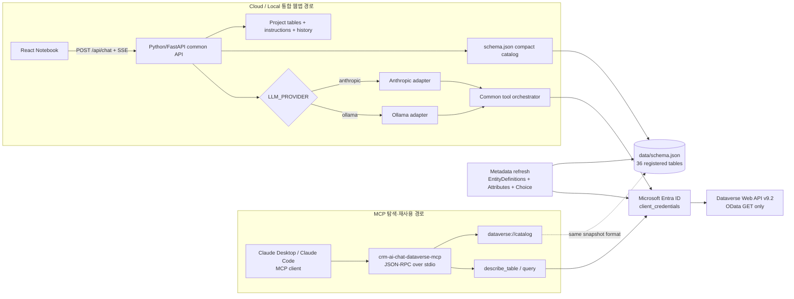
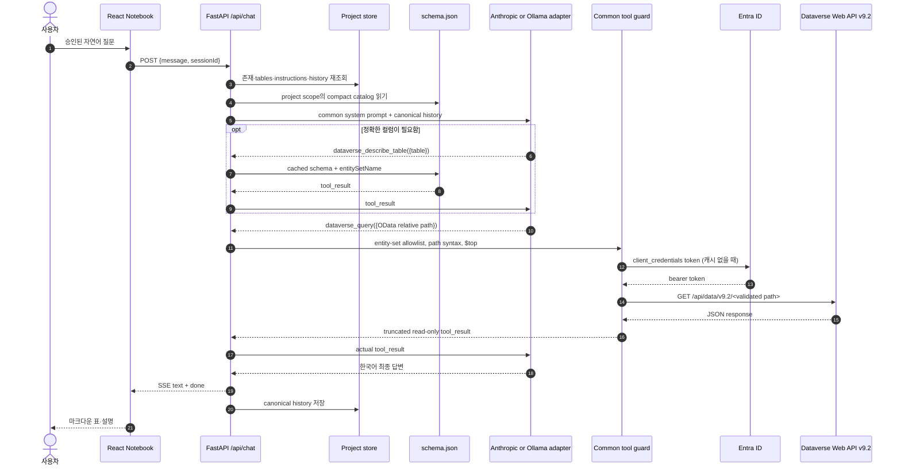

# CRM AI Notebook — 09 종단간 검증 시나리오

> 문서 ID: `CRM-AI-SPEC-09`  
> 버전: `3.0`  
> 상태: `Final`  
> 기준일: `2026-08-13`  
> 검증 상태: standalone MCP·Dataverse REST·스키마·Local Ollama/FastAPI 라이브 E2E PASS / Anthropic live 미실행  
> 적용 대상(검증 당시): `crm-ai-chat`(canonical/Cloud) / `crm-ai-chat-local-llm`(Local mirror) / `crm-ai-chat-dataverse-mcp`  
> ⚠️ 2026-08-13 이후 갱신: `crm-ai-chat-local-llm` mirror 저장소는 폐기했고 `crm-ai-chat` 단일 저장소만 운영한다. 아래 Local mirror 관련 수치·경로는 폐기 시점 기준 역사적 증거로 그대로 보존한다.  
> 상위 문서: [`../FINAL_HANDOVER.md`](../FINAL_HANDOVER.md)

> **핵심 판정:** 이 제품에서 일반적으로 부르는 “Text-to-SQL”은 실제로는 **Text-to-OData**다. LLM은 SQL을 생성·실행하지 않고, 허용된 Dataverse 엔티티 집합에 대한 OData 상대 경로를 만든다. 서버는 경로를 다시 검증한 뒤 Microsoft Dataverse Web API v9.2에 **HTTP GET**만 보낸다.

---

## 1. 이 문서가 증명하는 것

이 문서는 별개 기능을 나열하지 않고 다음 하나의 시나리오로 연결한다.

1. Dataverse 조회 도구를 MCP stdio 서버로 연결하고 자원·도구 계약을 탐색한다.
2. 같은 읽기 전용 계약을 통합 웹앱의 내부 LLM tool-use API에 적용한다.
3. 서비스 주체 OAuth2 `client_credentials`로 Dataverse REST에 접속한다.
4. `EntityDefinitions` 메타데이터를 REST로 읽어 36개 테이블의 `schema.json`을 정리한다.
5. 사용자 자연어 질문을 OData 조회로 변환하고 `describe → query → REST GET → 응답`을 완성한다.
6. 프로젝트별 지침을 저장하고 매 채팅 요청의 system prompt에 주입한다.
7. Cloud와 Local은 LLM provider·모델만 다르고 위 흐름과 보안 규칙은 같다.

증거는 코드, Git 이력, 민감 내용을 제외한 파일 통계, 과거 실행 로그와 저장 history로 나눈다. 질문 원문, 테넌트·클라이언처럼 식별 가능한 값, 시크릿, 액세스 토큰, 엔티티·컬럼명, CRM 레코드 내용은 싣지 않는다.

## 2. 가장 중요한 경계: MCP 서버와 통합 웹앱

### 2.1 서로 다른 두 실행 경로

| 구분 | 실제 MCP 경로 | 통합 웹앱 경로 |
|---|---|---|
| 저장소 | `crm-ai-chat-dataverse-mcp` | `crm-ai-chat` canonical 및 동기화된 `crm-ai-chat-local-llm` mirror |
| 입구 | MCP 클라이언트가 자식 프로세스 실행 | React가 FastAPI `POST /api/chat` 호출 |
| 프로토콜 | JSON-RPC over stdio | HTTP JSON + SSE, LLM provider API |
| 카탈로그 | `dataverse://catalog` MCP resource | system prompt의 압축 catalog |
| 스키마 상세 | `dataverse_describe_table` MCP tool | 동일 이름의 내부 LLM tool |
| 데이터 조회 | `dataverse_query` MCP tool | 동일 이름의 내부 LLM tool |
| 스코프 | 서버 인스턴스별 `DATAVERSE_MCP_TABLES` | 프로젝트별 `tables` |
| Dataverse 마지막 호출 | OAuth2 + OData GET | OAuth2 + OData GET |

**통합 웹앱은 `crm-ai-chat-dataverse-mcp` 프로세스를 런타임에 호출하지 않는다.** 대신 MCP 서버에서 정립한 카탈로그 + 두 도구의 읽기 전용 계약을 FastAPI 내부에 동일하게 구현했다. 따라서 웹앱 로그에 `dataverse_query`가 남았다는 것은 **웹앱 tool-use 실행 증거**이지, 별도 MCP stdio 프로세스를 호출했다는 증거는 아니다.

### 2.2 MCP가 사용된 의미

MCP는 두 가지 의미로 사용됐다.

- **구축·탐색 계약:** 카탈로그를 보고, 필요한 테이블을 describe한 뒤, 읽기 전용 query를 수행하는 순서를 도구 계약으로 정립했다.
- **별도 재사용 런타임:** Claude Desktop, Claude Code 등 일반 MCP 클라이언트가 stdio로 도구를 직접 사용할 수 있다.

반면 현재 웹앱의 실제 질문 처리는 MCP transport 대신 `backend/chat_api.py`의 내부 함수와 `backend/dataverse.py`의 Dataverse REST를 사용한다. 이 분리로 Cloud/Local 모두 MCP 클라이언트 설치 없이 같은 앱 기능을 가진다.

## 3. 전체 아키텍처



점선은 **파일 형식·도구 계약의 공유**를 뜻한다. 웹앱에서 MCP 서버로 반드시 네트워크 호출을 한다는 뜻이 아니다.

## 4. 하나의 종단간 시나리오

### A. MCP 연결과 도구 탐색

1. MCP 클라이언트가 `node dist/index.js`를 자식 프로세스로 실행한다.
2. `StdioServerTransport`로 initialize 핸드셰이크를 수행한다.
3. 클라이언트는 `dataverse://catalog` 자원과 다음 두 도구를 발견한다.

| 도구 | 입력 | 역할 | 네트워크 |
|---|---|---|---|
| `dataverse_describe_table` | `{ table }` | `schema.json`에서 컬럼·타입·라벨·엔티티 집합명 읽기 | 없음 |
| `dataverse_query` | `{ path }` | 검증된 OData 상대 경로를 Dataverse GET으로 실행 | 있음 |

MCP 서버의 카탈로그는 이미 정리된 `schema.json`을 읽는다. **MCP catalog 자원 자체가 Dataverse 전체 메타데이터를 자동 발견하거나 `schema.json`을 생성하는 것은 아니다.**

### B. 서비스 주체 인증과 `schema.json` 정리

현재 스키마 스냅샷의 생성·갱신 경로는 MCP가 아니라 **Dataverse REST metadata API**다.

1. 서버가 `DATAVERSE_TENANT_ID`, `DATAVERSE_CLIENT_ID`, `DATAVERSE_CLIENT_SECRET`, `DATAVERSE_URL`을 읽는다.
2. Microsoft identity platform v2 token endpoint에 `grant_type=client_credentials`, `scope=<Dataverse URL>/.default`로 토큰을 요청한다.
3. `POST /api/schemas/refresh`는 `schema.json`에 **이미 등록된 논리명 키**를 6개씩 배치로 처리한다.
4. 테이블별 `EntityDefinitions(LogicalName='...')`에서 `EntitySetName`, `DisplayName`, `Attributes`(논리명, 타입, 표시명, 필수 여부)를 GET한다.
5. Choice 계열(Picklist·State·Status·MultiSelect) 속성은 각 metadata와 `OptionSet`/`GlobalOptionSet`을 추가 GET해 필터에 필요한 숫자 코드를 `코드=라벨` 형태로 보강한다. 이 추가 요청은 공유 동시성 상한과 429 재시도를 적용한다.
6. 결과를 마크다운 스키마 표로 정규화하고 `schema`, `entitySetName`, `updatedAt`을 `data/schema.json`에 기록한다.
7. 갱신 후 메모리 카탈로그를 다시 로드한다.

현재 파일 실측 결과는 다음과 같다.

| 스냅샷 | 등록 테이블 | schema 존재 | entitySetName 존재 | updatedAt 존재 | SHA-256 식별 접두사 |
|---|---:|---:|---:|---:|---|
| Cloud 웹앱 | 36 | 36 | 36 | 36 | `CFF1A2BF…` |
| Local 웹앱 | 36 | 36 | 36 | 36 | `6D9EDB8E…` |
| MCP 서버 | 36 | 36 | 36 | 36 | `6D9EDB8E…` |

Local과 MCP의 hash가 같으므로 현재 MCP가 Local 스키마 스냅샷을 같은 바이트로 사용하는 것을 확인할 수 있다. Cloud hash가 다른 것은 갱신 시점·서식 차이가 있음을 뜻하며 36개 카탈로그 구조 완전성은 같다. 해시는 문서 작성 시점의 무결성 식별자이며 파일을 갱신하면 바뀐다. 전체 hash는 로컬 검증 출력으로만 보존하고 문서에는 접두사만 표시했다.

Cloud 과거 운영 로그에는 `2026-08-06` 36/36, `2026-08-07` 36/36 REST 스키마 갱신 완료 기록이 남아 있다. 즉 코드 정의만 있는 것이 아니라, 36개 테이블 메타데이터 배치가 실제 성공했던 이력이 있다.

> 제한: 현재 refresh는 기존 JSON 키만 갱신한다. 빈 신규 환경에서 36개 테이블을 자동 발견하지 않으므로 승인된 seed/백업을 먼저 복구해야 한다.

### C. 스키마·도구 계약의 웹앱 API 적용

통합 FastAPI 서버는 MCP 서버의 개념을 다음과 같이 내부 tool-use 계약으로 적용한다.

- 전체 컬럼을 prompt에 다 넣지 않고 `backend/dataverse.py`의 `build_compact_catalog()`로 테이블·라벨·도메인·엔티티 집합명만 주입한다.
- LLM이 정확한 컬럼을 모르면 `dataverse_describe_table`을 선택한다. 이 도구는 로컬 캐시만 읽으므로 Dataverse 네트워크 호출이 없다.
- 실제 데이터가 필요하면 `dataverse_query`를 선택한다. 서버는 LLM이 만든 `path`를 신뢰하지 않고 프로젝트 테이블 스코프와 `schema.json` 엔티티 집합 allowlist로 다시 검증한다.
- 일반 컬렉션 조회에 `$top`이 없으면 `$top=100`을 추가하고 100을 넘는 명시값은 100으로 낮춘다. `$count=true`에도 같은 행 상한을 적용한다.
- 절대 URL, CR/LF, backslash, fragment, `$batch`, `$ref`, `$value`, 허용 범위 밖 엔티티 집합을 거절한다.
- 프로젝트에 테이블이 지정되어 있으면 그 범위만 허용하고, 빈 배열이면 `schema.json`에 등록된 전체 테이블을 사용한다.
- CRM 생성·수정·삭제 도구는 등록되지 않았다.

### D. 자연어 → Text-to-OData → Dataverse 응답

사용자가 테이블이나 OData를 직접 입력할 필요는 없다. 실제 변환 단위는 다음과 같다.

```text
승인된 자연어 질문
  → LLM이 필요 테이블 선택
  → (필요 시) dataverse_describe_table({ table })
  → dataverse_query({ path: "<entity-set>?$select=...&$filter=...&$top=..." })
  → 서버 OData 가드·스코프 검증
  → GET <Dataverse URL>/api/data/v9.2/<validated-relative-path>
  → JSON tool_result
  → LLM이 한국어 설명·마크다운 표로 변환
  → SSE text/done
```

이 흐름에는 SQL parser, SQL driver, SQL connection string, `SELECT ... FROM ...` 실행 단계가 없다. `backend/chat_api.py`에서 SQL은 실제 조회 없이 본문에 OData·SQL·JSON을 적어 조회한 것처럼 하지 말라는 금지 규칙에만 등장한다. 따라서 문서·화면에서는 가능한 한 `Text-to-OData` 또는 `자연어 Dataverse 조회`라고 부른다.

### E. 프로젝트 지침 저장과 매 요청 주입

지침은 전역 파일이 아니라 프로젝트별 `data/projects/<id>.json`의 `instructions`에 저장된다.

| 지침 유형 | 필드 | system prompt 표현 |
|---|---|---|
| 테이블 관계 | `joins` | `fromTable.fromCol = toTable.toCol` |
| 업무 용어 | `terms` | `table.column: "term" = definition` |
| 질문 예시 | `examples` | `Q: ... / A: ...` |

1. 사용자가 지침 모달에서 저장하면 `PATCH /api/projects/{project_id}` 요청으로 해당 프로젝트만 바꾼다.
2. 채팅 요청에서 서버는 클라이언트가 보낸 tables/지침을 믿지 않고 `sessionId`로 프로젝트를 다시 읽는다.
3. `backend/chat_api.py`가 프로젝트 지침을 읽어 매 LLM turn의 system prompt에 합친다.
4. 지침·질문·도구 결과는 신뢰할 수 없는 업무 데이터로 취급하며, 시스템 규칙·자격 증명 공개를 요구하는 내용은 따르지 않는다.

현재 보존된 Cloud 4개, Local 2개 프로젝트 파일은 모두 `instructions` 구조를 가지고 있다. 문서 작성 시점의 보존 프로젝트에는 비어 있으므로, 코드·영속화 구조는 확인되지만 특정 업무 지침이 실제 데이터 응답을 바꿨다고 과장하지 않는다.

### F. Cloud / Local provider만 분기

| 구분 | Cloud | Local | 공통 계약 |
|---|---|---|---|
| `LLM_PROVIDER` | `anthropic` | `ollama` | provider factory의 단일 분기 |
| 어댑터 | Anthropic Messages REST/SSE | Ollama native `/api/chat` | 동일 canonical message/tool event |
| 활성 로그 | `logs/server.cloud.log` | `logs/server.local.log` | 동일 JSON line 형식·회전 정책 |
| 바뀌지 않는 것 | 웹 UI, FastAPI, 프로젝트, prompt, 두 Dataverse 도구, OAuth, OData 가드, SSE, history | 좌동 |

`backend/chat_api.py`는 제공자를 알지 못하는 공통 orchestrator다. `backend/provider_factory.py`가 환경변수를 보고 adapter 하나를 선택한다. provider 차이를 이 경계 밖으로 퍼뜨리지 않는 것이 두 프로필을 함께 유지보수하는 핵심 원칙이다.

### G. 응답·히스토리·로그 완료

1. 도구 결과가 LLM에 돌아가고 최종 한국어 답변을 생성한다.
2. 서버는 `text`, `tool`, `query`, `done` 또는 `error` SSE 이벤트를 브라우저에 보낸다.
3. 성공한 canonical history를 프로젝트에 저장하고, 오류 시 해당 turn을 rollback한다.
4. 장기 history에서 describe 원문은 생략 표시로 컴팩션해 context를 제어한다.
5. 실행 provider에 따라 활성 로그 파일 하나에 질문·도구·답변·오류 상태를 남긴다.

## 5. 종단간 시퀀스



## 6. 확인된 실행 증거

### 6.1 과거 웹앱 tool-use 로그

아래 수는 민감 메시지를 읽어 문서에 복사하지 않고 `category=API-쿼리` 및 메시지 앞의 도구명만 집계한 결과다.

| 프로필 | 로그 증거 위치 | `dataverse_describe_table` | `dataverse_query` | 해석 |
|---|---|---:|---:|---|
| Cloud | `logs/app.log`, `logs/app.log.*.gz` | 9 | 21 | 과거 API tool 실행 기록. 이 로그 세대는 성공/오류 필드가 없으므로 **호출 시도 횟수**로 해석 |
| Local | `../../crm-ai-chat-local-llm/logs/app.log` | 7 | 1 | 과거 Local API tool 실행 기록; query 1회 실행 완료 기록 |

새 통합 로거의 활성 파일은 Cloud `logs/server.cloud.log`, Local `logs/server.local.log`다. `app.log` 파일은 삭제하지 않은 과거 증거이며 새 실행의 활성 대상이 아니다.

### 6.2 저장 history의 tool_result 증거

history는 호출과 결과를 연결할 수 있어 로그보다 성공/오류 판단에 더 적합하다.

| 프로필 | 보존 history 호출 | 결과 판독 |
|---|---|---|
| Cloud | describe 3, query 4 | describe 성공 3; query 성공 3, 오류 1 |
| Local | describe 2, query 1 | describe 성공 2; query 성공 1 |

로그와 history는 같은 실행을 중복 기록할 수 있으므로 두 수를 더해 “총 사용량”으로 보지 않는다. 또한 이 증거는 같은 이름의 **웹앱 내부 도구**가 실제 사용됐음을 증명하며, MCP stdio transport 사용 횟수로 변환해 표현하지 않는다.

### 6.3 2026-08-12 보존 실측과 2026-08-13 현행 검증 상태

2026-08-12에는 승인된 자격 증명으로 standalone MCP·Dataverse REST·스키마와 당시 웹앱 구현을 실측했다. 2026-08-13에는 활성 런타임을 Python/FastAPI로 확정하고 자동 계약 검증을 다시 수행했다. 질문, 지침 원문, 테이블·컬럼명, URL, token, CRM 값은 증거에서 제외했다.

#### 독립 MCP stdio + live Dataverse REST

| 검증 항목 | 실측 결과 | 판정 |
|---|---|---|
| TypeScript type-check / build / 자격 증명 없는 smoke | 모두 PASS | 성공 |
| MCP SDK stdio initialize | handshake 완료 | 성공 |
| catalog resource | 36줄 읽기 | 성공 |
| tool discovery | `dataverse_describe_table`, `dataverse_query` 2개 | 성공 |
| cached describe | 정상 tool result | 성공 |
| allowlist negative test | 범위 밖 엔티티 집합 거절 | 성공 |
| Entra service-principal token | HTTP 200 | 성공 |
| Dataverse metadata GET | HTTP 200 | 성공 |
| Dataverse data GET | HTTP 200 | 성공 |
| live `dataverse_query` | 1 row, 99 properties; 응답 무결성 hash 접두사 `bcf8fcd9…` | 성공 |

`1 row / 99 properties`는 실제 응답이 JSON 행으로 파싱되었다는 구조 증거다. 해당 property 이름·값과 전체 hash는 문서에 싣지 않았다. 이 결과가 **별도 MCP stdio 프로세스의 실제 사용 증거**다.

#### 3-way schema 일치와 live metadata 실측

| 검증 항목 | 실측 결과 | 판정 |
|---|---|---|
| Cloud / Local / MCP 카탈로그 | 각각 36개 | 성공 |
| 3-way semantic comparison | mismatch 0 | 성공 |
| 승인된 테이블 1개의 live metadata 대비 | 캐시 110 / live 110 속성 | 성공 |

파일 hash가 다른 Cloud 스냅샷도 논리 카탈로그를 정규화해 비교했을 때 Local/MCP와 semantic mismatch가 0이었다. 또한 선택한 테이블의 저장 속성 수와 live `EntityDefinitions` 결과가 110/110으로 일치했다. 이는 36개 카탈로그의 형식 완전성과 대표 테이블의 live metadata 일치를 각각 증명한다.

#### 이전 웹앱 구현의 Cloud Text-to-OData + 지침 — 역사적 참고

| 검증 항목 | 2026-08-12 실측 결과 | 판정 |
|---|---|---|
| 격리 포트 기동 | `31987` | 성공 |
| `GET /api/health` | HTTP 200, `chat.enabled=true` | 성공 |
| 임시 프로젝트 생성·지침 PATCH | 저장 성공 | 성공 |
| `POST /api/chat` SSE | 전체 8 events, describe 1, query 2, done 1, error 0 | 성공 |
| 지침 system-prompt 주입 | 검증 marker 반영 `true` | 성공 |
| CRM 행 유출 없는 쿼리 | 서버 강제/LLM 생성 경로에 `$top=0`, CRM row egress 0 | 성공 |
| 정리 | 임시 프로젝트 DELETE 후 GET 404, 테스트 서버 종료 | 성공 |

이 테스트는 당시 TypeScript 서버 구현에서 수행된 역사적 증거다. 호출 계약·인증·describe·query·SSE·지침 주입·정리를 확인했지만, **2026-08-13 활성 Python/FastAPI 런타임의 라이브 E2E PASS 근거로 재사용하지 않는다.** CRM 행이 프로세스 밖으로 나오지 않도록 `$top=0`을 사용했고 임시 프로젝트·프로세스는 정리했다.

#### 현행 Python/FastAPI 자동 계약 검증

| 검증 항목 | 2026-08-13 결과 | 판정 |
|---|---|---|
| 프론트엔드 TypeScript type-check | 통과 | 성공 |
| Python 단위·API 계약 테스트 | 43/43 | 성공 |
| React/Vite build | 통과 | 성공 |
| Python backend compile | 통과 | 성공 |
| provider 계약 | 설정 우선순위, invalid provider, Anthropic SSE, Ollama NDJSON, health | 성공 |
| FastAPI·프로젝트 계약 | 12개 제품 API, health shape, CRUD, history 비노출, malformed JSON, unknown project | 성공 |
| 읽기 보안 계약 | `$top<=100`, scope/schema fail-closed, 절대·제어·특수 OData 경로 차단, 응답 상한 | 성공 |
| 현행 FastAPI + Local Ollama + Dataverse 라이브 채팅 | `$top=0` 안전 프로필 실측 | 성공 |
| 현행 FastAPI + Anthropic live | 내부 스키마 외부 전송 위험으로 안전 심사 차단 | 미실행 |

자동 테스트는 provider 공통 계약을 검증하고, Local 라이브 E2E는 FastAPI 전체 실행 경로를 검증한다. Anthropic은 외부 전송 승인 전까지 live PASS로 기록하지 않는다.

#### 현행 Python/FastAPI Local 라이브 E2E

| 검증 항목 | 2026-08-13 실측 결과 | 판정 |
|---|---|---|
| backend/runtime | `python-fastapi` | 성공 |
| provider/model | Ollama / `qwen3:8b`, localhost | 성공 |
| health/schema | health ok, schemaTables 36 | 성공 |
| 임시 프로젝트 지침 | 저장 `true` | 성공 |
| 내부 도구 호출 | describe 1회, query 2회 | 성공 |
| 최종 OData 제한 | `$top=0` 확인 | 성공 |
| CRM 행 LLM 전송 | 0행 | 성공 |
| SSE | done 1, error 0 | 성공 |
| 지침 marker | 확인 | 성공 |
| canonical checkout 답변 무결성 | 최종 회귀 516자, SHA-256 접두사 `c9ea0b568531c933` | 성공 |
| Local mirror checkout 답변 무결성 | 최종 회귀 297자, SHA-256 접두사 `f2ad01c9e15a0b9c` | 성공 |
| 정리 | 테스트 프로젝트 DELETE, 이후 GET 404 | 성공 |

동일한 안전 시나리오를 canonical checkout과 Local mirror checkout에서 각각 실행했다. 답변 길이와 해시는 비결정적인 모델 출력 때문에 다르지만, 두 실행 모두 describe 1회, query 2회, `$top=0`, CRM 전송 0행, SSE done 1/error 0, 지침 marker와 cleanup이라는 합격 조건을 만족했다. 이 검증은 실제 CRM 행 값을 LLM이나 문서로 반출하지 않고 서버·도구·Dataverse 연결과 지침 주입을 확인하기 위해 `$top=0`을 사용했다. Anthropic live는 같은 입력에 내부 스키마가 외부 제공자로 전송되는 위험 때문에 실행하지 않았다.

#### 증거 해석 규칙

- 과거 Cloud/Local `app.log` 집계는 **웹앱 내부 tool-use 사용 이력**이다.
- 이번 MCP SDK stdio initialize·tool call·live query는 **standalone MCP transport 실제 사용 증거**다.
- 2026-08-12 Cloud 앱 SSE 검증은 **이전 TypeScript orchestrator의 역사적 실행 증거**다.
- 현행 FastAPI는 자동 계약 테스트 43/43과 Local Ollama·Dataverse 안전 라이브 E2E를 통과했다.
- Anthropic live는 실행하지 않았으며 adapter mock 계약 테스트 결과와 혼동하지 않는다.
- 세 가지를 서로 대체하거나 횟수를 합산하지 않는다.

### 6.4 증거 매트릭스

| ID | 증명 대상 | 확인 결과 | 증거 위치 |
|---|---|---|---|
| `EV-MCP-001` | 실제 MCP transport | `StdioServerTransport` + JSON-RPC 서버 엔트리 존재 | `../../crm-ai-chat-dataverse-mcp/src/index.ts` |
| `EV-MCP-002` | MCP 노출 계약 | catalog resource 1개, read-only tools 2개만 등록 | `../../crm-ai-chat-dataverse-mcp/src/server.ts` |
| `EV-MCP-003` | MCP 프로토콜 검증 설계 | handshake, list/read resource, list/call tools, allowlist 거절 스모크 테스트 존재 | `../../crm-ai-chat-dataverse-mcp/scripts/smoke-test.mjs` |
| `EV-MCP-LIVE-001` | standalone MCP 실제 연결 | SDK stdio initialize, catalog 36줄, tools 2, describe, allowlist 거절, live query 성공 | 2026-08-12 실측 결과(본 문서 6.3) |
| `EV-LINEAGE-001` | MCP 적용 이력 | `539a4e5` MCP-only server, `f32ed63` frontend MCP-only 커밋이 현재 브랜치 조상 | Cloud Git 이력 |
| `EV-REST-001` | REST 전환 이력 | `258ff1a` Dataverse REST 공용 모듈, `a82b6b6` REST 스키마 갱신, `d8dada7` CLI 모드 제거 | Cloud Git 이력 |
| `EV-AUTH-001` | 서비스 주체 인증 | client credentials token 발급·캐시·Dataverse GET 공용 구현 | `../backend/dataverse.py` |
| `EV-SCHEMA-001` | metadata 정리 로직 | EntityDefinitions, Attributes, Picklist options → markdown + entitySetName | `../backend/dataverse.py`, `../backend/main.py` |
| `EV-SCHEMA-002` | 스키마 실행 이력 | Cloud 과거 로그에 36/36 갱신 완료 2회 | `../logs/app.log.2026-08-06.gz`, `../logs/app.log.2026-08-07.gz` |
| `EV-SCHEMA-003` | 스냅샷 완전성 | 세 스냅샷 모두 36/36 schema·entitySetName·updatedAt | 각 저장소 `data/schema.json` |
| `EV-SCHEMA-LIVE-001` | 3-way semantic/live metadata | Cloud/Local/MCP mismatch 0, 대표 테이블 cached/live 110/110 | 2026-08-12 실측 결과(본 문서 6.3) |
| `EV-API-001` | 웹앱 도구 계약 | describe/query 두 도구만 LLM에 제공 | `../backend/chat_api.py` |
| `EV-GUARD-001` | 읽기 가드 | 프로젝트 범위, entity set allowlist, 위험 경로 차단, `$top<=100`, 응답 상한 | `../backend/chat_api.py`, `../backend/dataverse.py`, `../tests_python/` |
| `EV-NOSQL-001` | Text-to-OData | active runtime에 SQL 실행 구현·의존성 없음; Dataverse GET만 사용 | `../backend/chat_api.py`, `../backend/dataverse.py`, `../requirements.txt` |
| `EV-INST-001` | 프로젝트 지침 | PATCH 저장, 서버 재조회, 매 turn system prompt 주입 | `../backend/projects.py`, `../backend/main.py`, `../backend/chat_api.py` |
| `EV-PROVIDER-001` | provider만 분기 | factory와 Anthropic/Ollama adapter, canonical event 계약 | `../backend/provider_factory.py`, `../backend/llm_provider.py`, `../backend/anthropic_provider.py`, `../backend/ollama_provider.py` |
| `EV-LOG-001` | 프로필 로그 | provider에서 cloud/local을 결정해 하나의 활성 파일에 기록 | `../backend/logger.py` |
| `EV-USE-CLOUD-001` | Cloud 도구 실사용 | 로그 9/21 호출, history describe 3 성공, query 3 성공·1 오류 | `../logs/`, `../data/projects/` |
| `EV-USE-LOCAL-001` | Local 도구 실사용 | 로그 7/1 호출, history describe 2·query 1 성공 | `../../crm-ai-chat-local-llm/logs/`, `../../crm-ai-chat-local-llm/data/projects/` |
| `EV-LEGACY-E2E-001` | 이전 웹앱 E2E | health enabled, 프로젝트·지침, SSE, marker, cleanup 성공 | 2026-08-12 역사적 실측; 현행 FastAPI PASS 근거 아님 |
| `EV-FASTAPI-AUTO-001` | 현행 자동 계약 | type-check, Python tests 43/43, SPA build, Python compile | 2026-08-13 검증 결과 |
| `EV-FASTAPI-LIVE-001` | 현행 웹앱 라이브 E2E | canonical checkout, Local Ollama + Dataverse `$top=0`: describe/query/SSE/지침/cleanup | 2026-08-13 PASS |
| `EV-FASTAPI-MIRROR-001` | Local mirror 동등 실행 | mirror checkout에서 같은 안전 E2E 합격 조건 재검증 | 2026-08-13 PASS |
| `EV-ANTHROPIC-LIVE-001` | Anthropic live | 내부 스키마 외부 전송 위험으로 실행하지 않음; adapter mock만 통과 | 미실행 |

## 7. 재현 명령과 합격 기준

### 7.1 민감 내용 없이 `schema.json` 구조 확인

`crm-ai-chat` 저장소 루트에서 실행한다.

```powershell
$schema = Get-Content -LiteralPath data\schema.json -Raw | ConvertFrom-Json
$entries = @($schema.PSObject.Properties)
[pscustomobject]@{
  Tables = $entries.Count
  WithSchema = @($entries | Where-Object { $_.Value.schema }).Count
  WithEntitySetName = @($entries | Where-Object { $_.Value.entitySetName }).Count
  WithUpdatedAt = @($entries | Where-Object { $_.Value.updatedAt }).Count
  Sha256 = (Get-FileHash -LiteralPath data\schema.json -Algorithm SHA256).Hash
}
```

합격 기준은 네 개 count가 모두 36이고 hash가 계산되는 것이다. 출력에 테이블·컬럼 내용을 추가하지 않는다.

### 7.2 MCP stdio 배선·캐시 describe·가드 재현

```powershell
Set-Location C:\Users\hansu\projects\crm-ai-chat-dataverse-mcp
npm run type-check
npm run build
npm run smoke-test
```

합격 기준:

- initialize 핸드셰이크 성공
- `dataverse://catalog` 노출·읽기 성공
- 두 도구만 노출
- 캐시 describe 성공
- allowlist 밖 엔티티 집합 거절

이 테스트는 자격 증명 없이 수행하므로 MCP protocol·자원·도구·가드를 증명하지만, Dataverse 실제 query 성공을 증명하지는 않는다.

### 7.3 REST metadata 갱신 재현

승인된 사내 환경에서 서버를 실행한 뒤 호출한다.

```powershell
$result = Invoke-RestMethod -Method Post -Uri http://localhost:3000/api/schemas/refresh
$result | Select-Object updated
```

합격 기준:

- HTTP 200
- 현재 카탈로그 기준 `updated = 36`
- 활성 프로필 로그에 `SCHEMA` 갱신 시작·완료
- 갱신 후 위 7.1의 네 count가 모두 36

이 요청은 메타데이터를 읽고 로컬 캐시를 갱신한다. CRM 레코드를 수정하지 않지만 `schema.json`은 바뀌므로 승인된 유지보수 시점에만 수행한다.

### 7.4 웹앱 Text-to-OData 재현

1. 테스트 전용 프로젝트를 만들고 승인된 최소 테이블 범위만 선택한다.
2. 식별자·개인정보·영업 수치를 요구하지 않는 승인된 검증 질문을 실행한다.
3. 브라우저 개발자 도구에서 응답 body 내용을 캡처하지 말고 SSE event type 순서만 확인한다.
4. 활성 로그에서 `API-질문`, `API-쿼리`, `API-답변`의 존재와 provider 표시만 점검한다. 문서·티켓에 message 원문을 붙이지 않는다.
5. 프로젝트 history에 `tool_call → tool_result → final text`가 저장되었는지 구조만 집계한다.

합격 기준:

- `tool`/`query` 이벤트의 도구명은 두 허용 도구 중 하나
- 표준 흐름은 필요 시 describe 후 query
- 실제 행 조회가 필요한 답변은 query tool_result를 거침
- 최종 SSE는 `done`으로 종료하고 history 저장 성공
- 로그는 실행 provider에 따라 `server.cloud.log` 또는 `server.local.log` 하나만 사용
- SQL 쿼리·SQL 연결·CRM write 호출 없음

### 7.5 프로젝트 지침 재현

1. 테스트 프로젝트에 분석 결과를 변조하지 않는 무해한 용어 또는 출력 형식 예시를 하나 저장한다.
2. 프로젝트를 다시 열어 저장값이 유지되는지 확인한다.
3. 질문을 실행하고 해당 지침이 답변 표현에 반영되는지 확인한다.
4. 다른 프로젝트에 같은 지침이 나타나지 않는지 확인한다.

합격 기준은 저장·재로드·주입·프로젝트 격리가 모두 맞는 것이다. 지침이 Dataverse 결과를 조작하거나 안전 규칙을 덮어쓰면 실패다.

## 8. 보안·증거 취급 규칙

- `.env`, `.mcp.json`, access token, client secret, API key를 문서·로그·스크린샷에 싣지 않는다.
- 이번 작업 중 노출된 기존 Anthropic API key는 다음 Cloud 실행 전에 반드시 폐기·재발급하며, 새 키도 문서·Git·로그에 남기지 않는다.
- `schema.json`의 테이블·컬럼·Choice 내용은 업무 메타데이터이므로 Git/Notion에 원문을 싣지 않는다. count·hash·완전성만 기록한다.
- 실제 CRM 응답은 증거자료에 복사하지 않는다. 필요하면 레코드를 제거한 이벤트 순서, HTTP status, 건수, 소요시간만 남긴다.
- 사용자 질문 원문과 LLM 최종 답변도 영업 정보를 포함할 수 있으므로 Notion에 복사하지 않는다.
- `dataverse_query` 시 항상 `$select`로 필요한 비식별 컬럼만 요청하고 원문 응답을 터미널이나 CI 로그에 남기지 않는다.
- MCP 서버와 웹앱 모두 애플리케이션 가드와 별개로 Dataverse 서비스 주체에 최소 읽기 권한만 부여해야 한다.

## 9. 최종 판정

| 질문 | 판정 |
|---|---|
| Dataverse MCP를 만들고 연결할 수 있는가? | 그렇다. 별도 stdio MCP 저장소가 catalog resource와 두 read-only tool을 제공하며, SDK stdio initialize부터 live Dataverse query까지 실제 PASS했다. |
| 통합 웹앱이 그 MCP 프로세스를 런타임에 호출하는가? | 아니다. 같은 도구 계약을 FastAPI 내부에 구현하고 Dataverse REST를 직접 호출한다. |
| `schema.json`은 MCP가 자동 생성했는가? | 아니다. 승인된 키 목록을 기준으로 REST `EntityDefinitions`를 조회해 갱신한 캐시다. MCP는 이 캐시를 catalog/describe에 사용한다. |
| 36개 스키마 정리 증거가 있는가? | 그렇다. 세 스냅샷 모두 36/36 필수 필드를 가지고 semantic mismatch 0이었다. Cloud 로그에 REST 갱신 36/36 완료 2회가 남아 있으며, 대표 테이블 live metadata도 cached/live 110/110으로 일치했다. |
| describe/query가 실제 사용됐는가? | 그렇다. standalone MCP, 과거 로그·history와 별도로 현행 FastAPI Local E2E에서 describe 1회/query 2회를 확인했다. |
| 프로젝트 지침이 실제 주입되는가? | 그렇다. 현행 FastAPI Local E2E에서 임시 프로젝트 지침을 저장하고 응답 marker를 확인한 뒤 삭제·GET 404까지 검증했다. |
| Text-to-SQL인가? | 제품 의미에서는 자연어 질의 변환이지만 기술적으로는 Text-to-OData다. SQL은 생성·전송·실행되지 않는다. |
| Cloud/Local의 기능은 같은가? | 그렇다. 현재 설계상 provider·모델·접속 정보와 로그 파일명만 다르고 공통 orchestrator를 사용한다. |

이 시나리오의 유지보수 기준은 “MCP/REST가 같다”가 아니라, **같은 읽기 전용 카탈로그·describe·query 계약을 다른 transport에서 일관되게 유지한다**는 것이다. 웹앱의 기능 수정은 Cloud/Local에 동일하게 반영하고, MCP 서버와 공유하는 계약을 바꾸면 별도 MCP 저장소도 함께 검토한다.
